在探讨 RAG、Agent 工作流、MCP 协议这些高深概念之前，我想先聊聊一个让 Guide 踩过不少坑的基础问题：明明设置了温度为 0，结构化输出还是崩；往模型里塞了一堆文档，它好像直接失忆，关键指令全当空气。

说到底，还是底层原理没搞清楚。

万丈高楼平地起。这篇文章就是来填这个坑的。我们暂时把顶层架构放一放，回到 LLM 的基本面上来：Token 怎么算、上下文窗口怎么管、采样参数怎么调。

本文会沿着一条主线展开：先看模型为什么被 Token 和上下文窗口限制，再看采样参数如何影响输出稳定性，最后落到 Token 预算和参数配置建议。

具体会讲清楚：

1. 大模型（LLM）到底在做什么？
2. Token 是什么？为什么中文和英文的 Token 消耗差很多？
3. 上下文窗口是什么？为什么会有上限？
4. Temperature、Top-p、Top-k 这些采样参数怎么影响输出？
5. Token 预算怎么做？

## ⭐️ Token 和上下文为什么决定成本与效果？

当你在输入法里打“今天天气真”，它会自动建议“好”——大模型做的事情本质上一样。只不过它看的不是前面几个字，而是前面几千甚至几十万个字。每次只“补”一个 Token（文本碎片），然后把这个碎片加进上下文，再预测下一个，如此循环，直到生成完整回答。

这个过程叫做**自回归生成（Autoregressive Generation）**。

理解了自回归生成，后面所有概念都好办了：

- **Token**：模型每一步“补”的文本碎片。
- **上下文窗口**：模型在“补”之前能看到多少文本。
- **Temperature / Top-p**：模型选哪个候选碎片的策略。
- **Max Tokens**：允许模型最多“补”多少步。

你可以把 Token 理解为“模型的阅读单位”。我们人类读中文是一个字一个字地看，读英文是一个词一个词地看。但模型既不按字、也不按词——它用一套自己的“拆字规则”（叫 Tokenizer）把文本切成大小不等的碎片，每个碎片就是一个 Token。

为什么不直接按字或按词切？因为模型需要在“词表大小”和“序列长度”之间取平衡：

- 每个汉字都是一个 Token，词表小、但序列长（模型要“补”更多步）。
- 每个词都是一个 Token，序列短、但词表会爆炸（中文词组太多了）。

所以实际用的是折中方案——**子词切分算法**（如 BPE、Unigram），高频词保留为整体，低频词拆成更小片段。

你可以把 Token 想象成乐高积木。常用的“积木块”比较大（比如“你好”可能是一个 Token），不常用的词会被拆成更小的基础块拼起来。

Token 不是“一个字”或“一个词”的严格等价物：

- 英文可能一个单词被拆成多个 Token。
- 中文可能一个词被拆成多个 Token，也可能多个字合并成一个 Token（取决于词频与词表）。

工程上通常用**经验估算**做容量规划，用**实际 API 返回的 usage**做精确计费与监控。

**经验估算（仅用于粗略规划）**：

- 英文：1 Token 大约对应 3~4 个字符（与文本类型相关）。
- 中文：1 Token 常见在 1~2 个汉字上下波动（与混排比例强相关）。

DeepSeek 官方数据：1 个英文字符约消耗 0.3 Token，1 个中文字符约消耗 0.6 Token。换算过来，1 个 Token 约等于 3.3 个英文字符或 1.7 个中文字符，与上述经验值吻合。

成本趋势提示：Token 成本与 Tokenizer 版本强相关。早期模型（如 GPT-3.5）中文压缩率较低（约 1 字 1.5~2 Token）。GPT-4o 使用 o200k_base Tokenizer（词表约 20 万），对中文压缩率有进一步提升；Qwen2.5 词表约 15 万，对中文常用词也有优化。实测数据因文本类型而异：新闻类约 1.5 字/Token，技术文档约 1.2 字/Token。

“趋近 1 字 1 Token”只适用于高频词汇，别拿它当成本估算基准。做预算前查一下当前模型版本的官方 Tokenizer 演示。

Token 划分直接影响模型理解能力。中文分词歧义和生僻字/低频专业术语的切分粒度，都会影响语义理解效果。

**Token 化过程示例**：

- 原文：`你好，我是 Guide。`
- 切分：`[你好]` `[，]` `[我是]` `[Guide]` `[。]`
- 统计：原文 12 字符 → Token 数 5 个 → 压缩比约 2.4 倍

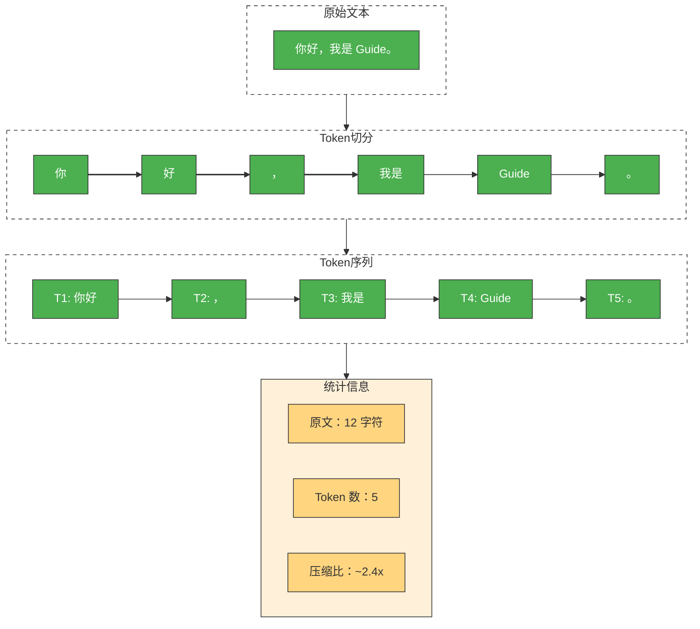

注意：实际 Token 切分由模型供应商的 Tokenizer 实现，不同供应商对相同文本可能产生不同的 Token 序列。

OpenAI 官方网页端 Tokenizer 工具：[OpenAI Tokenizer](https://platform.openai.com/tokenizer)

**特殊 Token**：除了文本内容对应的 Token，模型内部还会使用一些特殊标记，这些也会计入 Token 总数：

| 特殊 Token                   | 用途                  | 示例             |
| ---------------------------- | --------------------- | ---------------- |
| BOS（Beginning of Sequence） | 标记序列开始          | `<s>`          |
| EOS（End of Sequence）       | 标记序列结束          | `</s>`         |
| PAD（Padding）               | 批处理时填充短序列    | `<pad>`        |
| 工具调用标记                 | Function Calling 边界 | `<tool_call/>` |

这些特殊 Token 通常对用户不可见，但会占用上下文窗口。精确计数时建议使用官方 Tokenizer 工具而非手动估算。

### 多模态输入的 Token 开销

GPT-4o、Claude 3.5、Gemini 等模型已支持图片输入。**图片不是“零成本”的**——它会被转换成一批 Token，同样占用上下文窗口。

粗略估算规则：

| 模型       | 图片 Token 计算方式                           | 一张 1024×1024 图片约等于                 |
| ---------- | --------------------------------------------- | ------------------------------------------ |
| GPT-4o     | 按分辨率 + 细节模式                           | 低细节 ~85 tokens，高细节~1105~765 tokens |
| Claude 3.5 | 固定 ~5 tokens（缩略图）或 ~85 tokens（全图） | 取决于图片模式                             |
| Gemini     | 按分辨率计算                                  | ~258 tokens（标准）                        |

工程启示：

- 做多模态 RAG 时，要把图片 Token 也纳入预算。
- 批量处理图片时，注意首字延迟（TTFT）会显著增加。
- 如果只需要 OCR，考虑先用专门的 OCR 服务提取文字，再以纯文本形式送入模型。

### 上下文窗口的容量边界

**上下文窗口**是 LLM 的“工作记忆”（Working Memory）。它决定了模型在任何时刻可以处理或“记住”的文本量（以 Token 为单位）。

- 对话连续性：决定模型能进行多长的多轮对话而不遗忘早期细节。
- 单次处理能力：决定模型一次性能够处理的最大文档、代码库或数据样本。

“模型支持 128K/200K/1M”指的是一次调用里能放进模型的总 Token 上限。大多数模型的上下文窗口包含输入与输出的总和，但部分供应商（如 Google Gemini）对输入和输出分别设限，使用前请查阅具体 API 文档。

上下文窗口往往被隐形成本占用：


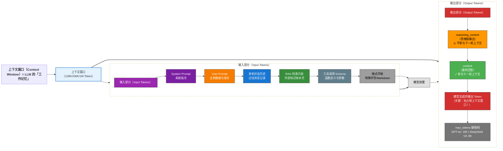

- System Prompt：调节模型行为的系统指令（对用户隐藏，但占用窗口）。
- User Prompt：业务数据与指令。
- 多轮对话历史：过往的消息记录。
- RAG 检索片段：从外部知识库检索到的补充信息。
- 工具调用 Schema：函数定义与参数结构。
- 格式开销：特殊字符、换行符、Markdown 标记等。
- 模型生成的输出 Token：**输出也占用上下文窗口**。

因此，你真正能塞进 Prompt 的“有效业务内容”往往远小于标称上限。

注意：上下文窗口（Context Window）≠ 最大生成长度。许多模型支持 128K 甚至 1M 输入，但单次输出上限因 API 而异。OpenAI Chat Completions API 使用 `max_tokens` 参数（GPT-4o 最大 16K 输出），部分新模型支持 `max_completion_tokens`（如 o1 系列），DeepSeek V3 最大输出 8K。使用前需查阅具体模型的 API 文档。

思维链模式的多轮对话处理：思维链模型（如 DeepSeek-R1）的 `reasoning_content`（思考过程）通常不会被自动包含在下一轮对话的上下文中，只有 `content`（最终回答）会参与后续对话。

这意味着：

- 无需为思考过程额外占用上下文窗口。
- 如果后续对话需要参考之前的推理过程，需要手动将 `reasoning_content` 拼接到消息历史中。
- 部分供应商的 SDK 会自动处理这一差异，建议查阅具体文档确认。

### 长上下文背后的计算约束

上下文窗口并非越大越好，它受限于 Transformer 架构的**自注意力机制（Self-Attention）**：

- 计算成本平方级增长：计算需求与序列长度呈平方级关系（O(N²)）。输入 Token 翻倍，处理能力需求可能变为 4 倍。
- 推理延迟增加：上下文变长后，模型生成每个新 Token 时需要关注的历史 Token 变多，首字延迟 TTFT 会显著增加。
- 安全风险增加：更长的上下文意味着更大的攻击面。

工程优化手段：FlashAttention、GQA/MQA、Sliding Window Attention、Ring Attention 等技术已显著降低长上下文的计算和显存开销。但 O(N²) 的理论复杂度仍是上限扩展的根本瓶颈。

### 上下文溢出的真实表现

当上下文接近上限或内容过长时，常见现象包括：

- 模型忽略早期约束：System Prompt 里要求“必须输出 JSON”，但因距离生成点太远，注意力不足导致被忽略。
- “中间丢失”现象：即使在 1M 窗口模型中，模型对开头和结尾的信息最敏感，对中间部分的信息召回率显著下降。
- 回答漂移：前半段还围绕问题，后半段开始总结/扩写/跑题。
- RAG 失效：检索文档过多，关键信息被稀释；或被截断导致证据链断裂。
- 成本与延迟激增：1M 上下文会导致 TTFT 显著增加，且 Token 成本呈线性增长。

### 输入 Token 与输出 Token 的计费差异

大多数供应商对输入 Token 和输出 Token 采用不同的计费标准，通常输出价格是输入的 **2~4 倍**：

| 模型              | 输入价格（/1M Tokens） | 输出价格（/1M Tokens） | 输出/输入比 |
| ----------------- | ---------------------- | ---------------------- | ----------- |
| GPT-4o            | \$2.50                 | \$10.00                | 4x          |
| Claude 3.5 Sonnet | \$3.00                 | \$15.00                | 5x          |
| DeepSeek V3       | ¥0.5                  | ¥2.0                  | 4x          |
| DeepSeek-R1       | ¥4.0                  | ¥16.0                 | 4x          |

工程启示：

- 长 Prompt + 短输出 = 更经济的调用方式。
- RAG 场景要控制检索片段数量，避免输入 Token 激增。
- 思维链模型的 reasoning tokens 通常按输出价格计费，成本更高。

### Prompt Caching 的省钱逻辑

当请求中存在大量重复的固定前缀（如 System Prompt、长 RAG Context），可以用 **Prompt Caching** 显著降低成本。

原理：供应商会缓存请求中“可复用的前缀部分”。下次请求如果前缀相同，这部分就不重新计费，只收“缓存读取”的费用（通常是正常价格的 10%~50%）。

典型适用场景：

- 多轮对话（System Prompt + 历史 Message 不变）。
- RAG 应用（检索片段重复率高）。
- 批量评估（同一份 System Prompt，不同的简历/文章）。

各供应商支持情况：

| 供应商    | 功能名称        | 缓存时长   | 缓存命中折扣   |
| --------- | --------------- | ---------- | -------------- |
| OpenAI    | Prompt Caching  | 5~10 分钟  | 输入价格约 50% |
| Anthropic | Prompt Caching  | 5 分钟     | 输入价格约 10% |
| DeepSeek  | Context Caching | 10~30 分钟 | 输入价格约 25% |

工程建议：

1. 把不变的内容放前面（System Prompt、工具定义、RAG Context），把变化的内容放后面（User Prompt）。
2. 监控 `cache_read_tokens` 和 `cache_creation_tokens` 指标，验证缓存命中率。
3. 批量任务尽量在缓存时间窗口内完成。

### 一次调用的 Token 预算公式

把“上下文窗口”当成一个固定容量的桶，下图展示了一个典型调用的 Token 预算分配：

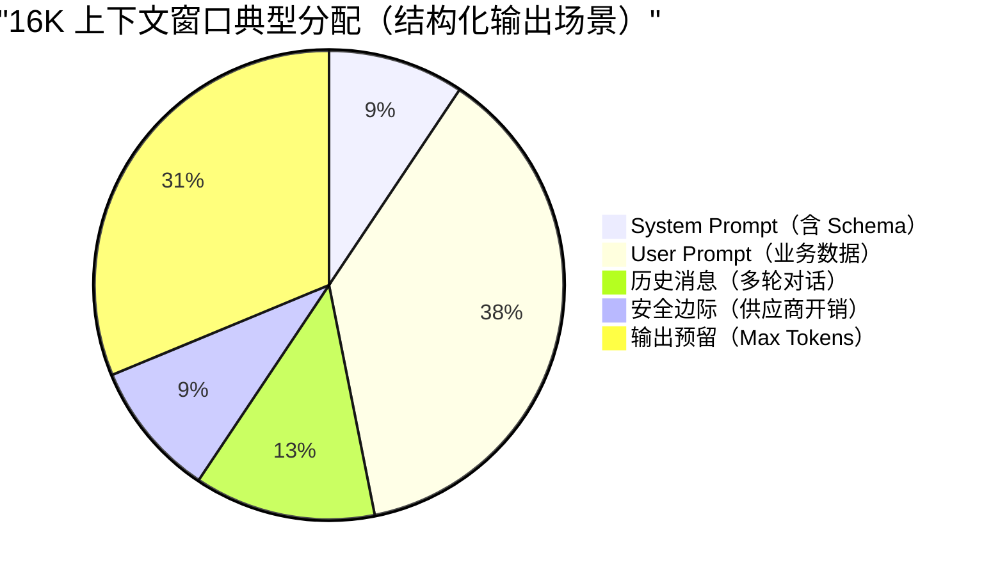

此分配仅为示意，实际比例需根据业务场景动态调整。

最实用的预算方式是：

**window ≥ input_tokens + max_output_tokens**

对于思维链模型，公式应调整为：

**window ≥ input_tokens + reasoning_tokens + max_output_tokens**

其中 `reasoning_tokens`（思考链 Token 数）难以精确预估，建议按 `max_output_tokens` 的 2~3 倍预留。

其中 `input_tokens` 至少包含：

- system prompt（含 schema / 工具定义）
- user prompt（含变量替换后的实际文本）
- 历史消息（多轮对话时）
- RAG context（如果拼进来了）

工程上建议反过来做预算（因为输出经常更可控）：

1. 先定 `max_output_tokens`（结构化输出通常不需要很长）。
2. 再为输入预留安全边际（例如再留 10%~20% 给供应商额外开销）。
3. 超预算时，用可解释的策略“减输入”而不是“赌模型会自我约束”：
   - 优先减少 RAG 的 Top-K 或做片段去重。
   - 对长字段做摘要/截断（如简历、长回答）。
   - 多段任务拆成多次调用（分批评估、两阶段生成）。

## ⭐️ 采样参数如何影响输出稳定性？

### 从 logits 到概率采样

模型每一步会给词表中**每个**候选 Token 打一个分数（内部叫 **logits**），分数越高说明模型越觉得这个词应该出现在这里。

举个例子，假设模型正在补全“今天天气真\_\_”，它可能给出这样的分数：

| 候选 Token | 原始分数（logit） |
| ---------- | ----------------- |
| 好         | 5.0               |
| 不错       | 3.2               |
| 棒         | 2.1               |
| 糟糕       | 0.5               |
| 紫色       | -8.0              |

但原始分数不是概率——需要经过一次数学变换（**softmax**）才能变成每个候选被选中的概率。变换后大致是：

| 候选 Token | 概率  |
| ---------- | ----- |
| 好         | 62%   |
| 不错       | 20%   |
| 棒         | 10%   |
| 糟糕       | 5%    |
| 紫色       | ≈ 0% |

最后，模型按这个概率分布“抽签”（采样），决定输出哪个 Token。

解码参数（Temperature、Top-p、Top-k 等）就是在这个“打分 → 概率 → 抽签”的过程中施加控制：

- Temperature：调整概率分布的“形状”，让高分选项更突出，或者让各选项更均匀。
- Top-p / Top-k：直接砍掉不靠谱的候选项，缩小“抽签池”。
- Penalty 系列：对已经出现过的词降分，防止“复读机”。

### Temperature 的“冒险程度”

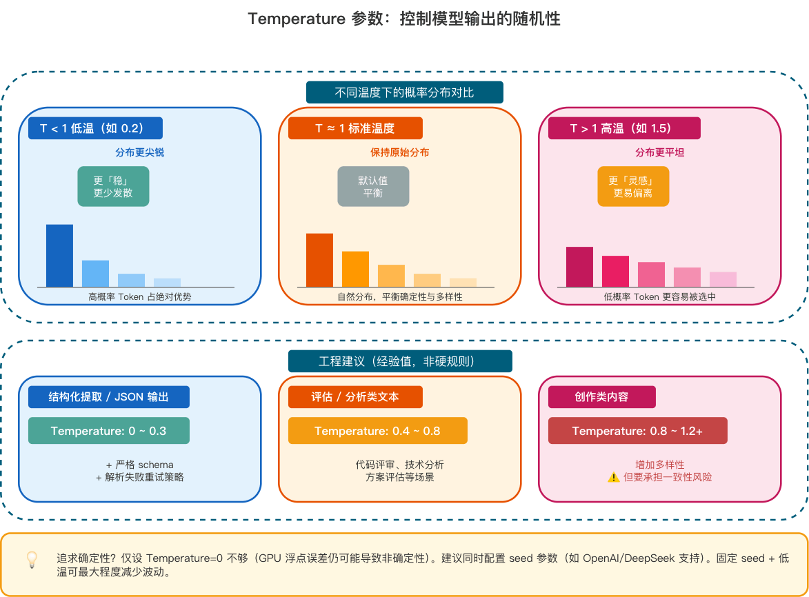

Temperature 的工作原理很简单：在 softmax 之前，先把所有分数**除以**温度值 T。

**p(t) = softmax(z_t / T)**

- T ≈ 1：保持原始分布。
- T < 1：分布更尖锐，更倾向选择高概率 Token（更“稳”）
- T > 1：分布更平坦，低概率 Token 更容易被采样到（更“野”）

还是用“今天天气真\_\_”的例子：

- T = 0.2（低温）：分数差距被放大（都除以 0.2，等于乘以 5），原本就领先的“好”概率飙升到 ~98%，几乎每次都选它。
- T = 1.0（默认温度）：保持原始分布不变，“好”62%、“不错”20%...按正常概率采样。
- T = 1.5（高温）：分数差距被缩小（都除以 1.5），“好”概率降到 ~35%，“棒”、“不错”甚至“糟糕”都有更大机会被选中。

温度越低，输出越确定；温度越高，输出越随机。

工程建议（经验值，非硬规则）：

| 场景                         | 推荐温度   | 说明                               |
| ---------------------------- | ---------- | ---------------------------------- |
| 结构化提取 / JSON 输出       | 0 ~ 0.3    | 配合严格 schema + 解析失败重试策略 |
| 评估 / 分析 / 代码评审       | 0.4 ~ 0.8  | 平衡确定性与表达多样性             |
| 创作类内容（文案、头脑风暴） | 0.8 ~ 1.2+ | 增加多样性，但要承担格式一致性风险 |

追求确定性？若需单元测试幂等或结果复现，仅设 `Temperature=0` 不够（GPU 浮点误差仍可能导致非确定性）。建议同时配置 **`seed` 参数**（如 OpenAI/DeepSeek 支持）。

即使配置 `seed`，以下情况仍可能导致结果不一致：

- 模型版本更新（底层权重变化）。
- 跨区域调用（不同集群可能部署不同版本）。
- Top-p 采样（即使 T=0，若 Top-p<1 仍有随机性）。

建议在 CI/CD 中仅将 LLM 调用用于冒烟测试，核心逻辑仍依赖 Mock。

### Top-p 与 Top-k 的“抽签池”

Temperature 调整的是概率分布的形状，但不管怎么调，词表里所有 Token 理论上都有被选中的可能。Top-p 和 Top-k 则更直接——把不靠谱的候选直接踢出抽签池。

还是用“今天天气真\_\_”的例子：

| 候选 Token | 概率 | 累计概率 |
| ---------- | ---- | -------- |
| 好         | 62%  | 62%      |
| 不错       | 20%  | 82%      |
| 棒         | 10%  | 92%      |
| 糟糕       | 5%   | 97%      |
| 紫色       | ≈0% | ≈100%   |

- Top-k = 3：只保留概率最高的 3 个候选（好、不错、棒），在这 3 个里重新分配概率后采样。“糟糕”和“紫色”直接出局。
- Top-p = 0.9：从高到低累加概率，保留累计刚好达到 90% 的最小集合。这里“好 + 不错 + 棒 = 92% ≥ 90%”，所以保留这 3 个。如果某个场景下头部更集中（比如第一名就占了 95%），Top-p 会自动只保留 1 个——比 Top-k 更灵活的地方就在这。

两者的区别：Top-k 固定保留 k 个，不管概率分布长什么样；Top-p 根据概率自适应调整候选数量。实践中 **Top-p 更常用**，因为它能自动适应不同的概率分布。

常见组合：

| 组合                | 效果                             | 适用场景               |
| ------------------- | -------------------------------- | ---------------------- |
| T=0（贪婪解码）     | 永远选最高分，完全确定           | 结构化输出、可复现场景 |
| 低温 + Top-p=0.9    | 相对稳定，但允许措辞上有些变化   | 分析报告、摘要         |
| 中高温 + Top-p=0.95 | 多样性较高，但排除了极端离谱选项 | 创意写作、对话         |

注意：贪婪解码虽然最稳定，但可能更容易陷入重复循环。

### 停止条件与截断风险

工程上需要意识到两点：

- **Max Tokens 是硬上限**：到上限会被强制截断，模型正写到一半也会被“掐断”。常见后果：JSON 缺右括号、列表缺最后几项、句子写了一半。
- **Stop Sequences（停止词）是软切断**：可以指定一些字符串（如 `"\n\n"` 或 `"```"`），模型生成到这些内容时会自动停止。但如果 stop 设计不当，可能提前截断关键字段。

结构化输出场景要把“截断风险”当成一类失败路径来设计缓解策略。

思维链模式的 Token 计算差异：对于支持思维链的模型（如 DeepSeek-R1），`max_tokens` 通常包含思考过程 + 最终回答两部分。例如设置 `max_tokens=8192`，模型可能在思考链上消耗 5000 tokens，最终回答只剩 3192 tokens 的预算。

不同供应商的默认值和上限差异较大：DeepSeek-R1 默认 32K、最大 64K；OpenAI o1 系列的输出上限也高于普通模型。使用前务必查阅具体模型的 API 文档。

### Penalty 与复读问题

可能遇到过模型反复输出同一句话，或者在长回答里不断重复相同观点。Penalty 参数用来缓解这类问题，它们在解码时**降低已出现 Token 的分数**：

| 参数               | 作用                                | 通俗理解                   |
| ------------------ | ----------------------------------- | -------------------------- |
| Repetition Penalty | 降低所有已出现 Token 的概率         | “说过的词，再说就扣分”   |
| Presence Penalty   | 只要 Token 出现过就扣分（不看次数） | “鼓励聊新话题”           |
| Frequency Penalty  | Token 出现次数越多扣分越重          | “同一个词说了三遍？重罚” |

工程陷阱：

- 结构化输出别乱加 Penalty：JSON 里字段名（如 `"name"`、`"score"`）需要反复出现，加了 Repetition Penalty 可能把必须出现的字段名也“惩罚掉”，导致输出残缺。
- RAG 问答别加 Presence Penalty：它会鼓励模型“说点新东西”，反而降低对检索内容的忠实度，增加幻觉风险。

保守建议：如果不确定这些参数的精确语义（不同供应商定义可能不同），建议保持默认值。用低温 + 更强 Prompt 约束 + 更短输出来获得稳定性，比调 Penalty 更可控。

### 思维链模式的参数限制

部分模型（如 DeepSeek-R1、OpenAI o1）支持“思维链模式”，在生成最终回答前会先输出一段内部推理过程。这类模型有特殊的参数约束：

不支持的采样参数：思维链模式下，以下参数通常被忽略：

- `temperature`、`top_p`：采样控制参数。
- `presence_penalty`、`frequency_penalty`：惩罚参数。

原因：思维链模式的设计目标是让模型“自由思考”，采用模型内部固定的采样策略，用户传入的采样参数会被忽略。

工程建议：

- 调用思维链模型时，不要依赖上述参数控制输出风格。
- 若需要更稳定的输出格式，应通过 Prompt 约束而非采样参数。
- 关注模型返回的 `reasoning_content` 字段（思考过程）与 `content` 字段（最终回答）的区别。

### 流式输出与首字延迟

默认情况下，API 会等模型生成完所有内容后一次性返回。流式输出则是边生成边返回——模型每生成一个（或几个）Token，就立刻推送给客户端，用户更早看到内容开始出现。

核心价值：改善用户体验，降低首字延迟（TTFT，Time-To-First-Token）。

常见误解澄清：

- 流式输出更快——总耗时（E2E latency）不一定下降，模型生成的总 Token 量相同。
- 流式输出更省钱——Token 计费不变，仍然受限流/配额影响。
- 如果需要结构化输出（如 JSON），流式场景要考虑“半成品 JSON”在前端/网关层的处理。

### Logprobs 与置信度排查

部分 API（如 OpenAI）支持返回每个生成 Token 的**对数概率**（logprobs），可以理解为模型对该 Token 的“确信程度”。logprob 越接近 0，模型越确信；值越小（如 -5.0），说明模型越“犹豫”。

工程应用场景：

- **置信度评估**：提取“金额: 1000”时，若对应 Token 的 logprob 很低，说明模型不太确定，可能需要人工复核。
- **异常检测**：监控生产环境中模型输出的平均 logprob，若突然下降可能提示 Prompt 漂移或输入数据异常。
- **多候选对比**：获取 Top-N 候选 Token 及其概率，用于纠错或二次排序。

注意事项：logprobs 会增加响应体积，且并非所有供应商都支持。使用前请查阅 API 文档。

### 采样参数配置建议

| 场景                | Temperature  | Top-p | Penalty  | 其他建议                     |
| ------------------- | ------------ | ----- | -------- | ---------------------------- |
| JSON / 结构化输出   | 0 ~ 0.3      | 1.0   | 保持默认 | 配合 Strict Mode + 重试策略  |
| 代码评审 / 技术分析 | 0.4 ~ 0.7    | 0.9   | 保持默认 | 结合 CoT Prompt              |
| 多轮对话            | 0.6 ~ 0.8    | 0.9   | 适度开启 | 控制历史消息长度             |
| 创意写作 / 头脑风暴 | 0.8 ~ 1.2    | 0.95  | 按需开启 | 接受输出多样性，做好后处理   |
| 思维链模型          | —（不支持） | —    | —       | 通过 Prompt 控制，非采样参数 |

## 总结

回顾这篇扫盲内容，核心其实就是处理好三个维度的工程权衡：

1. **Token 是成本与性能的物理标尺**：它不仅决定计费账单和推理延迟，更决定模型对文本的理解粒度。做容量规划时，必须按 Token 算账，而不是按字数算账。
2. **上下文窗口是极其稀缺的资源**：哪怕模型宣称支持 1M 上下文，也不意味着可以毫无节制地堆砌数据。为 Prompt、RAG 检索片段、历史对话和输出预留做好严格的 Token 预算分配，是走向生产环境的必修课。
3. **采样参数是业务场景的调音台**：如果追求稳定的 JSON 输出，就果断压低 Temperature 并配合严格的 Schema；如果需要创意与头脑风暴，再适度放开 Temperature 和 Top-p。不要迷信默认参数，要根据业务的容错率来定制。

打好这层参数与原理的地基，再去看 Agent 编排、RAG 检索或是 MCP 工具调用，你会发现那些高阶架构的本质，无非是在更好地调度这些底层 Token，更精准地管理这个上下文窗口。

## 一次生产级 LLM 调用包含哪些阶段？

很多人排查大模型调用问题时，只盯着供应商返回了什么。这个视角太窄。

一次生产级 LLM 调用，本质上是一条跨业务系统、上下文系统、模型网关、外部供应商和前端展示层的链路。任何一段没有治理好，最后都会表现成“模型不稳定”。


拆开看，一次请求通常包含 8 个阶段：

1. **业务请求进入**：校验用户身份、租户、套餐、功能权限、请求大小。
2. **上下文组装**：拼 System Prompt、用户输入、历史消息、RAG 证据、工具 Schema、输出格式约束。
3. **Token 预算预估**：估算输入 Token，预留输出 Token，决定是否裁剪历史、压缩上下文或换小模型。
4. **模型网关路由**：选择模型、供应商、区域、超时参数、重试策略、限流桶。
5. **供应商 API 调用**：同步返回或流式返回，可能经过 SSE、WebSocket 或普通 HTTP 响应体。
6. **响应解析**：处理 delta、finish reason、tool call、usage、拒答、结构化 JSON、异常中断。
7. **状态回写**：保存完整回答、增量片段、Token 用量、调用成本、失败原因和业务状态。
8. **观测与告警**：记录 traceId、providerRequestId、TTFT、总耗时、重试次数、429 次数、解析失败率。

很多团队栽的最多的一件事：**把模型网关当成透明代理**。它不是代理，它是 AI 应用的稳定性控制面。

如果没有网关，每个业务系统都会自己处理 API Key、超时、重试、限流、日志、供应商切换。短期看省事，长期一定变成事故放大器。Guide 的建议是：哪怕第一版很轻，也要把模型调用收口到一个统一的 `LLMGateway`。

## 同步返回和流式返回有什么区别？

默认的同步调用很好理解：后端发起请求，模型生成完全部内容后，一次性返回完整结果。

流式输出则是边生成边返回。模型每产生一段文本或一个事件，供应商就通过长连接把增量推给调用方。OpenAI 官方文档把 HTTP streaming 放在 SSE 场景下描述；Anthropic Messages API 也支持通过 SSE 增量返回事件；Gemini API 同样提供标准、流式和实时相关接口。具体字段和模型能力会变，**以官方文档最新展示为准**。

**为什么 Streaming 能降低 TTFT？**

TTFT（Time To First Token）指从请求发出到收到第一个可展示 Token 的时间。

同步返回时，用户要等模型生成完整答案。例如模型要生成 800 个 Token，后端必须等这 800 个 Token 都完成才把结果返回。

流式返回时，用户只要等模型开始生成第一个片段，就能看到内容逐步出现。

流式输出不是性能魔法。它没有让模型少算 Token，也不会天然省钱。它只是把等待过程拆成了可感知的进度，让用户觉得系统“活着”。

| 对比项       | 同步返回                   | 流式返回                             |
| ------------ | -------------------------- | ------------------------------------ |
| 首字延迟     | 高，需要等完整结果         | 低，收到第一个片段即可展示           |
| 端到端总耗时 | 取决于完整生成时间         | 通常仍取决于完整生成时间             |
| 前端体验     | 像提交表单后等待结果       | 像聊天软件逐字出现                   |
| 后端实现     | 简单，拿到完整字符串再处理 | 复杂，需要处理增量事件、取消、断流   |
| 结构化解析   | 简单，完整 JSON 一次解析   | 需要缓存完整内容，或使用增量解析器   |
| 适合场景     | 短文本、后台任务、严格事务 | 聊天、写作、报告生成、长回答         |
| 不适合场景   | 用户强交互的长回答         | 强事务、必须一次性校验完整结果的链路 |

Guide 的经验：面向用户展示的长文本默认用流式，后台批处理和强结构化任务默认用同步。

## ⭐️ SSE、WebSocket 和 HTTP chunked 这三种流式协议怎么选

流式输出有几种常见承载方式，别把它们混成一个东西。

| 方式         | 核心特点                                                                         | 适合场景                               | 边界                                                        |
| ------------ | -------------------------------------------------------------------------------- | -------------------------------------- | ----------------------------------------------------------- |
| SSE          | 浏览器原生 `EventSource`，服务端到客户端单向推送，格式是 `text/event-stream` | 文本聊天、模型增量输出、状态通知       | 单向通信；复杂双向控制需要额外 HTTP 请求                    |
| WebSocket    | 双向长连接，客户端和服务端都能随时发消息                                         | 实时语音、多人协作、需要频繁取消或插话 | 连接管理更复杂，网关、鉴权、心跳都要自己管好                |
| HTTP chunked | HTTP/1.1 的分块传输机制，响应体分块发送                                          | 后端到后端流式代理、低层传输           | 它是传输机制，不是应用事件协议；HTTP/2 之后有自己的流式机制 |

SSE 的优势是简单。浏览器端几行代码就能接收事件，服务端按 `data:` 一段段写出去即可。MDN 对 EventSource 的描述也强调了它和 WebSocket 的区别：SSE 是服务端到客户端的单向数据流。

WebSocket 适合更实时、更复杂的交互。比如语音 Agent 里，客户端要不断上传音频，服务端要不断返回 ASR、LLM、TTS 状态，还要支持用户中途打断。这种场景用 WebSocket 更自然。

HTTP chunked 更底层。很多服务端框架在没有 `Content-Length` 的情况下会用分块响应，它能实现“边写边发”，但不会帮你定义事件类型、重连语义、消息边界。业务层仍然要自己设计协议。

### SSE 协议的事件边界

SSE 在传输层仍是 HTTP，但**应用层是一份 UTF-8 纯文本协议**。每个事件由若干行字段组成，事件之间必须用**空行**结束，也就是连续两个换行符 `\n\n`。

常用字段如下：

| 字段      | 作用                                             |
| --------- | ------------------------------------------------ |
| `data`  | 业务载荷；允许多行 `data:`，客户端会按规范拼接 |
| `event` | 自定义事件名；浏览器默认事件类型是 `message`   |
| `id`    | 事件序号；配合浏览器重连语义可做断点提示         |
| `retry` | 建议的重连间隔（毫秒）                           |

**`\n\n` 是事件分隔符**。只要在“本应属于同一段模型增量”的字符串里出现了“裸的换行”，就有可能被客户端解析成“上一个事件已结束、下一个事件开始”。这是很多团队在 Demo 里没问题、一上对话界面加 Markdown 或列表就炸裂的根因。

Guide 在[《SpringAI 智能面试平台+RAG 知识库》](https://javaguide.cn/zhuanlan/interview-guide.html)的知识库问答里用的就是 SSE：模型一边生成，浏览器一边打字机展示；链路不长，但协议细节一个不落下。

### Spring Boot + Spring AI 的 SSE 写法

Java 侧常见做法是 **`Content-Type: text/event-stream`**，再用响应式流往外推。Spring 提供了 `ServerSentEvent<T>`，避免手写 `data:` 和 `\n\n` 拼串出错：

```java
@GetMapping(value = "/chat/stream", produces = MediaType.TEXT_EVENT_STREAM_VALUE)
public Flux<ServerSentEvent<String>> stream() {
    return Flux.interval(Duration.ofMillis(500))
        .map(seq -> ServerSentEvent.<String>builder()
            .id(Long.toString(seq))
            .event("token")
            .data("片段-" + seq)
            .retry(Duration.ofSeconds(3))
            .build());
}
```

和大模型对接时，增量源头通常是 SDK 或框架暴露的流式接口。以 Spring AI 为例，`ChatClient` 侧启用流式后拿到 `Flux<String>`，再映射成 SSE 推给前端：

```java
Flux<String> tokens = chatClient.prompt()
    .system(systemPrompt)
    .user(userPrompt)
    .stream()
    .content();
```

工程上要心里有数：WebMVC + `Flux` 只是在 Controller 出口用了响应式类型做 SSE，底层仍是 Servlet 容器。线程池、连接数和超时仍要按「长请求」来治理；Java 21 虚拟线程可以把「占着一个平台线程傻等」的成本降下来，这对动辄数十秒的生成链路很实用。

### 模型正文换行导致的 SSE 截断

假设你把某个 token 或片段直接塞进 `data:`，而片段里含有真实的换行符 `\n`。协议眼里这就是「字段结束 / 新字段开始」，前端事件边界立刻错位。

血泪教训：别指望「模型不太会输出换行」——列表、代码块、道歉话术一来，线上必现。

一条务实的做法是在应用层约定转义，例如在出站前把 `\n`、`\r` 转成字面量 `\\n`、`\\r`，前端收到后再还原：

```java
.map(chunk -> ServerSentEvent.<String>builder()
    .data(chunk.replace("\n", "\\n").replace("\r", "\\r"))
    .build())
```

```typescript
const text = chunk.replace(/\\n/g, "\n").replace(/\\r/g, "\r");
```

更「协议原生」的做法也能做：把一行正文拆成多行 `data:`，由客户端按规范拼回一行内的 `\n`。选型核心是：团队要在服务端和前端固定同一种语义，并把单元测试覆盖到「含换行、含 CR、含空行」的片段。

### Nginx 与网关的流式配置

只要前面挂了 Nginx 或其它响应缓冲型网关，`text/event-stream` 可能被攒够一整块才下发，用户侧的 TTFT 体感瞬间回到同步接口。

最小改动通常是：

```nginx
location /api/ {
    proxy_pass http://backend;
    proxy_buffering off;
    proxy_cache off;
    proxy_read_timeout 300s;
    proxy_set_header Connection "";
    add_header Cache-Control no-cache;
}
```

再配合 `proxy_read_timeout`（或等价配置）把「长生成」守住，否则链路会在沉默超时处被中间件切断。

### 流式异常的四类场景

流式链路最容易出问题的地方，往往不是“怎么开始”，而是“怎么结束”。

**第一类：用户取消。**

用户关闭页面、点击停止生成、切换会话，都应该触发取消。后端要同时取消：

- 到供应商 API 的请求。
- 正在解析的响应流。
- 后续 TTS、工具调用、落库任务。
- 还没提交的增量缓存。

血泪教训：不要只在前端停止展示。前端停了，后端还在生成，账单照样跑。

**第二类：超时。**

超时至少分三层：

- 连接超时：连不上供应商。
- TTFT 超时：连接上了，但迟迟没有第一个事件。
- 总时长超时：一直有输出，但超过业务可接受时间。

三者要分开记录。TTFT 超时通常指向模型排队、上下文过长或供应商抖动；总时长超时可能只是用户让模型写太长。

**第三类：断流。**

断流时不要轻易把半截内容当成成功。正确做法是记录 `finish_reason` 或最后事件状态，如果没有正常结束标记，就把本次调用标记为 `INTERRUPTED`，前端展示“已中断，可重新生成”，而不是悄悄落成完整答案。

**第四类：重连。**

SSE 的 `EventSource` 有自动重连能力，但大模型输出不是普通新闻推送。重连后是否能从断点续传，取决于你的服务端是否保存了事件序号、增量片段和供应商调用状态。多数情况下，供应商侧流已经断掉，无法真正从 Token 级别续上。

更稳的做法是：

- 服务端为每个流式响应生成 `messageId` 和递增 `sequence`。
- 已发送片段写入短期缓存。
- 前端重连时先补发已缓存片段。
- 如果供应商流已结束或失效，提示用户重新生成，而不是假装无缝续写。

## 哪些错误能重试，哪些不能重试？

重试是后端工程师最熟悉也最容易滥用的能力。

大模型 API 的重试有两个特殊点：

1. **请求贵**：失败请求也可能消耗配额，甚至已经消耗了部分 Token。
2. **输出非确定**：即使 Prompt 一样，第二次返回也可能和第一次不同。

### 错误类型对照表

| 类型             | 示例                                | 是否建议重试 | 处理方式                                    |
| ---------------- | ----------------------------------- | ------------ | ------------------------------------------- |
| 网络瞬断         | 连接重置、DNS 抖动、读超时          | 可以         | 指数退避 + 抖动，限制最大次数               |
| 供应商 5xx       | 500、502、503、504                  | 可以         | 短暂重试，超过阈值切换模型或降级            |
| 供应商过载       | Anthropic 529、类似 overloaded 错误 | 可以         | 慢重试，必要时熔断该供应商                  |
| 429 限流         | RPM、TPM、RPD、并发限制超出         | 谨慎         | 优先看 `Retry-After` 和限流头，排队或降级 |
| 流式中断         | 未收到正常结束事件                  | 视场景       | 用户可见任务不自动重试，后台任务可幂等重试  |
| 400 参数错误     | Schema 不合法、字段缺失、上下文超限 | 不建议       | 修请求，不要重试同一 payload                |
| 401/403 鉴权错误 | API Key 无效、权限不足              | 不建议       | 告警并停用对应 Key                          |
| 安全拒答         | 内容策略拒绝                        | 不建议       | 进入业务拒答流程                            |
| 解析失败         | JSON 不完整、字段类型错误           | 可有限重试   | 带失败原因二次修复，最多 1-2 次             |

OpenAI 官方限流文档建议对 rate limit error 使用随机指数退避，同时提醒失败请求也会计入每分钟限制；Anthropic 官方错误文档中明确列出了 429 rate limit、500 api error、504 timeout、529 overloaded 等错误类型。这里的结论不是某一家供应商专属，而是外部模型依赖的通用治理思路。

### 指数退避和抖动

指数退避的核心是：第 1 次失败等一小会儿，第 2 次失败等更久，第 3 次再更久，直到达到最大等待时间或最大重试次数。

抖动（Jitter）的核心是：不要让所有请求在同一时间点一起重试。否则系统刚从限流里恢复，马上又被同一批重试打爆。

一个实用公式：

```text
sleep = min(maxDelay, baseDelay * 2^retryCount) + random(0, jitter)
```

生产里别忘了加两条硬约束：

- **最大重试次数**：通常 2-3 次足够，别无限重试。
- **总体截止时间**：用户请求有整体 SLA，例如 15 秒，到点就失败，不要因为重试拖成 1 分钟。

### 幂等 Key 和去重机制

只要有重试，就必须讨论幂等。

幂等 Key 可以由业务生成，例如：

```text
tenantId:userId:conversationId:messageId:attemptGroup
```

服务端拿到请求后，先查这个 Key 是否已经存在：

- 如果已经成功，直接返回历史结果。
- 如果正在生成，返回同一个流式任务的订阅地址。
- 如果失败且允许重试，创建新的 attempt，但仍然挂在同一个业务消息下。
- 如果失败但不可重试，直接返回失败原因。

这能避免两个坑：

1. 用户狂点“重新发送”，后端创建多个模型调用。
2. 网关超时后自动重试，第一次其实已经成功落库，第二次又写了一条重复消息。

### 响应重复的处理

重试后的响应可能重复、冲突或部分重叠。

对聊天类应用，建议把一次用户消息下的多次模型调用区分为：

- `message_id`：业务消息 ID，对用户可见。
- `attempt_id`：模型调用尝试 ID，对系统可见。
- `provider_request_id`：供应商请求 ID，用于排查。
- `stream_sequence`：增量片段序号，用于去重和补发。

落库时，只允许一个 attempt 成为 `final`。其他 attempt 保留为诊断记录，不参与用户上下文。这样既能排查问题，又不会污染下一轮 Prompt。

## ⭐️ 为什么要限流？如何限流？

很多团队的限流意识，是从收到第一个 429 开始的。

这已经晚了。等供应商把你拦住，说明你的系统里根本没有容量管理。供应商的 429 是最后一道墙——如果你把它当容量规划工具用，迟早会在流量尖峰时被连续打脸。

### 限流的四层架构

| 层级     | 限制对象                     | 核心目的                     | 常见策略                       |
| -------- | ---------------------------- | ---------------------------- | ------------------------------ |
| 用户级   | 单个用户或账号               | 防止滥用、误操作、脚本刷接口 | 每分钟请求数、每日 Token 上限  |
| 租户级   | 企业、团队、项目             | 控制套餐成本和公平性         | 月度配额、并发上限、优先级队列 |
| 模型级   | 某个模型或模型族             | 避免热门模型被打满           | 模型维度令牌桶、降级到备用模型 |
| 供应商级 | OpenAI、Anthropic、Gemini 等 | 保护外部依赖和 API Key       | 全局 RPM、TPM、并发、熔断      |

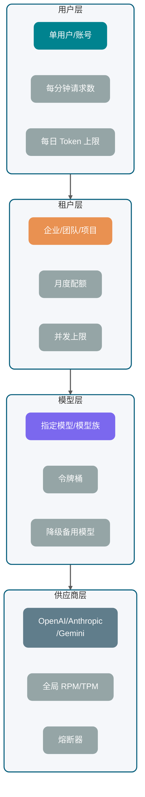

Gemini 官方限流文档把限流维度拆成 RPM、输入 TPM、RPD，并说明限制按项目而不是单个 API Key 应用；OpenAI 官方文档也展示了请求数、Token 数、剩余额度等 rate limit header。具体数值和模型关系变化很快，生产系统不要把文档里的静态数字写死，要从控制台、响应头或配置中心动态管理。

### 为什么 Token 预算比请求数更重要

传统 API 限流通常按 QPS。大模型 API 只按 QPS 不够。

两个请求的成本可能差很多：

- 请求 A：输入 500 Token，输出 100 Token。
- 请求 B：输入 80K Token，输出 8K Token。

它们都是 1 次请求，但对模型推理、供应商配额和账单的压力完全不是一个量级。

所以限流至少要同时看：

- **RPM**：每分钟请求数。
- **TPM**：每分钟 Token 数。
- **并发数**：正在生成的请求数量。
- **上下文大小**：单请求输入 Token。
- **最大输出**：`max_tokens` 或类似参数。
- **日/月预算**：租户或用户总成本。

Guide 的建议是：**先扣预算，再发请求**。

请求进入网关后，先估算 `input_tokens + reserved_output_tokens`，在用户、租户、模型、供应商几个桶里尝试扣减。扣不到就不要发给供应商，直接排队、降级或拒绝。

### 常见限流策略对比

| 策略       | 适合场景               | 优点                     | 缺点                      |
| ---------- | ---------------------- | ------------------------ | ------------------------- |
| 固定窗口   | 简单后台任务、管理接口 | 实现简单，容易统计       | 窗口边界容易突刺          |
| 滑动窗口   | 用户级请求限制         | 边界更平滑               | 实现和存储成本更高        |
| 令牌桶     | 模型调用、Token 预算   | 支持一定突发，工程上常用 | 参数需要调优              |
| 漏桶       | 严格平滑出流量         | 输出稳定，适合保护供应商 | 突发体验差                |
| 并发信号量 | 流式生成、长任务       | 能限制同时占用连接       | 不控制单个请求 Token 成本 |
| 优先级队列 | 多租户、多套餐         | 能保护高优先级请求       | 需要处理饥饿和超时        |

生产里通常不是选一个，而是组合：

- 用户级：滑动窗口 + 日 Token 上限。
- 租户级：令牌桶 + 月度预算
- 模型级：令牌桶 + 并发信号量
- 供应商级：全局令牌桶 + 熔断器
- 流式请求：并发信号量 + 总时长限制

关于限流算法的详细介绍，可以参考这篇文章：[服务限流详解](https://javaguide.cn/high-availability/limit-request.html)。

### 收到 429 应该怎么处理

HTTP 429 表示请求过多。后端处理 429 时，建议按这个顺序：

1. **读取 `Retry-After` 或供应商 rate limit header**：有明确恢复时间就尊重它。
2. **标记限流维度**：是请求数打满，还是 Token 打满，还是日配额耗尽。
3. **短请求可排队**：例如后台摘要任务可以进延迟队列。
4. **用户交互请求少重试**：用户等不起时，直接提示稍后再试或切换轻量模型。
5. **供应商连续 429 时熔断**：不要让所有请求继续撞墙。

一个典型降级链路：

```text
优先模型可用 -> 正常调用
优先模型 429 -> 切备用同级模型
备用模型也限流 -> 切轻量模型并缩短输出
仍不可用 -> 排队或返回"当前请求繁忙"
```

这里要避免一个误区：降级不是偷偷变差。如果轻量模型会影响答案质量，要在业务层明确标记，例如“当前为快速模式，复杂问题建议稍后重试”。

## 为什么要结构化返回？

很多业务一开始这样写 Prompt：

```text
请分析用户问题，输出 JSON，字段包括 intent、confidence、answer。
```

然后后端直接 `JSON.parse()`。

这在 Demo 阶段很常见，但生产环境会遇到各种边缘情况：

- 模型在 JSON 前加了一句“好的，以下是结果”。
- 字段缺失。
- 枚举值乱写。
- 数字返回成字符串。
- 流式返回时只拿到半个对象。
- 安全拒答时压根不是业务 Schema。

所以结构化返回的核心不只是“看起来像 JSON”，更关键的是**让模型输出能被程序稳定消费**。

### JSON Mode、JSON Schema 和 Structured Output 的区别

| 方式                        | 约束强度 | 工程价值                      | 风险                           |
| --------------------------- | -------- | ----------------------------- | ------------------------------ |
| 普通自然语言                | 几乎没有 | 适合展示型回答                | 不适合程序解析                 |
| Prompt 要求 JSON            | 弱       | 简单、跨模型                  | 容易混入解释文本或缺字段       |
| JSON Mode                   | 中       | 通常能保证语法是 JSON         | 不一定符合业务字段 Schema      |
| JSON Schema                 | 强       | 明确字段、类型、必填、枚举    | 不同供应商支持子集不同         |
| Structured Outputs          | 更强     | 供应商在解码或 SDK 层增强约束 | 受模型、SDK、Schema 子集限制   |
| Function Calling / Tool Use | 面向动作 | 适合让模型选择工具和参数      | 不是最终自然语言答案的万能替代 |

OpenAI 官方 Structured Outputs 文档强调可以让输出遵循开发者提供的 JSON Schema，并提供 `strict` 相关配置；Gemini 官方文档说明 structured output 使用 `response_format` 和 JSON Schema，且支持的是 JSON Schema 的子集；Anthropic 官方文档也提供 Structured Outputs 和 Strict tool use，二者解决的问题并不完全一样。具体模型、字段、Schema 子集变化较快，仍然以官方文档最新展示为准。

### 普通 JSON 和结构化输出的工程差异

普通自然语言返回像“人写给人看的说明”，结构化返回像“服务写给服务的接口”。

举个意图识别场景：

```json
{
  "intent": "refund_request",
  "confidence": 0.86,
  "entities": {
    "order_id": "202605080001",
    "reason": "商品破损"
  },
  "need_human_review": false
}
```

有了 Schema，后端可以做这些事：

- `intent` 只能是有限枚举。
- `confidence` 必须是数字。
- `order_id` 可以为空，但类型必须稳定。
- `need_human_review` 必须存在。
- 解析失败时可以进入修复或人工兜底流程。

这就是结构化返回的价值：**把“模型生成”变成“可校验的数据契约”**。

### 结构化输出失败后如何兜底

结构化输出仍然可能失败。失败不一定是供应商能力问题，也可能是 Schema 太复杂、上下文冲突、输出被截断、安全策略拒答。

建议兜底分四级：

1. **本地校验**：用 JSON Schema、Jackson、Bean Validation 校验字段和类型。
2. **轻量修复**：只让模型修复格式，不重新生成业务内容。
3. **降级 Schema**：复杂对象拆成多个小对象，或先分类再抽取字段。
4. **人工或规则兜底**：高价值订单、金融、医疗、法务场景不要完全依赖自动修复。

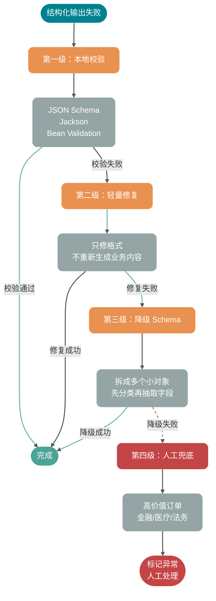

一个实用原则：结构化返回失败时，不要把原始自然语言硬塞给下游系统。能展示给用户，不代表能被程序执行。

## Java 后端怎么落地 LLM 调用？

下面给一个简化版 Java 伪代码，重点不是绑定某个 SDK，而是展示工程结构：网关统一处理 Token 预算、限流、重试、流式解析、幂等和观测。

```java
public interface LLMClient {
    LLMResponse chat(LLMRequest request);

    void stream(LLMRequest request, StreamHandler handler);
}

public interface StreamHandler {
    void onStart(String messageId);

    void onDelta(String messageId, long sequence, String delta);

    void onComplete(String messageId, LLMUsage usage);

    void onError(String messageId, Throwable error);
}

public final class LLMGateway {
    private final LLMClient client;
    private final RateLimiter rateLimiter;
    private final IdempotencyStore idempotencyStore;
    private final TokenEstimator tokenEstimator;
    private final Observation observation;

    public LLMGateway(
            LLMClient client,
            RateLimiter rateLimiter,
            IdempotencyStore idempotencyStore,
            TokenEstimator tokenEstimator,
            Observation observation) {
        this.client = client;
        this.rateLimiter = rateLimiter;
        this.idempotencyStore = idempotencyStore;
        this.tokenEstimator = tokenEstimator;
        this.observation = observation;
    }

    public LLMResponse chatWithRetry(BusinessCommand command) {
        String idemKey = command.idempotencyKey();
        IdempotencyRecord existed = idempotencyStore.find(idemKey);
        if (existed != null && existed.isSuccess()) {
            return existed.toResponse();
        }

        LLMRequest request = buildRequest(command);
        TokenBudget budget = tokenEstimator.estimate(request);
        rateLimiter.acquire(command.tenantId(), request.model(), budget);

        RetryPolicy retryPolicy = RetryPolicy.defaultPolicy();
        Throwable lastError = null;

        for (int attempt = 0; attempt <= retryPolicy.maxRetries(); attempt++) {
            String attemptId = idemKey + ":attempt:" + attempt;
            long startNanos = System.nanoTime();

            try {
                idempotencyStore.markRunning(idemKey, attemptId);
                LLMResponse response = client.chat(request.withAttemptId(attemptId));

                ParsedAnswer parsed = parseAndValidate(response.content(), command.schema());
                idempotencyStore.markSuccess(idemKey, attemptId, response, parsed);
                observation.recordSuccess(request, response.usage(), startNanos, attempt);
                return response;
            } catch (LLMException ex) {
                lastError = ex;
                observation.recordFailure(request, ex, startNanos, attempt);

                if (!retryPolicy.canRetry(ex, attempt)) {
                    idempotencyStore.markFailed(idemKey, attemptId, ex);
                    throw ex;
                }

                sleep(retryPolicy.nextDelay(ex, attempt));
            }
        }

        throw new LLMException("LLM request failed after retries", lastError);
    }

    public void stream(BusinessCommand command, StreamHandler downstream) {
        String idemKey = command.idempotencyKey();
        LLMRequest request = buildRequest(command).enableStream();
        TokenBudget budget = tokenEstimator.estimate(request);
        rateLimiter.acquire(command.tenantId(), request.model(), budget);

        String messageId = command.messageId();
        StreamBuffer buffer = new StreamBuffer(messageId);
        idempotencyStore.markRunning(idemKey, messageId);

        client.stream(request, new StreamHandler() {
            @Override
            public void onStart(String ignored) {
                downstream.onStart(messageId);
            }

            @Override
            public void onDelta(String ignored, long sequence, String delta) {
                if (buffer.seen(sequence)) {
                    return;
                }
                buffer.append(sequence, delta);
                idempotencyStore.appendDelta(messageId, sequence, delta);
                downstream.onDelta(messageId, sequence, delta);
            }

            @Override
            public void onComplete(String ignored, LLMUsage usage) {
                String fullText = buffer.fullText();
                ParsedAnswer parsed = parseAndValidate(fullText, command.schema());
                idempotencyStore.markSuccess(idemKey, messageId, fullText, parsed, usage);
                downstream.onComplete(messageId, usage);
            }

            @Override
            public void onError(String ignored, Throwable error) {
                idempotencyStore.markInterrupted(idemKey, messageId, buffer.fullText(), error);
                downstream.onError(messageId, error);
            }
        });
    }

    private LLMRequest buildRequest(BusinessCommand command) {
        return LLMRequest.builder()
                .model(command.model())
                .systemPrompt(command.systemPrompt())
                .userPrompt(command.userPrompt())
                .context(command.context())
                .responseSchema(command.schema())
                .timeout(command.timeout())
                .metadata("tenantId", command.tenantId())
                .metadata("messageId", command.messageId())
                .build();
    }

    private ParsedAnswer parseAndValidate(String content, JsonSchema schema) {
        try {
            return ParsedAnswer.fromJson(content, schema);
        } catch (Exception ex) {
            throw new NonRetryableLLMException("Structured output validation failed", ex);
        }
    }

    private void sleep(Duration duration) {
        try {
            Thread.sleep(duration.toMillis());
        } catch (InterruptedException ex) {
            Thread.currentThread().interrupt();
            throw new LLMException("Retry sleep interrupted", ex);
        }
    }
}
```

这段代码有几个关键点：

- **业务入口不直接调用供应商 SDK**，统一走 `LLMGateway`。
- **先估算 Token 并扣限流桶**，避免发出去才发现没额度。
- **幂等记录包住整次业务消息**，attempt 只是系统内部重试。
- **同步和流式分开处理**，流式要记录 `sequence`，避免重连补发时重复。
- **结构化解析在落库前做**，失败就进入失败状态，而不是污染业务数据。

真实项目里还要补充：

- API Key 池和供应商路由。
- 模型优先级和降级策略。
- Prompt 版本号。
- 响应内容安全审查。
- usage 成本计算。
- traceId 和 providerRequestId 对齐。
- 流式取消信号向供应商请求传播。
- SSE 出站契约：换行与事件边界的处理方式要与前端一致，网关关闭缓冲并放宽读超时。

## 没有指标就没有稳定性

AI 应用的观测不能只记录“调用成功/失败”。

至少要记录这些指标：

| 指标                | 含义                | 用途                              |
| ------------------- | ------------------- | --------------------------------- |
| TTFT                | 首个 Token 返回时间 | 判断排队、上下文过长、供应商抖动  |
| E2E Latency         | 端到端完成时间      | 判断用户体验和 SLA                |
| Input Tokens        | 输入 Token          | 成本分析、上下文膨胀排查          |
| Output Tokens       | 输出 Token          | 成本分析、异常长回答排查          |
| Retry Count         | 重试次数            | 识别供应商不稳定或策略过激        |
| 429 Rate            | 限流比例            | 判断配额和限流桶是否合理          |
| Parse Failure Rate  | 结构化解析失败率    | 判断 Schema、Prompt、模型适配问题 |
| Cancel Rate         | 用户取消比例        | 判断响应太慢或生成太长            |
| Provider Error Rate | 供应商错误率        | 路由、降级、熔断依据              |

日志里建议带上这些字段：

```text
trace_id
tenant_id
user_id
conversation_id
message_id
attempt_id
model
provider
prompt_version
input_tokens
output_tokens
ttft_ms
latency_ms
retry_count
finish_reason
error_type
provider_request_id
```

没有这些字段，线上排查会非常痛苦。用户说“刚才 AI 没返回”，你连是哪家供应商、哪个模型、哪次 attempt、有没有收到第一个 delta 都查不到。

## 面试问题

### 1. 大模型 API 调用的完整链路是什么

一次调用从业务请求进入开始，先做用户、租户、权限和参数校验；然后组装 System Prompt、用户输入、历史消息、RAG 证据、工具定义和输出 Schema；接着估算 Token 预算，经过模型网关做路由、限流、超时、重试和供应商选择；供应商返回同步结果或流式事件后，后端解析增量、校验结构化输出、落库状态和 usage；最后把 TTFT、总耗时、错误码、重试次数、Token 成本写入观测系统。

核心点是：**LLM 调用不能只看作一个 HTTP 请求，它是一条需要治理的生产链路**。

### 2. Streaming 为什么能改善体验

Streaming 让模型边生成边返回，用户可以更早看到第一个 Token，因此降低 TTFT。它不保证总生成时间变短，也不天然减少 Token 成本。后端需要额外处理取消、超时、断流、重连、半成品 JSON 和增量落库。

### 3. SSE 和 WebSocket 怎么选

如果只是服务端向浏览器推模型文本，SSE 更简单，天然适合单向增量输出；落地时别忘了 **`text/event-stream` 对换行与事件边界敏感**，以及反向代理缓冲会把「流式」攒成「批量」。如果客户端也要频繁向服务端发数据，例如语音流、实时控制、多人协作、插话打断，WebSocket 更适合。HTTP chunked 更偏底层传输机制，业务层仍要自己定义消息边界和事件类型。

### 4. 哪些大模型 API 错误可以重试

网络瞬断、连接重置、部分 5xx、504、供应商过载通常可以有限重试；429 要结合 `Retry-After`、限流头、排队和降级处理；400 参数错误、401/403 鉴权错误、内容安全拒答通常不能重试。结构化解析失败可以做 1-2 次格式修复，但不要无限重试。

### 5. 为什么大模型调用必须做幂等

因为重试、用户重复点击、网关超时都会让同一个业务请求被执行多次。没有幂等 Key，就可能重复落库、重复扣费、重复发通知。正确做法是用业务消息 ID 生成幂等 Key，把多次模型调用 attempt 挂在同一条业务消息下，只允许一个 attempt 成为最终结果。

### 6. 限流为什么不能只按 QPS

因为大模型 API 的成本和压力主要由 Token 决定。一个 500 Token 请求和一个 80K Token 请求都是 1 次请求，但资源消耗差异很大。生产限流要同时看 RPM、TPM、并发数、上下文大小、最大输出和租户预算。

### 7. JSON Mode 和 Structured Outputs 有什么区别

JSON Mode 更关注“输出是合法 JSON”，但不一定符合你的业务 Schema。Structured Outputs 或 JSON Schema 约束更强，可以要求字段、类型、必填项、枚举等结构。Function Calling 或 Tool Use 更适合让模型产出工具调用参数。不同供应商支持的 Schema 子集不同，落地前要查官方文档并写兼容层。

### 8. 流式结构化返回怎么处理

不要一边收到 delta 一边直接 `JSON.parse()` 完整对象。更稳的做法是：增量阶段只展示文本或记录片段，等收到正常结束事件后拼成完整内容，再做 Schema 校验。若供应商支持结构化流式事件或 SDK accumulator，可以使用官方累积器；否则自己维护 buffer、sequence 和结束状态。

## 总结

收束一下这篇文章的几个工程判断：

- **模型网关是稳定性入口**。路由、限流、重试、幂等、观测全在这里收口。没有网关的团队，每个业务模块各自处理 API Key 和重试逻辑，短期省事，长期一定出事故。
- **Streaming 降低的是 TTFT，不是总成本**。它改善用户体感，但取消、超时、断流、重连和半成品 JSON 解析全是新问题。SSE 还要额外盯住事件边界、换行转义与 Nginx 缓冲——Guide 在项目里因为 `proxy_buffering` 没关，流式愣是变成了批量。
- **重试必须和幂等绑定**。能重试的错误有限，不能让重试制造重复业务结果。用户狂点"重新发送"，后端如果没有幂等 Key 拦着，Token 账单和落库记录都会翻倍。
- **限流不能只按 QPS**。一个 500 Token 请求和一个 80K Token 请求对供应商的压力差两个量级，必须同时看请求数、Token 数、并发和预算。
- **结构化返回是数据契约**。JSON Schema、Structured Outputs、Tool Use 解决的是"让下游系统能稳定消费模型输出"，而不是"让输出看起来像 JSON"。
- **没有观测就没有稳定性**。TTFT、usage、attempt、providerRequestId、parse failure rate——线上排查时少任何一个字段，都会让你多花几倍时间定位问题。

大模型 API 调用，本质上是接入一个聪明但昂贵、偶尔排队、会被限流、输出还需要校验的外部系统。把这套工程治理做到位，AI 应用才算真正从 Demo 走向生产。

## ⭐️ 为什么“请返回 JSON”不可靠？

先看一个非常常见的 Prompt：

```text
请判断下面用户反馈属于哪类工单，返回 JSON。

用户反馈：我付款成功了，但是订单一直显示待支付。
```

模型可能返回：

```json
{
  "category": "payment",
  "priority": "high",
  "reason": "用户付款成功但订单状态未更新"
}
```

看起来没问题。但这只是“看起来”。

当你把它接进后端系统，真正需要的是一份可以被程序稳定消费的契约。比如：

- `category` 只能是 `PAYMENT`、`LOGISTICS`、`AFTER_SALE`、`ACCOUNT`。
- `priority` 只能是 `LOW`、`MEDIUM`、`HIGH`。
- `confidence` 必须是 `0` 到 `1` 之间的小数。
- `reason` 可以为空吗？最大长度是多少？
- 如果用户输入缺少信息，应该返回 `NEED_MORE_INFO`，还是继续猜？

自然语言 Prompt 很难长期守住这些边界。常见翻车点主要有 5 类。

### 格式漂移

你要求模型返回 JSON，它大部分时候会返回 JSON，但不代表每次都只返回 JSON。

常见输出长这样：

```text
以下是分类结果：
{
  "category": "PAYMENT",
  "priority": "HIGH"
}
```

人看没问题，程序解析直接失败。尤其在流式输出、长上下文、多轮对话里，模型很容易把之前学到的“解释型回答习惯”带回来。

### 字段缺失

你要求：

```json
{
  "category": "PAYMENT",
  "priority": "HIGH",
  "confidence": 0.92,
  "reason": "用户已支付但订单状态未同步"
}
```

它可能返回：

```json
{
  "category": "PAYMENT",
  "reason": "用户已支付但订单状态未同步"
}
```

这在模型视角里不一定是“错误”。它可能觉得 `priority` 没有把握，所以省略；也可能觉得 `confidence` 不重要。但后端 DTO 反序列化、规则引擎、数据库写入都不会因为它“没把握”就自动补齐。

### 类型错误

结构化输出里最隐蔽的错误是类型错位：

```json
{
  "orderId": "1029384756",
  "needManualReview": "false",
  "confidence": "0.87"
}
```

JSON 语法是合法的，但业务类型不合法。`needManualReview` 是字符串，不是布尔值；`confidence` 是字符串，不是数字。很多系统会在反序列化时自动转换，看似更“宽容”，实际上会把上游错误静默吞掉，后续排查更痛苦。

### 额外解释文本

模型天然喜欢解释，尤其当问题涉及不确定性时。它可能在结构化结果外补一句：

```text
我认为这个问题主要和支付回调有关，但还需要进一步核实。
```

如果这是给人看的，很好；如果这是给程序解析的，就是噪声。结构化输出场景里，**可读性不是第一目标，可解析性才是第一目标**。

### 边界条件崩溃

用户输入越规整，模型越稳定；用户输入一旦模糊、矛盾或带攻击性，结构就容易崩。

比如用户说：

```text
我不想提供订单号，你们自己查。另外别给我返回 JSON，直接告诉我怎么赔。
```

如果没有强约束，模型可能顺着用户走，放弃原本格式。这个问题和 Prompt 注入、上下文优先级、工具权限都有关，不能只靠一句“必须返回 JSON”解决。

核心结论：Prompt 可以表达意图，但不能替代 Schema、校验器、重试机制和权限控制。结构化输出的本质，是把大模型输出纳入工程契约。

## ⭐️ 怎样把 JSON 从格式要求变成工程契约？

很多人把 JSON Mode、JSON Schema、Structured Outputs 混着说，面试时也容易答散。Guide 建议先用一句话拆开：

- **JSON Mode**：约束模型输出“合法 JSON”。
- **JSON Schema**：描述 JSON 数据“应该长什么结构”。
- **Structured Outputs**：模型供应商提供的结构化生成能力，让输出尽量或严格贴合你给的 Schema。

这三者不是同一层东西。

### JSON Mode 只能保证什么？

JSON Mode 的目标通常是让模型输出合法 JSON。

所以 JSON Mode 能解决这类问题：

```text
好的，以下是结果：
{ ... }
```

但不能稳定解决这类问题：

```json
{
  "category": "pay",
  "priority": "urgent",
  "confidence": "very high"
}
```

它是合法 JSON，但不是合法业务数据。

### JSON Schema 负责定义什么？

JSON Schema 是一种描述 JSON 文档结构的规范。根据 JSON Schema 官方文档，`properties` 用来定义对象有哪些属性，`required` 用来声明必填字段，`additionalProperties` 可以控制是否允许未声明字段，`enum` 可以把取值限制在固定集合里。

一个工单分类 Schema 可以这样写：

```json
{
  "type": "object",
  "properties": {
    "category": {
      "type": "string",
      "enum": [
        "PAYMENT",
        "LOGISTICS",
        "AFTER_SALE",
        "ACCOUNT",
        "NEED_MORE_INFO"
      ],
      "description": "工单分类。信息不足时选择 NEED_MORE_INFO。"
    },
    "priority": {
      "type": "string",
      "enum": ["LOW", "MEDIUM", "HIGH"],
      "description": "处理优先级。涉及资金损失、无法下单、批量影响时优先级更高。"
    },
    "confidence": {
      "type": "number",
      "minimum": 0,
      "maximum": 1,
      "description": "分类置信度，范围为 0 到 1。"
    },
    "reason": {
      "type": "string",
      "description": "分类依据，控制在 80 个中文字符以内。"
    }
  },
  "required": ["category", "priority", "confidence", "reason"],
  "additionalProperties": false
}
```

这份 Schema 对后端很有价值，但它本身不会让模型“自动听话”。你需要把它传给支持结构化输出的 API，或者在服务端用校验器校验模型输出。

### Structured Outputs 能前移哪些约束？

Structured Outputs 通常指供应商提供的结构化输出能力。它会把 JSON Schema 或类似 Schema 传入模型调用，让模型输出符合指定结构的数据。

这里要注意一个工程细节：**不同供应商支持的 JSON Schema 子集并不完全一致**。比如某些关键字、递归结构、组合关键字在不同 API 中支持程度不同。真正落地时，不要照搬完整 JSON Schema 规范的所有能力，先读对应供应商的"supported schemas"或工具定义文档。

### 生成阶段的三层约束对比

| 对比维度             | JSON Mode      | JSON Schema                        | Structured Outputs                       |
| -------------------- | -------------- | ---------------------------------- | ---------------------------------------- |
| 本质                 | 输出格式开关   | 数据结构描述规范                   | 模型 API 的结构化生成能力                |
| 主要约束             | JSON 语法合法  | 字段、类型、枚举、必填、额外属性等 | 输出尽量或严格匹配 Schema                |
| 是否保证业务字段完整 | 不保证         | 只描述，不执行生成                 | 取决于供应商能力和 Schema 支持范围       |
| 是否负责工具执行     | 不负责         | 不负责                             | 不负责，只产出结构化结果                 |
| 典型用途             | 简单 JSON 输出 | 定义数据契约和校验规则             | 分类、抽取、函数参数生成、Agent 中间结果 |
| 仍需服务端校验       | 需要           | 需要                               | 仍然需要                                 |

一句话：**JSON Mode 管语法，JSON Schema 管契约，Structured Outputs 把契约前移到模型生成阶段，但最终兜底仍在服务端**。

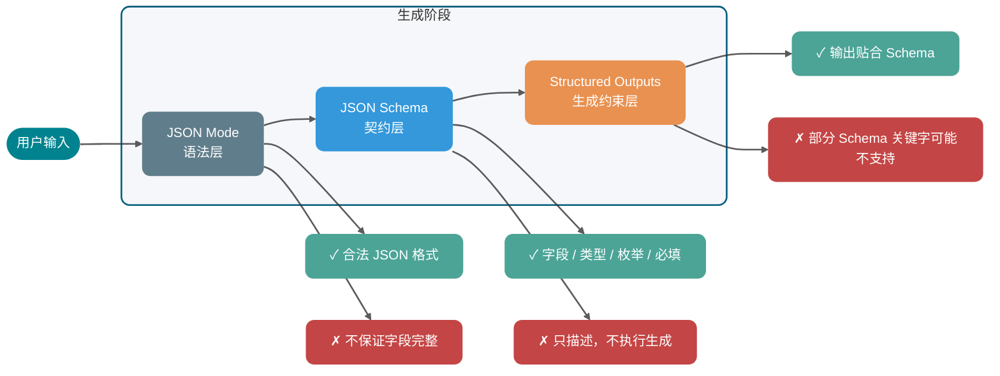

## ⭐️ Function Calling 到底调用了什么？

Function Calling 这个名字很容易误导新人。很多人以为“模型调用函数”，好像模型真的执行了你的 Java 方法。

不是。

模型没有直接执行你的后端代码。它做的是：根据用户问题和工具描述，生成一个结构化的工具调用意图。真正执行工具的是你的业务服务、Agent Runtime、MCP Host 或供应商托管环境。

### 模型生成的是调用意图

一个典型工具调用链路如下：


拆成工程步骤就是：

1. **服务端注册工具定义**：包括工具名、用途描述、参数 Schema。
2. **用户发起请求**：比如“帮我查一下订单 1029384756 到哪了”。
3. **模型选择工具**：模型判断需要调用 `query_order`，并生成参数 `{"orderId": "1029384756"}`。
4. **业务侧校验参数**：校验类型、必填、权限、订单归属、幂等键等。
5. **业务侧执行工具**：调用订单系统、数据库或 HTTP API。
6. **工具结果回填模型**：把查询结果作为 tool result 发回模型。
7. **模型生成最终回答**：模型把结构化结果转成人类能理解的回复。

Anthropic 官方文档对这个链路讲得很直白：Claude 会根据用户请求和工具描述决定是否调用工具，并返回结构化调用；客户端工具由你的应用执行，然后你把 `tool_result` 发回去。Gemini 官方文档也强调，Function Calling 会让模型决定要调用哪个函数并提供参数，真正调用实际函数的动作在应用侧完成。

### 为什么需要工具调用意图？

因为自然语言输入和后端 API 之间隔着一层语义鸿沟。

用户会说：

```text
我昨天买的那台咖啡机还没发货，帮我查下。
```

后端 API 需要的是：

```json
{
  "userId": "U10086",
  "orderId": "O202605070001",
  "includeLogistics": true
}
```

Function Calling 的价值，就是让模型完成“自然语言意图 → 结构化参数”的映射。但它只负责映射，不负责替你绕过权限、查数据库、扣库存、发短信。

高频盲区：工具调用不是“让模型无所不能”的魔法，它只是把模型擅长的语义理解和程序擅长的确定性执行连接起来。

## Function Calling、MCP Tool、HTTP API、Agent Skill 应该怎么分层？

这一节是面试高频题。Guide 建议用“层次”来讲，不要把它们放在同一层比较。

### 先看它们分别解决哪层问题

| 能力                             | 本质定位                     | 解决的问题                     | 谁来执行                 | 典型边界             |
| -------------------------------- | ---------------------------- | ------------------------------ | ------------------------ | -------------------- |
| JSON Mode                        | 输出格式开关                 | 让模型输出合法 JSON            | 模型侧生成               | 不保证字段和业务语义 |
| JSON Schema / Structured Outputs | 数据契约与结构化生成         | 让输出或工具参数符合结构       | 模型侧生成 + 服务端校验  | 不负责外部系统调用   |
| Function Calling / Tool Calling  | 模型到工具的调用意图生成机制 | 自然语言转工具名和参数         | 通常由业务侧或供应商执行 | 不等于 API 本身      |
| MCP                              | 工具和上下文接入协议         | 标准化工具发现、调用、资源访问 | MCP Client / Server 协作 | 不替代模型推理能力   |
| 普通 HTTP API                    | 业务服务接口                 | 确定性业务读写                 | 后端服务                 | 不理解自然语言       |
| Agent Skill                      | 可复用任务说明和执行 SOP     | 复杂任务的流程编排和上下文注入 | Agent 按说明执行         | 不一定包含工具调用   |

### Function Calling 如何映射到 HTTP API？

普通 HTTP API 是后端系统的确定性接口。例如：

```http
GET /api/orders/O202605070001
```

Function Calling 是模型输出的调用意图。例如：

```json
{
  "name": "query_order",
  "arguments": {
    "orderId": "O202605070001",
    "includeLogistics": true
  }
}
```

两者之间通常需要一个工具执行层做映射：

```text
模型工具调用 query_order → 服务端校验参数 → 调用 GET /api/orders/{orderId}
```

所以，Function Calling 可以包一层 HTTP API，但 HTTP API 本身不是 Function Calling。

### MCP Tool 解决的是哪一层标准化？

Function Calling 是模型供应商侧的工具调用机制，各家的请求和响应格式会有差异。

MCP Tool 是 MCP 协议里的工具能力。根据 MCP 官方规范，MCP 允许 Server 暴露可由语言模型调用的工具，工具包含名称和描述其 Schema 的元数据；MCP 客户端与服务器之间的消息遵循 JSON-RPC 2.0。

换句话说：

- **Function Calling 解决模型如何表达“我要调用哪个工具、参数是什么”**。
- **MCP 解决工具如何被标准化发现、描述、调用和返回结果**。

一个支持 MCP 的 Agent Runtime，可以先通过 MCP 发现工具，再把这些工具定义转换成某个模型供应商的 Function Calling 格式传给模型。模型选择工具后，Runtime 再把调用转成 MCP 的 `tools/call` 请求。

### Agent Skill 为什么不是 Function Calling 的语法糖？

Skills 更像“任务说明书”，核心是上下文注入和流程编排。

比如一个“线上事故复盘 Skill”可能写着：

1. 先读取事故时间线。
2. 再查询监控截图。
3. 再拉取发布记录。
4. 最后按“现象、影响、根因、改进项”输出。

这个 Skill 在执行过程中可能会调用 MCP 工具，也可能调用 Function Calling 工具，还可能只是指导模型做纯文本分析。它不是 Function Calling 的语法糖。

一句话总结：Function Calling 是底层“神经信号”，MCP 是工具接入“接口标准”，HTTP API 是业务系统“确定性能力”，Skill 是上层“执行说明书”。

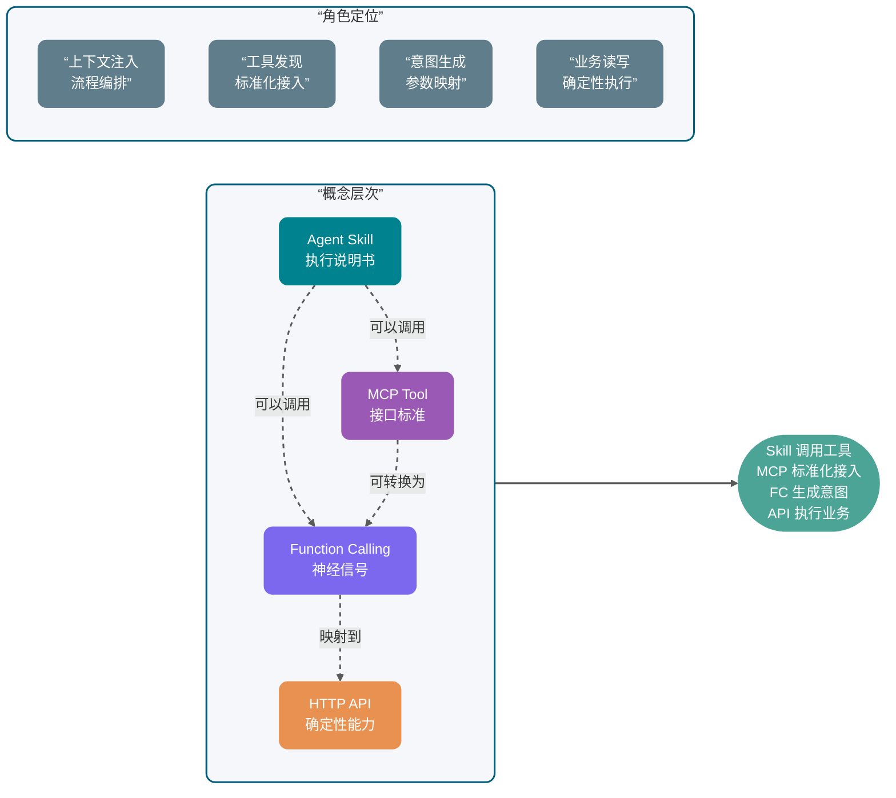

## 什么时候该用 Structured Outputs，什么时候该上工具？

上面已经拆过层次，这里换成工程选型视角：你到底应该只要结构化结果，还是应该让模型选择工具并触发外部系统？

| 维度             | JSON Mode               | JSON Schema / Structured Outputs    | Function Calling / Tool Calling    | MCP                                                          |
| ---------------- | ----------------------- | ----------------------------------- | ---------------------------------- | ------------------------------------------------------------ |
| 所在层次         | 模型输出格式层          | 数据契约与生成约束层                | 模型工具意图层                     | 应用协议层                                                   |
| 输入给模型的内容 | “输出 JSON”的模式开关 | Schema 或响应格式定义               | 工具名、工具描述、参数 Schema      | 通常由 Host 转换后给模型，协议本身在 Client 和 Server 间通信 |
| 模型输出         | JSON 文本               | 符合 Schema 的 JSON 或结构化对象    | 工具名 + 参数，或最终回答          | 不直接规定模型输出，规定 MCP 消息                            |
| 是否调用外部系统 | 否                      | 否                                  | 生成调用意图，执行在外部           | 是，MCP Client 调 MCP Server                                 |
| 是否跨模型标准化 | 各厂商实现不同          | Schema 标准相对通用，但支持子集不同 | 各厂商格式不同                     | 目标是标准化工具和上下文接入                                 |
| 适合场景         | 简单结构化文本          | 数据抽取、分类、参数生成            | 订单查询、发邮件、查库存等工具任务 | 多工具、多客户端、团队共享工具生态                           |
| 主要风险         | 合法 JSON 但字段不对    | Schema 太复杂或支持不一致           | 工具误调用、参数越权               | Server 权限、安全边界、协议兼容                              |

实战倾向：

- 只做轻量数据抽取，可以先用 Structured Outputs。
- 需要读写业务系统，优先考虑 Function Calling / Tool Calling。
- 工具很多、客户端很多、希望跨 IDE 或跨 Agent 复用，考虑 MCP。
- 复杂任务有一套固定 SOP，考虑 Skill，把工具组合和决策过程沉淀下来。

## ⭐️ 结构化输出怎么工程化落地？

结构化输出不是“加一个 Schema 参数”就完事了。生产环境要考虑 Schema 设计、版本兼容、失败处理、日志和降级。

### 1. Schema 设计：一个字段只表达一件事

坏设计：

```json
{
  "result": "支付问题，高优先级，需要人工处理"
}
```

好设计：

```json
{
  "category": "PAYMENT",
  "priority": "HIGH",
  "needManualReview": true,
  "reason": "用户已支付但订单状态未同步"
}
```

字段越原子，后端越容易校验、统计、路由和灰度。

### 2. 字段说明要写“何时用”和“何时不用”

很多工具误调用，根源并不在模型推理能力，而在字段描述太模糊。

比如：

```json
{
  "category": {
    "type": "string",
    "description": "工单分类"
  }
}
```

这几乎没用。更好的写法是：

```json
{
  "category": {
    "type": "string",
    "enum": ["PAYMENT", "LOGISTICS", "AFTER_SALE", "ACCOUNT", "NEED_MORE_INFO"],
    "description": "工单分类。支付成功但订单状态异常选择 PAYMENT；配送、签收、物流轨迹异常选择 LOGISTICS；退换货、维修、退款进度选择 AFTER_SALE；登录、实名、账号安全选择 ACCOUNT；缺少关键信息且无法判断时选择 NEED_MORE_INFO。"
  }
}
```

工具描述的核心不在长度，而在**边界清楚**。

### 3. 枚举优先于自由文本

分类、状态、动作类型、风险等级，能用 `enum` 就不要用自由文本。

自由文本的问题是不可控：

```json
{
  "priority": "urgent"
}
```

后端到底把 `urgent` 当成 `HIGH`，还是当成非法值？如果你在服务端做模糊映射，就相当于把模型的不确定性扩散到了业务规则里。

### 4. 必填字段要谨慎，但不要偷懒

OpenAI Function Calling 严格模式文档要求对象参数设置 `additionalProperties: false`，并将 `properties` 中字段都标为 `required`。这类约束能提升参数结构稳定性，但工程上要注意一个点：如果某个字段业务上确实可缺失，不要让模型随便编。

常见做法有两种：

- 用 `null` 明确表达未知，例如 `"refundId": null`。
- 用状态字段表达缺信息，例如 `"status": "NEED_MORE_INFO"`。

不要让字段缺失成为“未知”的表达方式。缺失字段对后端来说通常是异常，不是业务状态。

### 5. 版本兼容：Schema 也要有版本号

结构化输出一旦被多个服务消费，就会进入接口治理问题。

建议在 Schema 中增加版本字段：

```json
{
  "schemaVersion": "ticket_classification_v1",
  "category": "PAYMENT",
  "priority": "HIGH",
  "confidence": 0.91,
  "reason": "用户已支付但订单状态未同步"
}
```

版本兼容的基本原则：

- 新增字段尽量只做可选扩展，避免破坏旧消费者。
- 删除字段要先灰度，确认下游没有依赖。
- 枚举新增要谨慎，因为旧系统可能不认识新枚举。
- Prompt、Schema、解析代码、看板指标要一起版本化。

结构化输出不是一段 Prompt，它是接口契约。

### 6. 校验失败重试：让模型修正具体错误

不要一失败就把原始问题重跑一遍。更好的做法是把校验错误反馈给模型，让它只修结构。

例如服务端发现：

```text
$.priority: must be one of LOW, MEDIUM, HIGH
$.confidence: must be number
```

下一轮可以给模型：

```text
上一次输出没有通过 JSON Schema 校验，请只返回修正后的 JSON，不要添加解释。

校验错误：
1. priority 必须是 LOW、MEDIUM、HIGH 之一。
2. confidence 必须是 number。

原始输出：
{...}
```

重试策略建议：

- 最多重试 1 到 2 次。
- 每次重试都带上明确的校验错误。
- 重试仍失败时进入降级逻辑。
- 所有失败样本写入日志，后续用于优化 Schema 和 Prompt。

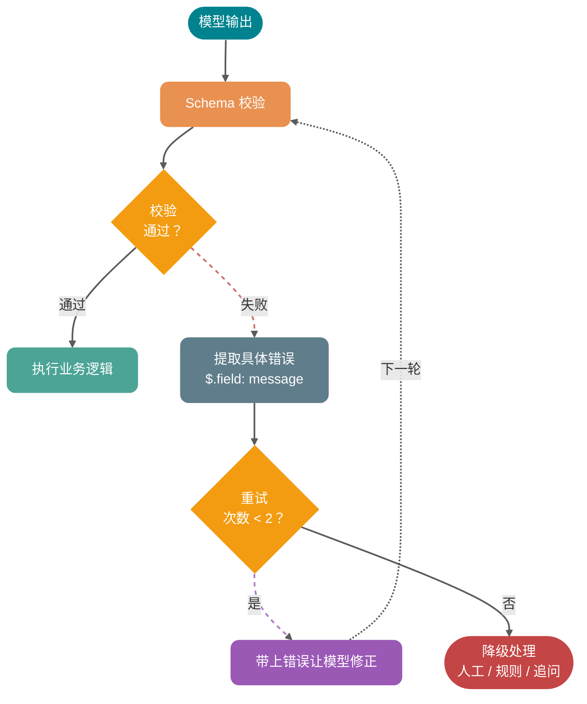

### 7. 降级策略：别让一个 JSON 拖垮主流程

生产环境必须回答一个问题：结构化输出失败时，业务怎么办？

常见降级策略：

| 场景             | 降级策略                               |
| ---------------- | -------------------------------------- |
| 工单分类失败     | 进入人工队列，标记 `AI_PARSE_FAILED` |
| 订单查询参数缺失 | 追问用户补充订单号                     |
| 风险评分失败     | 使用规则引擎兜底评分                   |
| 工具调用超时     | 返回“系统繁忙”，不继续让模型猜       |
| 非关键字段缺失   | 使用默认值，但记录告警                 |

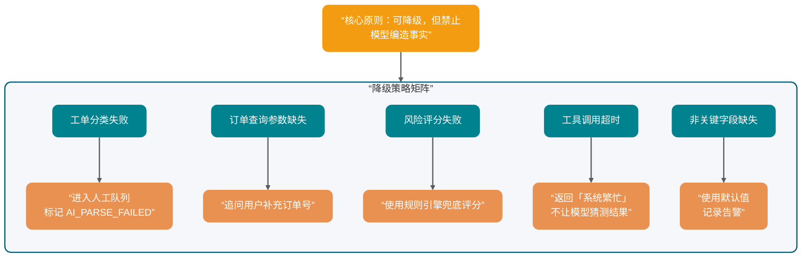

关键原则：**可以降级，但不能让模型编造业务事实**。

## ⭐️ 工具调用安全怎么保证？

Function Calling 里最危险的部分，往往发生在你拿着模型生成的 JSON 去操作真实系统时。

查订单还好，发退款、删数据、发短信、执行 SQL 就完全不是一个风险等级。

### 1. 参数校验：Schema 校验只是第一层

Schema 能检查类型和结构，但检查不了业务权限。

比如：

```json
{
  "orderId": "O202605070001"
}
```

Schema 只能知道这是一个字符串。它不知道这个订单是不是当前用户的，也不知道订单是否已经退款，更不知道这个用户是否有客服权限。

服务端至少要做三层校验：

- **结构校验**：类型、必填、枚举、长度、格式。
- **业务校验**：订单归属、状态流转、库存、金额范围。
- **权限校验**：用户身份、角色、租户、数据范围。

### 2. 权限控制：工具不是谁都能调

不要把内部管理工具直接暴露给所有用户场景。

建议按风险等级分层：

| 风险等级 | 工具类型                     | 控制策略                       |
| -------- | ---------------------------- | ------------------------------ |
| 低风险   | 查询天气、读取公开文档       | 基础限流和日志                 |
| 中风险   | 查询订单、查询用户资料       | 身份校验、数据范围校验         |
| 高风险   | 退款、发券、改地址、发短信   | 权限校验、二次确认、审计       |
| 极高风险 | 删除数据、执行 SQL、批量操作 | 默认禁止，走人工审批或专用后台 |

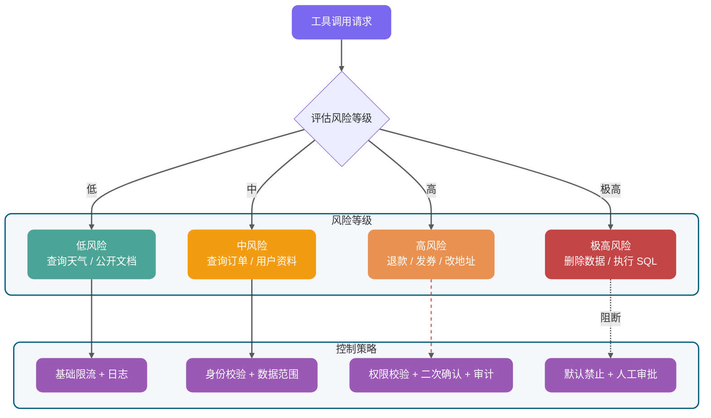

### 3. 敏感操作二次确认

模型可以建议退款，但不应该直接替用户退款，除非业务明确允许。

高风险工具可以拆成两步：

1. `prepare_refund`：生成退款预案，返回金额、原因、影响。
2. `confirm_refund`：用户或客服确认后执行。

这样做的好处是：模型负责整理信息和建议动作，人类或业务规则负责最后确认。

### 4. 幂等：别让重试变成重复扣款

工具调用链路里会有重试：模型重试、网络重试、队列重试、业务服务重试。

涉及写操作时必须设计幂等：

- 请求携带 `idempotencyKey`。
- 数据库建立唯一约束。
- 外部支付、退款接口使用幂等号。
- 重复请求返回同一结果，而不是重复执行。

如果一个工具不能安全重试，它就不应该被 Agent 随意调用。

### 5. 审计日志：记录模型意图和执行结果

建议记录：

- 用户输入。
- 命中的工具名。
- 模型生成的参数。
- 服务端校验结果。
- 真实执行的业务请求。
- 工具返回结果。
- 最终回复。
- traceId、userId、tenantId、schemaVersion、model。

出了问题，你才能回答：“模型想做什么？服务端允许了什么？业务系统实际做了什么？”

### 6. 超时和重试：工具失败要短路

工具超时后，不要让模型继续基于空结果编回答。

建议：

- 查询类工具设置较短超时。
- 写操作谨慎重试，必须配幂等。
- 外部依赖失败时返回明确错误码。
- 模型拿到工具错误后，只能解释“当前无法完成”，不能猜测结果。

## Java 后端示例：把订单查询做成可校验工具

下面用一个订单查询工具做完整示例。场景是：用户用自然语言询问订单状态，模型通过 Function Calling 生成 `query_order` 工具调用，Java 服务端校验参数后分发到订单服务。

### 工具参数 JSON Schema

```json
{
  "$schema": "https://json-schema.org/draft/2020-12/schema",
  "type": "object",
  "properties": {
    "schemaVersion": {
      "type": "string",
      "const": "query_order_v1",
      "description": "工具参数版本，当前固定为 query_order_v1。"
    },
    "orderId": {
      "type": "string",
      "pattern": "^O[0-9]{12,20}$",
      "description": "订单号，以大写字母 O 开头，后面跟 12 到 20 位数字。"
    },
    "includeLogistics": {
      "type": "boolean",
      "description": "是否需要返回物流信息。用户询问发货、配送、签收、快递时为 true。"
    },
    "idempotencyKey": {
      "type": "string",
      "minLength": 16,
      "maxLength": 80,
      "description": "本次工具调用的幂等键，由服务端或 Agent Runtime 生成。"
    }
  },
  "required": [
    "schemaVersion",
    "orderId",
    "includeLogistics",
    "idempotencyKey"
  ],
  "additionalProperties": false
}
```

这个 Schema 有几个刻意设计：

- `schemaVersion` 固定版本，后续方便兼容。
- `orderId` 用 `pattern` 做基础格式约束。
- `includeLogistics` 用布尔值，避免模型输出 `"yes"`、`"需要"` 这类自由文本。
- `idempotencyKey` 即使当前只是查询，也先保留，后续扩展写操作时不用重构调用链路。
- `additionalProperties: false` 防止模型偷偷塞入服务端不认识的字段。

### Java 服务端校验与分发

下面示例使用 Jackson 解析 JSON，使用 JSON Schema Validator 做结构校验。真实项目中，依赖版本建议跟随项目 BOM 或安全扫描结果统一管理。

```java
package cn.javaguide.ai.tool;

import com.fasterxml.jackson.databind.JsonNode;
import com.fasterxml.jackson.databind.ObjectMapper;
import com.networknt.schema.JsonSchema;
import com.networknt.schema.JsonSchemaFactory;
import com.networknt.schema.SpecVersion;
import com.networknt.schema.ValidationMessage;

import java.math.BigDecimal;
import java.time.Instant;
import java.util.Map;
import java.util.Set;

public class ToolCallDispatcher {

    private static final ObjectMapper OBJECT_MAPPER = new ObjectMapper();

    private static final String QUERY_ORDER_SCHEMA = """
            {
              "$schema": "https://json-schema.org/draft/2020-12/schema",
              "type": "object",
              "properties": {
                "schemaVersion": {
                  "type": "string",
                  "const": "query_order_v1"
                },
                "orderId": {
                  "type": "string",
                  "pattern": "^O[0-9]{12,20}$"
                },
                "includeLogistics": {
                  "type": "boolean"
                },
                "idempotencyKey": {
                  "type": "string",
                  "minLength": 16,
                  "maxLength": 80
                }
              },
              "required": ["schemaVersion", "orderId", "includeLogistics", "idempotencyKey"],
              "additionalProperties": false
            }
            """;

    private final JsonSchema queryOrderSchema;
    private final OrderService orderService;
    private final PermissionService permissionService;
    private final AuditLogService auditLogService;

    public ToolCallDispatcher(
            OrderService orderService,
            PermissionService permissionService,
            AuditLogService auditLogService
    ) {
        JsonSchemaFactory factory = JsonSchemaFactory.getInstance(SpecVersion.VersionFlag.V202012);
        this.queryOrderSchema = factory.getSchema(QUERY_ORDER_SCHEMA);
        this.orderService = orderService;
        this.permissionService = permissionService;
        this.auditLogService = auditLogService;
    }

    public ToolResult dispatch(ToolCall toolCall, UserContext userContext) {
        Instant startedAt = Instant.now();

        try {
            ToolResult result = switch (toolCall.name()) {
                case "query_order" -> handleQueryOrder(toolCall.argumentsJson(), userContext);
                default -> ToolResult.failed("UNSUPPORTED_TOOL", "不支持的工具：" + toolCall.name());
            };

            auditLogService.record(AuditEvent.success(
                    userContext.userId(),
                    toolCall.name(),
                    toolCall.argumentsJson(),
                    result.code(),
                    startedAt
            ));
            return result;
        } catch (Exception ex) {
            auditLogService.record(AuditEvent.failed(
                    userContext.userId(),
                    toolCall.name(),
                    toolCall.argumentsJson(),
                    ex.getClass().getSimpleName(),
                    startedAt
            ));
            return ToolResult.failed("TOOL_EXECUTION_FAILED", "工具执行失败，请稍后重试。");
        }
    }

    private ToolResult handleQueryOrder(String argumentsJson, UserContext userContext) throws Exception {
        JsonNode arguments = OBJECT_MAPPER.readTree(argumentsJson);

        Set<ValidationMessage> errors = queryOrderSchema.validate(arguments);
        if (!errors.isEmpty()) {
            return ToolResult.failed("INVALID_ARGUMENTS", formatValidationErrors(errors));
        }

        QueryOrderArgs args = OBJECT_MAPPER.treeToValue(arguments, QueryOrderArgs.class);

        if (!permissionService.canReadOrder(userContext.userId(), args.orderId())) {
            return ToolResult.failed("FORBIDDEN", "当前用户无权查询该订单。");
        }

        OrderView order = orderService.queryOrder(args.orderId(), args.includeLogistics());
        if (order == null) {
            return ToolResult.failed("ORDER_NOT_FOUND", "未查询到该订单。");
        }

        return ToolResult.success(Map.of(
                "orderId", order.orderId(),
                "status", order.status(),
                "amount", order.amount(),
                "paidAt", order.paidAt(),
                "logistics", order.logistics()
        ));
    }

    private String formatValidationErrors(Set<ValidationMessage> errors) {
        return errors.stream()
                .map(ValidationMessage::getMessage)
                .sorted()
                .reduce((left, right) -> left + "；" + right)
                .orElse("参数不符合 Schema。");
    }

    public record ToolCall(String name, String argumentsJson) {
    }

    public record QueryOrderArgs(
            String schemaVersion,
            String orderId,
            boolean includeLogistics,
            String idempotencyKey
    ) {
    }

    public record UserContext(String userId, String tenantId) {
    }

    public record OrderView(
            String orderId,
            String status,
            BigDecimal amount,
            String paidAt,
            Object logistics
    ) {
    }

    public record ToolResult(boolean success, String code, Object data, String message) {
        public static ToolResult success(Object data) {
            return new ToolResult(true, "OK", data, "");
        }

        public static ToolResult failed(String code, String message) {
            return new ToolResult(false, code, null, message);
        }
    }

    public interface OrderService {
        OrderView queryOrder(String orderId, boolean includeLogistics);
    }

    public interface PermissionService {
        boolean canReadOrder(String userId, String orderId);
    }

    public interface AuditLogService {
        void record(AuditEvent event);
    }

    public record AuditEvent(
            String userId,
            String toolName,
            String argumentsJson,
            String resultCode,
            boolean success,
            Instant startedAt
    ) {
        public static AuditEvent success(
                String userId,
                String toolName,
                String argumentsJson,
                String resultCode,
                Instant startedAt
        ) {
            return new AuditEvent(userId, toolName, argumentsJson, resultCode, true, startedAt);
        }

        public static AuditEvent failed(
                String userId,
                String toolName,
                String argumentsJson,
                String resultCode,
                Instant startedAt
        ) {
            return new AuditEvent(userId, toolName, argumentsJson, resultCode, false, startedAt);
        }
    }
}
```

这段代码重点不在某个库的用法，而在后端工具执行层的基本姿势：

1. **先按工具名分发**，未知工具直接拒绝。
2. **先做 JSON Schema 校验**，再反序列化成业务参数。
3. **再做权限校验**，确认当前用户能访问该订单。
4. **工具返回结构化结果**，让模型基于事实生成回答。
5. **全链路审计**，把模型意图、参数和执行结果都记下来。

如果你把模型输出的参数直接传给订单服务，等于把业务系统的入口暴露给一个概率模型。

## 上线前应该检查哪些工程细节？

结构化输出上线前，Guide 建议按下面这份清单过一遍。

### Schema 层

- 字段是否足够原子？
- 枚举是否覆盖“信息不足”“无需操作”等状态？
- `required` 是否明确？
- `additionalProperties` 是否关闭？
- 字段描述是否说明了使用边界？
- 是否有 `schemaVersion`？

### 模型调用层

- 是否使用供应商原生 Structured Outputs 或严格工具调用能力？
- 是否控制输出长度，避免 JSON 被截断？
- 是否避免在结构化输出任务里使用过高的采样随机性？
- 是否为校验失败设计重试 Prompt？

### 服务端执行层

- 是否做 Schema 校验？
- 是否做业务校验和权限校验？
- 写操作是否幂等？
- 高风险操作是否二次确认？
- 工具超时后是否短路？
- 是否有审计日志和 traceId？

### 降级层

- 解析失败是否进入人工队列或规则兜底？
- 工具失败时是否禁止模型编造结果？
- 是否统计失败率、错误类型和高频非法枚举？
- 是否能根据失败样本反推 Schema 和 Prompt 的改进点？

## 常见误区

### 误区 1：Temperature 设为 0 就一定稳定

低 Temperature 能减少随机性，但不能替代 Schema。上下文过长、指令冲突、输出截断、工具描述模糊时，结构化输出仍然会失败。

### 误区 2：用了 Structured Outputs 就不用校验

不行。供应商能力降低的是生成阶段出错概率，不代表服务端可以放弃边界。你仍然需要防御非法参数、越权访问、重放请求和业务状态冲突。

### 误区 3：Schema 越复杂越好

复杂 Schema 会增加模型理解和供应商兼容成本。实践中建议从稳定字段开始，少用复杂组合关键字，把核心字段、枚举、必填和额外字段限制先做好。

### 误区 4：工具越多 Agent 越强

工具越多，模型选择空间越大，误调用概率也会上升。工具设计要小而清晰，大而全的工具最容易让 Agent 犯迷糊。

### 误区 5：Function Calling 可以绕过业务权限

Function Calling 只是参数生成机制。权限控制必须在服务端，不能藏在 Prompt 里。Prompt 里的“不要越权查询”只能算提醒，不能算安全边界。

## 面试问题

### 1. 为什么只写“请返回 JSON”不可靠

因为这只是自然语言约束，不是工程契约。模型可能输出额外解释文本、漏字段、类型错误、生成未知枚举，或者在复杂上下文里忘记格式要求。生产环境要结合 JSON Schema、原生 Structured Outputs、服务端校验、失败重试和降级策略。

### 2. JSON Mode 和 Structured Outputs 有什么区别

JSON Mode 主要保证输出是合法 JSON，不保证符合业务 Schema。Structured Outputs 会把 Schema 接入生成链路，让输出按供应商支持范围贴合字段、类型、枚举、必填等约束。即使用了 Structured Outputs，服务端仍要校验。

### 3. JSON Schema 在大模型应用里解决什么问题

它把“输出应该长什么样”变成可校验的数据契约。常用能力包括 `properties`、`required`、`enum`、`additionalProperties`、`pattern`、`minimum`、`maximum` 等。它既能给模型提供结构化约束，也能给服务端做兜底校验。

### 4. Function Calling 的完整链路是什么

服务端先注册工具定义，模型根据用户请求生成工具名和参数，业务侧校验参数并执行真实工具，再把工具结果回填给模型，模型基于结果生成最终回答。模型不直接执行函数，执行权在业务侧或供应商托管工具侧。

### 5. Function Calling 和 MCP 有什么区别

Function Calling 是模型侧的工具调用意图生成机制，重点是“自然语言如何变成工具名和参数”。MCP 是应用层协议，重点是“工具如何被标准化发现、描述、调用和返回结果”。MCP 可以承载工具生态，Function Calling 可以作为模型选择 MCP 工具时的底层能力之一。

### 6. MCP Tool 和普通 HTTP API 有什么关系

HTTP API 是业务服务接口，通常面向程序调用；MCP Tool 是暴露给 AI Host 的标准化工具能力，可以在内部再调用 HTTP API、数据库或本地脚本。MCP 解决接入标准化，HTTP API 解决具体业务能力。

### 7. Agent Skill 和 Function Calling 是一回事吗

不是。Skill 是可复用的任务说明和执行 SOP，核心是上下文注入和流程编排。Function Calling 是底层工具调用机制。一个 Skill 可以指导 Agent 调用多个 Function Calling 工具或 MCP 工具，也可以完全不调用工具。

### 8. 结构化输出失败后怎么处理

先用服务端校验器拿到具体错误，再把错误反馈给模型做有限重试。重试仍失败时进入降级：人工队列、规则引擎兜底、追问用户补信息或返回明确失败。不要让模型在没有事实依据时继续编答案。

### 9. 工具调用为什么必须做安全治理

因为工具调用会操作真实系统。参数合法不代表业务合法，模型生成的 `orderId` 也不代表当前用户有权访问。必须做参数校验、权限控制、敏感操作二次确认、幂等、审计日志、超时和重试控制。

### 10. 面试里怎么一句话概括结构化输出

结构化输出的本质，是把大模型从“生成给人看的文本”收敛成“生成给程序消费的数据契约”；Function Calling 则是在这个契约之上，把自然语言意图转换成可校验、可执行、可审计的工具调用。

## 总结

1. **“请返回 JSON”只是提示，不是契约**。它挡不住格式漂移、字段缺失、类型错误和边界条件崩溃。
2. **JSON Mode、JSON Schema、Structured Outputs 分别在不同层次工作**：语法、契约、生成约束，不能混为一谈。
3. **Function Calling 不执行函数**。模型生成的是工具调用意图，执行、校验、权限和审计都在业务侧。
4. **MCP 和 Function Calling 不冲突**。MCP 标准化工具接入，Function Calling 帮模型选择工具并生成参数。
5. **服务端校验永远不能省**。Schema 校验、业务校验、权限校验、幂等和审计日志，是结构化输出进入生产环境的底线。
6. **结构化输出是上下文工程的一部分**。它决定模型输出能否进入后续链路，也决定 Agent 能不能稳定调用工具。
