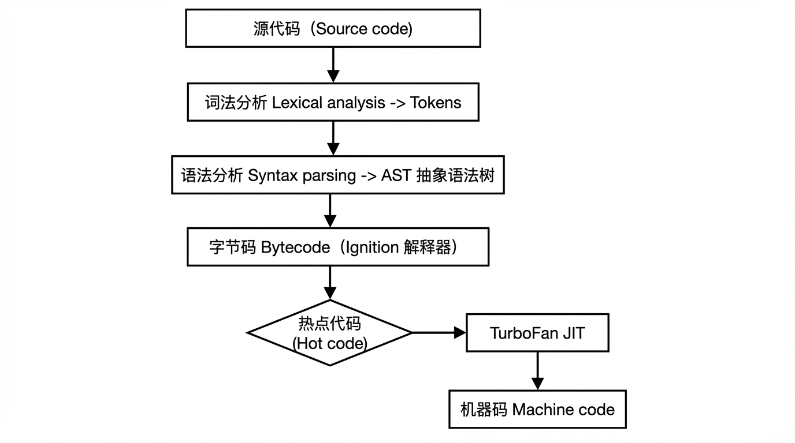
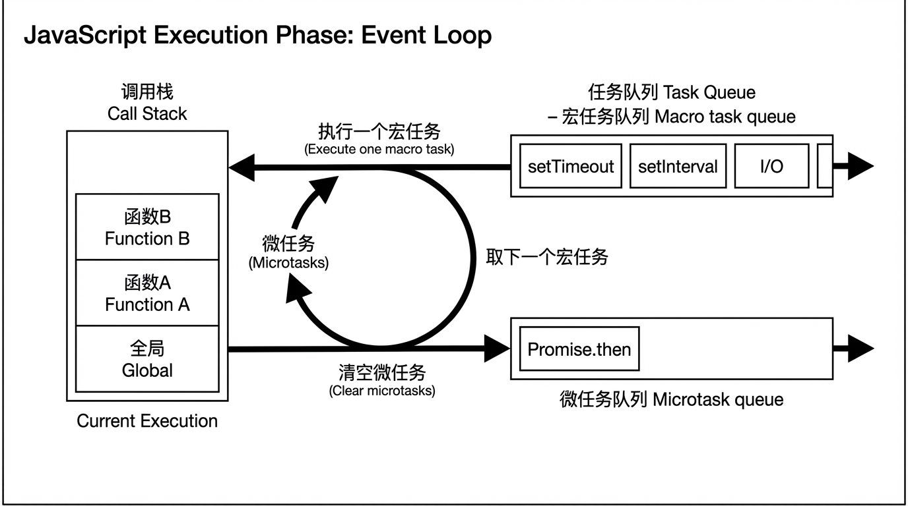

# JavaScript

### JavaScript 文件的执行流程

JavaScript 文件的处理可分为**编译阶段**和**执行阶段**两部分。以下内容整理自公开文档与规范，文末标注信息来源。

---

#### 一、编译阶段

编译阶段将**源代码**转换为引擎可执行或可解释的**内部表示**，主要包括解析与（可选）字节码/机器码生成。

**1.1 引擎与宿主环境**

JavaScript 的执行需要 **JavaScript 引擎** 与 **宿主环境** 两者配合：

- **JavaScript 引擎**：实现 ECMAScript 语言核心，负责对源代码进行**解析（parse）**并**执行**。
- **宿主环境**：提供与外界交互、安全与性能等机制（如浏览器中的 HTML DOM、Node.js 等）。

**1.2 词法分析（分词）**

- 将源码**从左到右**扫描，拆成最小语法单元 **token**（如关键字、标识符、运算符、字面量、括号等）。
- 会忽略注释与不必要的空白，并识别换行、控制字符等。

**1.3 语法分析（解析）**

- 根据语法规则，将 token 序列组合成**抽象语法树（AST）**等内部结构。
- 若存在语法错误，会在此阶段报错。

**1.4 字节码与 JIT（现代引擎，如 V8）**

- **字节码**：AST 可被进一步转换为**字节码**，由解释器（如 V8 的 Ignition）逐条执行，占用内存比机器码小。
- **JIT**：对**热点代码**（频繁执行的代码），引擎会将其编译为**机器码**（如 V8 的 TurboFan），提高执行速度。这种“解释 + 即时编译”的方式兼顾启动速度与运行性能。



*图：编译阶段大致流程（源代码 → 词法分析 → Token → 语法分析 → AST → 字节码 → 可选 JIT 机器码）*

---

#### 二、执行阶段

执行阶段在**单线程**下进行，依赖**调用栈**和**事件循环（作业队列）**，逐条执行代码并处理异步回调。

**2.1 代理（Agent）与执行设施**

在规范中，每个**自主执行 JavaScript 的实体**称为一个 **agent**，它维护：

| 设施 | 作用 |
|------|------|
| **栈（执行上下文栈）** | 即“调用栈”，通过压入/弹出执行上下文（如函数调用）转移控制流，后进先出（LIFO）。 |
| **作业队列（Event loop）** | 存放待执行的 job，单线程下实现异步；一般先进先出（FIFO）。 |
| **堆（Heap）** | 存放对象的 memory 区域。 |

每个 **job** 开始时会压入执行上下文，**调用栈清空**时该 job 视为完成，再从队列取下一个 job。

**2.2 执行上下文（栈帧）**

**执行上下文**是执行的最小单位（常称作栈帧），用于记录：

- **绑定（Bindings）**：如 `this`，以及 `var` / `let` / `const` / `function` / `class` 声明的变量、私有标识符等。
- 返回地址等控制信息。

每次函数调用会**压入**新的执行上下文，返回时**弹出**。生成器（generator）会挂起并保存执行上下文，以便之后恢复。

**2.3 作业队列与事件循环**

- 执行时，从**作业队列**中取出一个 **job** 并执行；执行过程中可能产生新的 job，会追加到队列末尾。
- 作业也可由平台机制添加（定时器、I/O、DOM 事件等）。
- 当一个 job 的**调用栈被清空**时，该 job 完成，再取下一个 job。
- 在 HTML 中，作业分为 **task（宏任务）** 与 **microtask（微任务）**：
  - **微任务**优先级更高：当前宏任务执行完后，会**先清空微任务队列**，再取下一个宏任务。
  - 常见**宏任务**：整体 script、setTimeout、setInterval、I/O、UI 渲染。
  - 常见**微任务**：Promise.then / catch / finally、queueMicrotask、MutationObserver。

**“执行至完成”（Run-to-completion）**：每个 job 会完整执行完毕才执行下一个 job，因此正在执行的函数不会被抢占。若某个 job 执行过久，会阻塞 UI 等，应避免。

**永不阻塞**：通过事件与回调处理 I/O，等待异步结果时仍可处理其他工作。注意：`alert()`、同步 XHR 等会阻塞，应避免使用。



*图：执行阶段示意（调用栈 + 宏任务队列 + 微任务队列）*

**2.4 脚本作为作业执行**

在浏览器中，每个 **`<script>` 的加载与执行**会作为**任务**参与事件循环。脚本经解析、编译后，其**顶层代码**作为 job 执行：同步代码顺序执行，产生的异步回调（如 `setTimeout`、`Promise.then`）会作为新的 task 或 microtask 入队，按事件循环规则在后续执行。

---

#### **三、补充：同步 / 异步与宏任务 / 微任务示例**

- **同步任务**：进入主线程后顺序执行，直到当前 job 结束。
- **异步任务**：在满足条件后（如定时器到时、I/O 完成）被放入**任务队列**，主线程空闲时再被取出执行。
- **执行顺序**：先执行当前宏任务（含整体 script），再**清空当前轮次的所有微任务**，再取下一个宏任务，如此循环。

示例：

```javascript
console.log(1);
setTimeout(() => console.log(2), 0);
new Promise(resolve => resolve()).then(() => console.log(3));
console.log(4);
// 输出顺序：1 → 4 → 3 → 2
```

- `1`、`4` 为同步代码，先执行。
- `then` 回调为微任务，在本轮宏任务结束后、下一个宏任务前执行，故输出 `3`。
- `setTimeout` 回调为宏任务，在下一轮执行，故最后输出 `2`。

---

#### **四、关于 setTimeout 的说明**

“3 秒后执行”更准确的说法是：**3 秒后，回调被放入任务队列**；是否马上执行还取决于**主线程是否空闲**。若主线程一直忙碌（例如执行了 10 秒），该回调可能在实际约 10 秒后才执行。

---

### 基础数据类型

#### number

数字类型，包括整数、小数、`NaN`、`Infinity`。

**常见 API**：`Number()`、`parseInt(s, radix)`、`parseFloat(s)`、`Number.isNaN()`、`Number.isFinite()`、`Number.isInteger()`、`toFixed(n)`、`toPrecision(n)`；`Math` 系列（如 `Math.floor`、`Math.round`、`Math.max`、`Math.random`）。

**开发注意**：浮点运算有精度问题，金额等建议用整数分存储或使用 decimal 库；`NaN !== NaN`，判断用 `Number.isNaN(x)`；大整数超出 `Number.MAX_SAFE_INTEGER` 用 `BigInt`。

**强制转换**：`Number(value)` — `null`→0，`undefined`→NaN，`""`→0，`"  "`→0，`"123"`→123，`true`→1，`false`→0；对象先 `valueOf()` 再 `toString()` 再按字符串规则转。

**常见 API 面试题**（以下整理自 MDN 及常见面试总结，便于记忆与回答）：

- **Number.isNaN() 与全局 isNaN() 的区别**：全局 `isNaN(x)` 会先将参数强制转换为数字再判断是否为 NaN，因此 `isNaN("foo")` 为 `true`（字符串被转成 NaN）；`Number.isNaN(x)` 不做类型转换，只有参数类型为 number 且值为 NaN 时才返回 `true`，故 `Number.isNaN("foo")` 为 `false`。面试中常问“为什么更推荐 Number.isNaN”，答案即：更严格、不产生误判。[MDN - Number.isNaN](https://developer.mozilla.org/zh-CN/docs/Web/JavaScript/Reference/Global_Objects/Number/isNaN)、[MDN - isNaN](https://developer.mozilla.org/zh-CN/docs/Web/JavaScript/Reference/Global_Objects/isNaN)
- **安全整数**：JavaScript 采用 IEEE 754 双精度 64 位，仅当整数在 **-(2⁵³-1) 到 2⁵³-1**（即 `Number.MIN_SAFE_INTEGER` 到 `Number.MAX_SAFE_INTEGER`，约 ±9007199254740991）范围内才能被精确表示；超出可能被舍入。`Number.isSafeInteger(x)` 用于判断是否在该安全范围内；大整数应使用 `BigInt`。[MDN - Number](https://developer.mozilla.org/zh-CN/docs/Web/JavaScript/Reference/Global_Objects/Number)
- **Number.EPSILON**：表示 1 与大于 1 的最小浮点数之差（2⁻⁵²），常用于浮点相等比较时的误差容差（如 `Math.abs(a - b) < Number.EPSILON`）。
- **Number.isFinite() / Number.isInteger()**：`Number.isFinite(x)` 不进行类型转换，只有 x 为有限数字才为 true（`Number.isFinite("1")` 为 false）；`Number.isInteger(x)` 判断是否为整数。

**安全金额处理方法及原因**（内容来源：Stack Overflow、MDN，不编造）：

- **为什么不能直接用 Number 做金额**：JavaScript 只有基于 IEEE 754 的双精度浮点数，很多十进制小数无法用二进制精确表示，例如 `0.1 + 0.2 === 0.3` 为 **false**（结果为 `0.30000000000000004`），整数运算在安全整数范围内是精确的，因此可通过“换算成最小单位再算”或“使用高精度库”避免误差。[Stack Overflow - Precise financial calculation in JavaScript](https://stackoverflow.com/questions/2876536/precise-financial-calculation-in-javascript-what-are-the-gotchas)、[MDN - Number 编码](https://developer.mozilla.org/zh-CN/docs/Web/JavaScript/Reference/Global_Objects/Number#number_%E7%BC%96%E7%A0%81)
- **方法一：按最小单位（整数）存储与计算**：将金额以“分”等最小单位存为整数（如 25.50 元存为 2550），运算全程用整数，仅在展示时再除以 100。这样利用“整数在安全范围内可精确表示”避免浮点误差。注意不同货币最小单位不同（如日元无辅币、部分货币为千分之一单位），需按币种设计。[Stack Overflow 高赞答案：scale by 100, integer arithmetic is exact](https://stackoverflow.com/questions/2876536/precise-financial-calculation-in-javascript-what-are-the-gotchas)
- **方法二：使用高精度十进制库**：使用 **decimal.js**、**bignumber.js**、**big.js** 等任意精度十进制库进行加减乘除，避免二进制浮点表示带来的误差；展示时可用 `toFixed` 等格式化为字符串。此类库在金融、加密货币等场景被广泛推荐。[Stack Overflow 推荐 decimal.js / moneysafe 等](https://stackoverflow.com/questions/2876536/precise-financial-calculation-in-javascript-what-are-the-gotchas)、[npm - decimal.js](https://www.npmjs.com/package/decimal.js)
- **注意**：仅用 `toFixed(n)` 或 `Math.round(x*100)/100` 只能控制展示或单次舍入，不能从根本上解决多次运算的累积误差；金额业务建议要么“整数分存储”，要么“全程用 decimal/BigNumber 库计算”，并注意舍入规则与币种约定。

**常见 Number 面试代码题**（题目与解法整理自前端面试题、BFE.dev、SegmentFault 等，仅作复习用）：

1. **浮点精度**：`0.1 + 0.2 === 0.3` 的输出是？  
   **答案**：`false`。结果为 `0.30000000000000004`，因 IEEE 754 双精度下部分十进制小数无法精确用二进制表示。[BFE.dev - 0.1+0.2](https://bigfrontend.dev/zh/question/js-float-precision)、[vue3js.cn 面试 - 精度丢失](https://vue3js.cn/interview/JavaScript/loss_accuracy.html)

2. **安全整数**：`Math.pow(2, 53) === Math.pow(2, 53) + 1` 的输出是？  
   **答案**：`true`。超过 2⁵³ 的整数无法被精确表示，相邻整数可能相等。面试会问安全整数范围及 `Number.isSafeInteger()`。[SegmentFault - JS数字精度](https://segmentfault.com/a/1190000021684144)

3. **map + parseInt**：`['1','2','3'].map(parseInt)` 的输出是？  
   **答案**：`[1, NaN, NaN]`。`map` 会传入 (元素, 索引, 数组)，即 `parseInt('1',0)`→1，`parseInt('2',1)`→NaN（基数 1 无效），`parseInt('3',2)`→NaN（二进制无 '3'）。正确写法：`['1','2','3'].map(n => parseInt(n, 10))` 或 `.map(Number)`。[BFE.dev - parseInt](https://bigfrontend.dev/zh/quiz/parseInt-II)、[CSDN - map parseInt 陷阱](https://blog.csdn.net/ZYH_5201314/article/details/148481037)

4. **小数展示**：如何让 `1.4000000000000001` 在展示上等于 `1.4`？  
   常见写法：用 `toPrecision` 截断再转回数字（仅适用于展示，不解决运算误差）。  
   ```javascript
   function strip(num, precision = 12) {
     return +parseFloat(num.toPrecision(precision));
   }
   strip(1.4000000000000001) === 1.4; // true
   ```
   [vue3js.cn 面试 - 精度丢失](https://vue3js.cn/interview/JavaScript/loss_accuracy.html)

5. **手写小数加法（整数运算思路）**：不依赖库，实现 0.1 + 0.2 得到 0.3。  
   思路：按小数位数放大为整数，相加后再缩小。  
   ```javascript
   function add(num1, num2) {
     const d1 = (num1.toString().split('.')[1] || '').length;
     const d2 = (num2.toString().split('.')[1] || '').length;
     const base = Math.pow(10, Math.max(d1, d2));
     return (num1 * base + num2 * base) / base;
   }
   add(0.1, 0.2); // 0.3
   ```
   [vue3js.cn 面试 - 精度丢失](https://vue3js.cn/interview/JavaScript/loss_accuracy.html)

#### string
#### string

字符串类型，可用单引号、双引号或模板字符串表示。

**常见 API**：`String()`、`str.length`、`str[i]`/`str.charAt(i)`、`concat`、`slice(start,end)`、`substring`、`substr`（已弃用）、`indexOf`/`lastIndexOf`、`includes`/`startsWith`/`endsWith`、`split`、`trim`/`trimStart`/`trimEnd`、`replace`/`replaceAll`、`toLowerCase`/`toUpperCase`、`padStart`/`padEnd`、`repeat`；正则 `match`/`search`。

**开发注意**：字符串不可变，所有“修改”都返回新字符串；长字符串拼接用数组 `join` 或模板字符串，避免大量 `+`；用户输入做展示前要做转义防 XSS。

**强制转换**：`String(value)` — `null`→`"null"`，`undefined`→`"undefined"`，对象先 `toString()`，没有则 `valueOf()`；`"" + value` 等价于 `String(value)`。

#### boolean

布尔类型，取值为 `true` 或 `false`。

**常见 API**：`Boolean()`；逻辑运算 `!`、`&&`、`||`、`??`；判断类如 `Array.isArray`、`Object.is`。

**开发注意**：条件判断依赖“假值”列表：`false`、`0`、`""`、`null`、`undefined`、`NaN`（以及 document.all 等），其余为真；用 `===` 避免隐式转换；可选链 `?.` 与空值合并 `??` 可简化判空。

**强制转换**：`Boolean(value)` — 假值只有 `false`、`0`、`""`、`null`、`undefined`、`NaN`，其余为 `true`；`!!value` 等价于 `Boolean(value)`。在 `if`、`&&`、`||` 等表达式中会按此规则隐式转换。

**常见 API 的自定义实现**：

- **Boolean(value)**：用假值列表显式判断，避免隐式转换。
  ```javascript
  function myBoolean(value) {
    if (value === false || value === 0 || value === '' || value === null || value === undefined) return false;
    if (typeof value === 'number' && Number.isNaN(value)) return false;
    return true;
  }
  // 或简写：!!value 等价于 Boolean(value)
  ```

- **Object.is(a, b)**：与 `===` 的区别是 `Object.is(NaN, NaN)` 为 `true`，`Object.is(0, -0)` 为 `false`。
  ```javascript
  function myObjectIs(a, b) {
    if (a === b) return a !== 0 || 1 / a === 1 / b; // 区分 +0 与 -0
    return Number.isNaN(a) && Number.isNaN(b);      // NaN === NaN
  }
  ```

- **逻辑与 &&（短路）**：若左边为假值则返回左边，否则返回右边。
  ```javascript
  function myAnd(a, b) {
    return !myBoolean(a) ? a : b;
  }
  ```

- **逻辑或 ||（短路）**：若左边为真值则返回左边，否则返回右边。
  ```javascript
  function myOr(a, b) {
    return myBoolean(a) ? a : b;
  }
  ```

- **空值合并 ??**：仅当左边为 `null` 或 `undefined` 时返回右边，否则返回左边（与 `||` 不同，不把 `0`、`''` 当空）。
  ```javascript
  function myNullish(a, b) {
    return a !== null && a !== undefined ? a : b;
  }
  ```

#### undefined

未定义，变量未赋值时的默认值。

**常见 API**：无专属 API；可用 `typeof x === 'undefined'` 或 `void 0` 得到安全未定义值；可选链 `obj?.prop` 在缺失时得到 `undefined`。

**开发注意**：未声明变量直接使用会报错，未赋值仅声明得到 `undefined`；函数无 return 或 return 无值得到 `undefined`；避免把 `undefined` 当作有效业务值传递，可用 `null` 或哨兵值；JSON 不包含 `undefined`，序列化会丢键。

**强制转换**：转 number 为 `NaN`，转 string 为 `"undefined"`，转 boolean 为 `false`；与 `null` 在 `==` 下相等，`===` 不相等。

**常见面试题**（以下整理自 web.dev、Stack Overflow、GreatFrontend、BFE.dev，不编造）：

- **undefined 与 null 的区别？**  
  **undefined**：表示“未赋值”或“没有值”，由系统赋予——变量声明未赋值、函数无返回值、缺少的形参均为 `undefined`。**null**：表示“空引用”，由开发者主动赋值，表示意图性的“无值”。[web.dev - null and undefined](https://web.dev/learn/javascript/data-types/null-undefined)、[Stack Overflow - difference between null and undefined](https://stackoverflow.com/questions/5076944/what-is-the-difference-between-null-and-undefined-in-javascript)
- **未声明（undeclared）与 undefined 的区别？**  
  未声明：从未用 `var`/`let`/`const` 声明过的变量，严格模式下访问会抛 `ReferenceError`。undefined：已声明但未赋值，或运算/函数无有效返回值。未声明变量的 `typeof` 也会返回 `"undefined"`（历史行为）。[GreatFrontend - null, undefined, undeclared](https://www.greatfrontend.com/questions/quiz/whats-the-difference-between-a-variable-that-is-null-undefined-or-undeclared-how-would-you-go-about-checking-for-any-of-these-states)
- **`null == undefined` 和 `null === undefined` 的结果？**  
  `null == undefined` 为 **true**（宽松相等会做类型转换）；`null === undefined` 为 **false**（类型不同）。[web.dev - null and undefined](https://web.dev/learn/javascript/data-types/null-undefined)
- **如何安全地判断 undefined？**  
  用 `x === undefined`，或在可能未声明的全局/跨脚本场景用 `typeof x === 'undefined'`，避免未声明变量报错。不要用 `undefined` 作为变量名（可被覆盖），可用 `void 0` 获取安全的 undefined。[web.dev](https://web.dev/learn/javascript/data-types/null-undefined)、[MDN - typeof](https://developer.mozilla.org/zh-CN/docs/Web/JavaScript/Reference/Operators/typeof)

#### null

空值，表示“空”或“无”的引用。

**常见 API**：无专属 API；判断用 `value === null`；`typeof null === 'object'`（历史遗留）。

**开发注意**：主动赋空用 `null`，未初始化用 `undefined`；DOM 取不到元素时为 `null`；接口约定“无值”时建议统一用 `null` 或明确文档；`JSON.stringify(null)` 为 `"null"`。

**强制转换**：转 number 为 `0`，转 string 为 `"null"`，转 boolean 为 `false`；与 `undefined` 在 `==` 下相等。

**常见面试题**（以下整理自 web.dev、Stack Overflow、MDN、掘金等，不编造）：

- **typeof null 的结果？为什么？**  
  结果为 **`"object"`**。这是 JavaScript 早期实现的遗留错误（二进制低位与对象类型标记相同），为兼容性一直未修复。[web.dev - null and undefined](https://web.dev/learn/javascript/data-types/null-undefined)、[MDN - null](https://developer.mozilla.org/zh-CN/docs/Web/JavaScript/Reference/Operators/null)、[Stack Overflow - why is null an object](https://stackoverflow.com/questions/801032/why-is-null-an-object-and-whats-the-difference-between-null-and-undefined)
- **Number(null) 和 Number(undefined) 的结果？**  
  `Number(null)` 为 **0**，`Number(undefined)` 为 **NaN**。面试常考二者在类型转换上的差异。[常见面试题总结](https://juejin.cn/post/6844904079706030094)
- **如何准确区分 null 与 undefined？**  
  用严格相等：`x === null` 判断 null，`x === undefined` 判断 undefined。若需“同时为 null 或 undefined”可写 `x == null`（因 `null == undefined` 为 true）。不推荐用 `typeof` 区分 null（因 `typeof null === 'object'`）。[GreatFrontend](https://www.greatfrontend.com/questions/quiz/whats-the-difference-between-a-variable-that-is-null-undefined-or-undeclared-how-would-you-go-about-checking-for-any-of-these-states)、[FrontendInterviewQuestions](https://frontendinterviewquestions.com/interview-questions/-difference-between-null-and-undefined)
- **何时用 null、何时用 undefined？**  
  **null**：主动表示“空”或“无引用”（如清空对象引用、接口返回“无数据”）。**undefined**：表示“未初始化/未赋值/未返回”（变量默认、缺省参数、无 return）。约定上“有意为空”用 null，“尚未有值”用 undefined。[web.dev](https://web.dev/learn/javascript/data-types/null-undefined)、[BFE.dev - null and undefined](https://bigfrontend.dev/quiz/null-and-undefined)

#### symbol

唯一符号类型（ES6），常用于对象属性键、避免冲突。

**常见 API**：`Symbol(description)`、`Symbol.for(key)`、`Symbol.keyFor(sym)`；`Object.getOwnPropertySymbols(obj)` 取符号键；常用内置 symbol 如 `Symbol.iterator`、`Symbol.toStringTag`。

**开发注意**：每次 `Symbol()` 都生成新值，`Symbol.for(key)` 可全局复用；作为键时不会被 `for..in`、`Object.keys()` 枚举，需用 `getOwnPropertySymbols`；不能与 number/string 等混用运算，需先转成字符串。

**强制转换**：不能隐式转 number（会抛错）；`String(sym)` 或 `sym.toString()` 得到 `"Symbol(description)"`；转 boolean 恒为 `true`。

#### bigint

大整数类型（ES2020），可表示超出 `Number` 安全范围的整数。

**常见 API**：字面量 `123n`、`BigInt(value)`；支持 `+`、`-`、`*`、`/`、`%`、`**`，不能与 Number 混算，需先统一类型；`BigInt.asIntN(n, bigint)`、`BigInt.asUintN(n, bigint)` 做位宽截断。

**开发注意**：不能与 Number 直接运算，如 `1n + 1` 会报错，需 `1n + BigInt(1)` 或先转再算；`/` 为整除；JSON 不支持 BigInt，序列化需自定义或转字符串；部分库/API 尚未支持，使用前需确认环境。

**强制转换**：`Number(bigint)` 大数可能丢精度；`String(bigint)` 得到十进制字符串；`Boolean(bigint)` 仅 `0n` 为 false；不能隐式转 number（会报错）。

#### object

引用类型，包括普通对象、数组、函数、Date、RegExp 等；按引用比较与传递。

**常见 API**：`Object.keys`/`values`/`entries`、`Object.assign`、`Object.create`、`Object.hasOwn`/`hasOwnProperty`、`Object.freeze`/`seal`、`Object.is`；数组的 `push`/`pop`/`slice`/`map`/`filter`/`reduce` 等；`JSON.stringify`/`JSON.parse`。

**开发注意**：赋值与传参是引用复制，修改会影响原对象；深拷贝需递归或 `structuredClone`（环境支持）；判等用 `Object.is` 或深比较库；避免在原型上随意挂属性污染全局。

**强制转换**：转 number 或 string 时先调 `valueOf()`，若返回非对象再转；否则再调 `toString()` 再转。`[]`→`""`→0，`{}`→`"[object Object]"`→NaN；`Date` 优先用 `toString()`。

---

### 基本类型与引用类型、Object 与 Array 进阶

#### 一、基本类型与引用类型的存储方式

| 维度 | 基本类型（primitive） | 引用类型（object） |
|------|----------------------|--------------------|
| **类型** | number、string、boolean、undefined、null、symbol、bigint | Object、Array、Function、Date、RegExp 等 |
| **存储位置** | 值本身存在**栈**（或引擎的“栈/寄存器”等可快速访问的存储） | 对象实体存在**堆**，变量/属性存的是**堆地址**（引用） |
| **赋值与传参** | **按值复制**：复制的是值本身，两份数据互不影响 | **按引用复制**：复制的是引用（地址），多份引用指向同一堆对象，改一处都变 |
| **比较** | `===` 比较值是否相等 | `===` 比较引用是否指向同一对象；内容相同但不同对象则为 false |

**要点**：基本类型占用固定、较小空间，拷贝成本低；引用类型大小不固定，栈上只存“指针”，实际数据在堆上，拷贝时只拷贝指针，所以会出现“改 b 导致 a 也变”的现象。

#### 二、Array 装不同类型子元素时的存储、能否存不同类型

- **能否存储不同类型的元素？** **可以**。JavaScript 的数组是“有序、可下标访问”的对象，每个槽位可以放任意类型的值，不要求元素类型一致。例如 `[1, 'a', null, {}, [2], true]` 合法。
- **存储会发生什么变化？** **数组本身的存储方式不变**：数组是引用类型，存在堆上；数组的每个“槽位”本质是对象的数字键属性（`0`、`1`、`2`…），属性值可以是任意类型。**元素是基本类型**：该槽位存的就是这个值；**元素是引用类型**：该槽位存的是**引用**（指向堆上的对象/数组），所以“数组里放对象”只是存了引用，修改 `arr[0].name` 会改堆上的原对象。**总结**：不同元素类型不会改变“数组是对象、元素是属性值”的机制；区别仅在于属性值是“值本身”还是“引用”。

#### 三、Object 常见 API 的自定义实现

```javascript
// Object.keys(obj)：自身可枚举字符串键数组
function myKeys(obj) {
  if (obj == null || typeof obj !== 'object') return [];
  const keys = [];
  for (const k in obj) if (Object.prototype.hasOwnProperty.call(obj, k)) keys.push(k);
  return keys;
}

// Object.values(obj)
function myValues(obj) {
  return myKeys(obj).map(k => obj[k]);
}

// Object.entries(obj)
function myEntries(obj) {
  return myKeys(obj).map(k => [k, obj[k]]);
}

// Object.assign(target, ...sources)：会改 target
function myAssign(target, ...sources) {
  if (target == null) throw new TypeError('target cannot be null or undefined');
  const t = Object(target);
  for (const src of sources) {
    if (src == null) continue;
    for (const k of Object.keys(src)) t[k] = src[k];
  }
  return t;
}

// Object.hasOwn(obj, prop)
function myHasOwn(obj, prop) {
  return Object.prototype.hasOwnProperty.call(Object(obj), prop);
}

// Object.is(a, b)：NaN===NaN、+0!==-0
function myObjectIs(a, b) {
  if (a === b) return a !== 0 || 1 / a === 1 / b;
  return Number.isNaN(a) && Number.isNaN(b);
}
```

`Object.create`、`Object.freeze`/`seal` 等涉及内部槽位，无法用纯 JS 完全等价实现，以原生 API 为准。

#### 四、Array API 的自定义实现及对原数组的影响

**会改变原数组**：`push`、`pop`、`shift`、`unshift`、`splice`、`sort`、`reverse`、`fill`、`copyWithin`。  
**不改变原数组**：`slice`、`concat`、`map`、`filter`、`reduce`、`find`、`findIndex`、`indexOf`、`includes`、`join`、`flat`、`flatMap`、`some`、`every`、`forEach`、`toReversed`、`toSorted`、`toSpliced`、`with` 等。

```javascript
// ---------- 不改变原数组 ----------
function mySlice(arr, start, end) {
  const len = arr.length;
  const s = start == null ? 0 : start < 0 ? Math.max(0, len + start) : start;
  const e = end == null ? len : end < 0 ? len + end : Math.min(len, end);
  const out = [];
  for (let i = s; i < e; i++) out.push(arr[i]);
  return out;
}

function myConcat(arr, ...args) {
  const out = arr.slice();
  for (const x of args) out.push(...(Array.isArray(x) ? x : [x]));
  return out;
}

function myMap(arr, fn) {
  const out = [];
  for (let i = 0; i < arr.length; i++) out.push(fn(arr[i], i, arr));
  return out;
}

function myFilter(arr, fn) {
  const out = [];
  for (let i = 0; i < arr.length; i++) if (fn(arr[i], i, arr)) out.push(arr[i]);
  return out;
}

function myReduce(arr, fn, init) {
  let acc = init;
  let i = 0;
  if (init === undefined) { acc = arr[0]; i = 1; }
  for (; i < arr.length; i++) acc = fn(acc, arr[i], i, arr);
  return acc;
}

function myFind(arr, fn) {
  for (let i = 0; i < arr.length; i++) if (fn(arr[i], i, arr)) return arr[i];
  return undefined;
}

function myFindIndex(arr, fn) {
  for (let i = 0; i < arr.length; i++) if (fn(arr[i], i, arr)) return i;
  return -1;
}

function myIndexOf(arr, val, from) {
  const start = from == null ? 0 : from < 0 ? Math.max(0, arr.length + from) : from;
  for (let i = start; i < arr.length; i++) if (arr[i] === val) return i;
  return -1;
}

function myIncludes(arr, val, from) {
  return myIndexOf(arr, val, from) !== -1;
}

function myJoin(arr, sep) {
  return arr.length === 0 ? '' : arr.reduce((s, x, i) => s + (i ? sep : '') + (x != null ? String(x) : ''), '');
}

// ---------- 会改变原数组 ----------
function myPush(arr, ...items) {
  for (const x of items) arr[arr.length] = x;
  return arr.length;
}

function myPop(arr) {
  if (arr.length === 0) return undefined;
  const v = arr[arr.length - 1];
  arr.length--;
  return v;
}

function myShift(arr) {
  if (arr.length === 0) return undefined;
  const v = arr[0];
  for (let i = 0; i < arr.length - 1; i++) arr[i] = arr[i + 1];
  arr.length--;
  return v;
}

function myUnshift(arr, ...items) {
  for (let i = arr.length + items.length - 1; i >= items.length; i--) arr[i] = arr[i - items.length];
  for (let i = 0; i < items.length; i++) arr[i] = items[i];
  return arr.length;
}

function myReverse(arr) {
  for (let i = 0, j = arr.length - 1; i < j; i++, j--) [arr[i], arr[j]] = [arr[j], arr[i]];
  return arr;
}
```

**Array 方法对原数组影响速查**：`push`、`pop`、`shift`、`unshift`、`splice`、`sort`、`reverse`、`fill`、`copyWithin` → **改**；`slice`、`concat`、`map`、`filter`、`reduce`、`find`、`indexOf`、`includes`、`join`、`flat`、`flatMap`、`some`、`every`、`forEach`、`toReversed`、`toSorted`、`toSpliced`、`with` → **不改**。

#### 五、总结

- **存储**：基本类型按值存（栈），引用类型在堆上、变量存引用；赋值与传参时基本类型复制值、引用类型复制引用，故引用类型会出现“多处共享同一对象”的副作用。
- **Array 与元素类型**：数组可混合存放任意类型；元素为基本类型时存值、为对象时存引用，存储结构不因元素类型改变。
- **Object/Array API**：Object 的 keys/values/entries/assign/hasOwn/is 可手写理解；Array 的 slice、map、filter、reduce、push、pop、reverse 等也可手写。使用时务必区分**是否改变原数组**：需保留原数组用 slice、map、filter、concat、toReversed、toSorted 等，需原地修改用 push、pop、splice、sort、reverse 等，并在代码中标明“会修改原数组”，避免隐蔽 bug。

---

### ES6：let / const / var、解构、模板字符串、正则表达式

#### 一、let、const 与 var

**知识点**

| 维度 | var | let | const |
|------|-----|-----|-------|
| **作用域** | 函数作用域（函数内声明在函数内有效；无块级） | 块级作用域（`{}`、if、for 等） | 块级作用域 |
| **重复声明** | 同一作用域可重复声明 | 同一作用域不可重复声明 | 同一作用域不可重复声明 |
| **赋值** | 可先声明后赋值，可多次赋值 | 可先声明后赋值，可多次赋值 | 声明时必须初始化，之后不可重新赋值（对象/数组内容可改） |
| **提升** | 会提升，未赋值前为 `undefined` | 有提升但存在**暂时性死区（TDZ）**，声明前访问报 ReferenceError | 同 let |

**暂时性死区（TDZ）**：在块内，从块开始到 `let`/`const` 声明语句执行完之前，该变量都“未初始化”，访问会抛错。let/const 不会像 var 那样在声明前得到 `undefined`。

**常见面试题**

1. **var、let、const 的区别？** 答：作用域（函数 vs 块级）、是否可重复声明、是否必须初始化、提升与 TDZ。优先用 const，再 let，避免 var。[freeCodeCamp - var let const](https://www.freecodecamp.org/news/var-let-and-const-whats-the-difference/)
2. **下面输出什么？**
   ```javascript
   var tmp = 123;
   if (true) {
     console.log(tmp);  // ReferenceError: Cannot access 'tmp' before initialization
     let tmp;
   }
   ```
   答：块内 `let tmp` 形成块级作用域，且存在 TDZ，在声明前访问 `tmp` 报错（不会取到外层的 123）。[MDN - let](https://developer.mozilla.org/zh-CN/docs/Web/JavaScript/Reference/Statements/let)
3. **下面输出什么？**
   ```javascript
   function bar(x = y, y = 2) { return [x, y]; }
   bar();  // ReferenceError: y is not defined
   ```
   答：参数从左到右求值，`x = y` 时 `y` 还在 TDZ，故报错。[TDZ 与默认参数]
4. **const 声明的对象可以改属性吗？** 答：可以。const 保证的是“绑定不可改”（不能重新赋值），对象内容（属性）可以修改。

---

#### 二、解构（Destructuring）

**知识点**

- **数组解构**：`const [a, b] = [1, 2]`；跳过：`[a, , b]`；剩余：`[a, ...rest]`；默认值：`[a = 0] = []`。
- **对象解构**：`const { a, b } = obj`；重命名：`const { a: x, b: y } = obj`；默认值：`const { a = 1 } = obj`；嵌套：`const { a: { b } } = obj`。
- **函数参数解构**：`function f({ x, y }) {}`；`function f([a, b]) {}`。

**常见面试题**

1. **交换两个变量，不借助临时变量？** 答：`[a, b] = [b, a]`（数组解构）。
2. **从对象中解构并重命名？** 答：`const { name: userName, age: userAge } = user`。
3. **解构时默认值何时生效？** 答：当右侧对应值为 `undefined` 时使用默认值；`null` 不会触发默认值：`const { a = 1 } = { a: null }` 得到 `a === null`。

---

#### 三、模板字符串（Template Literals）

**知识点**

- 使用反引号 `` ` ``，内部可换行；插值：`${expression}`，表达式结果转为字符串拼接。
- **标签模板**：函数名后紧跟反引号模板，如 `` tag`a${1}b` `` 等价于 `tag(['a','b'], 1)`，第一个参数是模板中非插值部分组成的字符串数组，可用于自定义解析、i18n、过滤 HTML 等。

**常见面试题**

1. **实现简单模板替换**：将 `"Hello {{name}}"` 中的 `{{name}}` 替换为数据对象中的值。
   ```javascript
   function render(template, data) {
     return template.replace(/\{\{(\w+)\}\}/g, (match, key) => data[key] ?? match);
   }
   render('Hello {{name}}', { name: 'World' });  // "Hello World"
   ```
   [BFE.dev - interpolation](https://bigfrontend.dev/zh/problem/interpolation)、[看云 - 模板字符串解析](https://www.kancloud.cn/hanxuming/realquestionsforfrontend/3195670)
2. **标签模板的 first argument 是什么？** 答：由模板中非插值部分组成的字符串数组（插值两侧的字符串），例如 `` tag`a${1}b` `` 中为 `['a', 'b']`。

---

#### 四、正则表达式（RegExp）

**知识点**

- **创建**：字面量 `/pattern/flags`；构造函数 `new RegExp(pattern, flags)`（适合动态 pattern）。
- **常用标志**：`g` 全局匹配、`i` 忽略大小写、`m` 多行、`u` Unicode、`s` 单行（. 匹配换行）。
- **RegExp 方法**：`reg.test(str)` 返回布尔；`reg.exec(str)` 返回匹配数组或 null，带 g 时每次更新 lastIndex。
- **String 方法**：`str.match(reg)` 无 g 时同 exec，有 g 时返回所有匹配字符串数组；`str.replace(reg, replacement)`；`str.search(reg)` 返回首个匹配索引或 -1；`str.split(reg)` 按匹配分割。

**test / exec / match 区别（常见面试）**

| 方法 | 调用者 | 返回值 | 带 g 时行为 |
|------|--------|--------|-------------|
| test | RegExp | boolean | 多次调用会更新 lastIndex，依次匹配 |
| exec | RegExp | 匹配数组或 null（含 index、input、groups） | 同上，逐次返回每个匹配 |
| match | String | 无 g：同 exec；有 g：所有匹配字符串组成的数组（无 index/input） | 一次返回所有匹配 |

**常见面试题**

1. **test 与 match 的区别？** 答：test 只判断是否有匹配（boolean）；match 返回匹配内容，无 g 时返回第一个匹配的详细信息，有 g 时返回所有匹配字符串。[MDN - test](https://developer.mozilla.org/zh-CN/docs/Web/JavaScript/Reference/Global_Objects/RegExp/test)、[MDN - match](https://developer.mozilla.org/zh-CN/docs/Web/JavaScript/Reference/Global_Objects/String/match)
2. **正则带 g 时，连续调用 exec 为何结果不同？** 答：exec 会更新 lastIndex，下次从上次匹配结束位置继续，用于循环取所有匹配。[MDN - exec](https://developer.mozilla.org/zh-CN/docs/Web/JavaScript/Reference/Global_Objects/RegExp/exec)
3. **写出匹配邮箱/手机号/URL 的正则？** 答：根据需求写字符类、量词、分组即可，面试常考边界（不要过度匹配）和可读性（可拆成多段或加注释）。[BFE.dev - RegExp](https://bigfrontend.dev/zh/quiz/RegExp)
