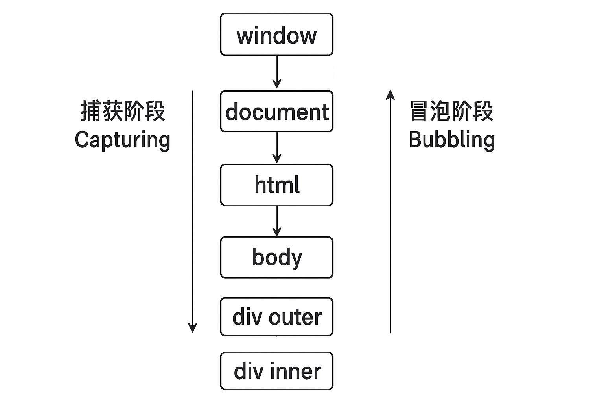
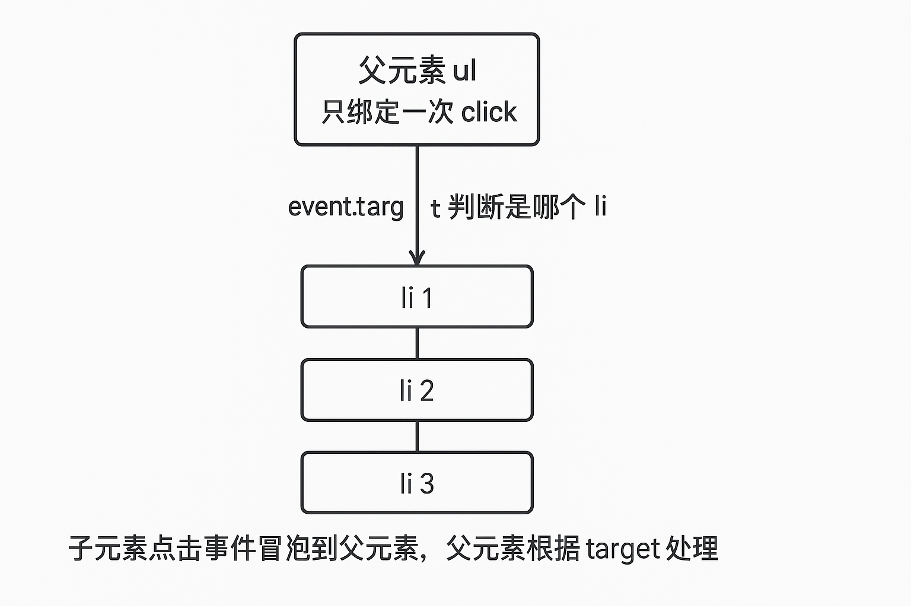

# JavaScript 事件

### 一、事件绑定

#### 1. HTML 属性绑定（不推荐）

在标签上直接写 `on事件名="处理代码"`，代码字符串会在全局作用域执行。

```html
<button onclick="console.log('clicked')">点击</button>
<button onclick="handleClick()">调用函数</button>
```

- **缺点**：逻辑与结构耦合、难以维护、只能绑定一个处理函数、易造成全局污染。

#### 2. DOM 0 级：on 属性

通过 JS 给元素赋值 `element.onclick = function () {}`。同一事件只能绑定一个处理函数，再次赋值会覆盖。

```javascript
const btn = document.querySelector('#btn');
btn.onclick = function () { console.log('clicked'); };
// 再赋值会覆盖
btn.onclick = function () { console.log('replaced'); };
```

- **特点**：简单；**缺点**：只能一个监听器、无法指定捕获阶段。

#### 3. DOM 2 级：addEventListener（推荐）

`element.addEventListener(type, listener [, options])`，可多次添加同一类型的多个监听器，并可指定在捕获或冒泡阶段触发。

```javascript
const btn = document.querySelector('#btn');
btn.addEventListener('click', function () { console.log('first'); });
btn.addEventListener('click', function () { console.log('second'); });  // 不覆盖，都会执行

// 第三个参数：true 表示捕获阶段，false（默认）表示冒泡阶段
div.addEventListener('click', fn, true);   // 捕获
div.addEventListener('click', fn, false);  // 冒泡
```

- **移除**：`element.removeEventListener(type, listener)`，需传入与添加时**同一个函数引用**，否则无法移除。

```javascript
const handler = function () { console.log('once'); };
btn.addEventListener('click', handler);
btn.removeEventListener('click', handler);  // 必须用同一引用
```

---

### 二、事件处理常见问题与方案详解

#### 问题 1：this 指向丢失

- **现象**：在回调里期望 `this` 指向当前元素，但传的是普通函数且被当作方法调用时 `this` 才为元素；若把方法作为回调传入（如 `setTimeout(btn.onclick, 1000)`）则 `this` 会丢失。
- **方案**：使用 `addEventListener` 时，回调内的 `this` 默认指向当前绑定元素；若需固定可用箭头函数外再包一层、或 `element.addEventListener('click', handler.bind(element))`；或在回调内用 `event.currentTarget` 表示当前绑定元素。

```javascript
btn.addEventListener('click', function () {
  console.log(this === btn);           // true
  console.log(event.currentTarget === btn);  // true
});
```

#### 问题 2：重复绑定与内存泄漏

- **现象**：多次给同一元素绑定同一回调却不移除，会导致重复执行或无法释放引用。
- **方案**：需要“只触发一次”时用 `{ once: true }`；组件卸载或不再需要时调用 `removeEventListener` 移除，且保证传入同一函数引用。

```javascript
btn.addEventListener('click', handler, { once: true });  // 只执行一次后自动移除
```

#### 问题 3：阻止默认行为与事件传播

- **preventDefault()**：取消浏览器默认行为（如链接跳转、表单提交、右键菜单）。
- **stopPropagation()**：阻止事件继续向父级或子级传播（冒泡或捕获），当前元素上其他监听器仍会执行。
- **stopImmediatePropagation()**：阻止传播，且同一元素上后续监听器也不再执行。

```javascript
link.addEventListener('click', function (e) {
  e.preventDefault();  // 不跳转
});
inner.addEventListener('click', function (e) {
  e.stopPropagation();  // 不再冒泡到 outer
});
```

#### 问题 4：动态添加的元素没有绑定事件

- **现象**：后来通过 JS 插入的节点，之前给“旧子元素”绑定的监听器不会自动生效。
- **方案**：使用**事件委托**（见第六节）：在父节点上绑定，通过 `event.target` 判断实际点击的是哪个子节点并处理。

#### 问题 5：事件顺序与阶段混淆

- **现象**：同一元素既在捕获又在冒泡阶段绑定了监听器，不清楚谁先执行。
- **方案**：牢记事件流顺序：**捕获阶段**（从 window 到目标）→ **目标阶段** → **冒泡阶段**（从目标到 window）。先执行所有捕获阶段监听器（从外到内），再目标阶段，再冒泡阶段监听器（从内到外）。

---

### 三、事件机制

#### 事件流三阶段

1. **捕获阶段（Capturing）**：从 `window` 沿 DOM 树**向下**传播到目标元素（target）。
2. **目标阶段（Target）**：事件到达目标元素，在目标上注册的监听器按**注册顺序**执行（与 addEventListener 的第三个参数无关）。
3. **冒泡阶段（Bubbling）**：从目标元素沿 DOM 树**向上**传播回 `window`。

默认使用 `addEventListener(type, fn)` 时，监听器在**冒泡阶段**执行；`addEventListener(type, fn, true)` 在**捕获阶段**执行。



*图：事件从外到内经历捕获，在目标上触发，再从内到外冒泡。*

#### 事件对象（Event）

回调函数会收到一个**事件对象**，常用属性与方法：

| 属性/方法 | 说明 |
|-----------|------|
| `event.target` | 实际触发事件的元素（事件发生的节点） |
| `event.currentTarget` | 当前正在执行监听器的元素（绑定事件的节点，回调内 `this` 通常等于它） |
| `event.type` | 事件类型字符串，如 `'click'` |
| `event.preventDefault()` | 阻止默认行为 |
| `event.stopPropagation()` | 阻止继续传播 |
| `event.stopImmediatePropagation()` | 阻止传播且同元素后续监听器不执行 |
| `event.eventPhase` | 当前阶段：1 捕获，2 目标，3 冒泡 |

```javascript
outer.addEventListener('click', function (e) {
  console.log(e.target);         // 被点击的那个元素
  console.log(e.currentTarget);  // outer
  console.log(e.eventPhase);     // 1 或 2 或 3
});
```

---

### 四、事件冒泡与事件捕获

#### 事件冒泡（Bubbling）

事件从**目标元素**开始，沿 DOM 树**向上**传播，依次触发各祖先节点上在**冒泡阶段**注册的同类型监听器。大多数情况下我们只关心冒泡阶段。

```html
<div id="outer">outer
  <div id="inner">inner</div>
</div>
```

```javascript
const outer = document.getElementById('outer');
const inner = document.getElementById('inner');
outer.addEventListener('click', () => console.log('outer 冒泡'));
inner.addEventListener('click', () => console.log('inner 冒泡'));
// 点击 inner 时输出顺序：inner 冒泡 → outer 冒泡
```

#### 事件捕获（Capturing）

事件从 **window** 开始，沿 DOM 树**向下**传播到目标，依次触发各祖先节点上在**捕获阶段**注册的监听器。需要在子元素事件之前拦截时使用。

```javascript
outer.addEventListener('click', () => console.log('outer 捕获'), true);
inner.addEventListener('click', () => console.log('inner 捕获'), true);
inner.addEventListener('click', () => console.log('inner 冒泡'), false);
outer.addEventListener('click', () => console.log('outer 冒泡'), false);
// 点击 inner 时输出顺序：outer 捕获 → inner 捕获 → inner 冒泡 → outer 冒泡
```

#### 阻止传播

在某个监听器内调用 `e.stopPropagation()` 后，事件不再向下一阶段或对向传播（捕获阶段调用则不再向下捕获且不再冒泡；冒泡阶段调用则不再向上冒泡）。

```javascript
inner.addEventListener('click', function (e) {
  console.log('inner');
  e.stopPropagation();  // 不再冒泡到 outer
});
```

---

### 五、事件回调机制

- 事件监听器（回调）由**浏览器**在事件发生时调用，通常在与主线程相同的线程上**同步**执行；若回调里执行耗时逻辑，会阻塞渲染与后续事件。
- 回调内触发的“异步操作”（如 `setTimeout`、`fetch`、Promise）会在任务队列中排队，不会阻塞当前回调执行完毕；但**微任务**（如 Promise.then）会在当前脚本（含当前回调）末尾、在下一个宏任务前执行完毕。
- **要点**：尽快结束回调，复杂逻辑用 `setTimeout(fn, 0)` 或 `queueMicrotask` 拆到下一轮，避免长时间占用主线程导致卡顿。

```javascript
btn.addEventListener('click', function () {
  console.log('1');
  Promise.resolve().then(() => console.log('2'));
  setTimeout(() => console.log('3'), 0);
  console.log('4');
});
// 输出顺序：1 → 4 → 2 → 3
```

---

### 六、事件委托原理与实现

#### 原理

**事件委托**（事件代理）：不给每个子元素单独绑定事件，而是在**父元素**上绑定；利用**事件冒泡**，子元素触发的事件会冒泡到父元素，在父元素的监听器里通过 `event.target` 判断实际触发的子元素并执行对应逻辑。

- **优点**：减少监听器数量、节省内存；**动态添加**的子节点无需再绑定即可响应同一逻辑；结构变更时只需维护父节点一处绑定。
- **适用**：列表项点击、表格行操作、大量同类子元素等。



*图：只在父元素上绑定一次 click，通过 event.target 区分是哪一个子元素被点击。*

#### 实现示例

```html
<ul id="list">
  <li data-id="1">项目 1</li>
  <li data-id="2">项目 2</li>
  <li data-id="3">项目 3</li>
</ul>
```

```javascript
const list = document.getElementById('list');
list.addEventListener('click', function (e) {
  const li = e.target.closest('li');  // 兼容点击到 li 内的 span 等情况
  if (!li || !list.contains(li)) return;
  const id = li.dataset.id;
  console.log('点击了项目', id);
});

// 动态添加的 li 无需再绑定，同样会触发上述逻辑
list.insertAdjacentHTML('beforeend', '<li data-id="4">项目 4</li>');
```

- **注意**：若子元素内还有嵌套（如 `<li><span>文字</span></li>`），点击 span 时 `e.target` 是 span，可用 `e.target.closest('li')` 找到所在列表项再处理。

#### 委托封装示例

```javascript
function delegate(parent, eventType, childSelector, handler) {
  parent.addEventListener(eventType, function (e) {
    const target = e.target.closest(childSelector);
    if (target && parent.contains(target)) {
      handler.call(target, e);
    }
  });
}
delegate(document.getElementById('list'), 'click', 'li', function (e) {
  console.log(this.dataset.id, this.textContent);
});
```

