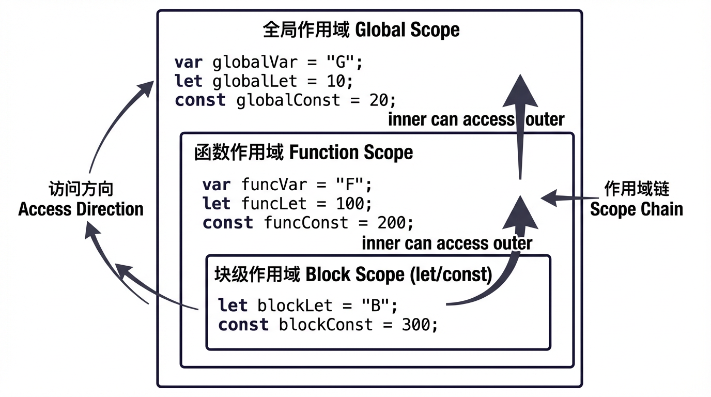
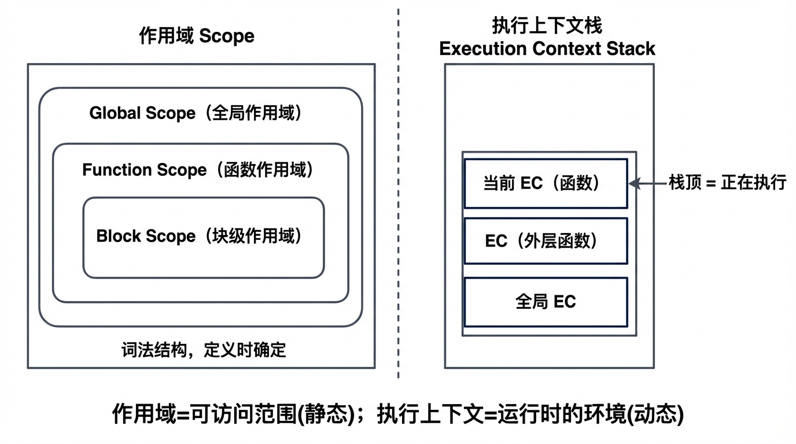

# JavaScript 函数

### 一、函数的定义方式

#### 函数声明

使用 `function` 关键字 + 函数名 + 形参列表 + 函数体；**会提升**（hoisting），同一作用域内可在声明前调用；函数名必填。若在块（如 `if`）内使用函数声明，行为因环境而异（非严格模式下可能被提升到外层），建议在块内使用函数表达式。

```javascript
function fn(a, b) { return a + b; }
fn(1, 2);  // 3；声明前调用也成立（提升）
```

#### 函数表达式

将函数作为表达式赋给变量或属性：`const fn = function () {}`。**不会提升**，只能在赋值后调用；函数名可选（匿名函数表达式）。常用在回调、IIFE、块内需要局部函数的场景。

```javascript
const fn = function (a, b) { return a + b; };
// 声明前调用：const 会 ReferenceError，var 会 undefined 再调用报 TypeError
```

#### 命名函数表达式

形如 `const f = function inner() {}`：函数有名字 `inner`，但 `inner` 仅在函数体内可访问，常用于递归、调试栈中显示名称。同样不会提升。

```javascript
const factorial = function f(n) { return n <= 1 ? 1 : n * f(n - 1); };
```

#### 箭头函数

语法 `(params) => expression` 或 `(params) => { statements }`。单参数可省括号，单表达式可省 `return` 与花括号。**无声明提升**；无自身 `this`（继承定义时外层 `this`）；无 `arguments`，需用剩余参数 `...args`；不能作为构造函数（`new` 报错），无 `prototype`。适合回调、简短逻辑；需要动态 `this` 或 `arguments` 时用普通函数。

```javascript
const add = (a, b) => a + b;
const fn = () => { console.log(this); };  // this 为定义时外层 this
```

#### Function 构造函数

`new Function('a', 'b', 'return a + b')` 动态创建函数。最后一个参数为函数体字符串，前面均为形参名。在全局作用域中创建，仅能访问全局变量，难以做静态分析，且存在安全与性能问题，一般不推荐使用。

---

**函数定义方式 · 常见面试题**

1. **函数声明和函数表达式的区别？**  
   函数声明会提升，可在声明前调用；函数表达式不会提升，只能在赋值后调用。函数声明必须有函数名；函数表达式可以是匿名。  
   [BFE.dev - function declaration vs expression](https://bigfrontend.dev/zh/question/function-expression-vs-function-declaration)

2. **箭头函数与普通函数的区别？**  
   箭头函数无自己的 `this`（继承外层）、无 `arguments`、不能 `new`、无 `prototype`、无提升；普通函数有独立的 `this`、`arguments`，可作构造函数。

3. **下面输出什么？**
   ```javascript
   console.log(fn);
   function fn() {}
   var fn = 1;
   ```
   答：输出 `function fn() {}`。函数声明提升优先于变量声明，同名时保留函数；若再执行 `console.log(fn)` 且前面有 `fn = 1` 的赋值，则之后为 `1`。

4. **为什么在块（if/for）内更推荐用函数表达式而不是函数声明？**  
   块内函数声明在不同环境下提升与作用域不一致，易产生可移植性问题；函数表达式赋值给 `let`/`const` 时作用域明确限定在块内，行为一致。

5. **Function 构造函数创建的函数有什么特点？**  
   在全局作用域中创建，只能访问全局变量；函数体为字符串，不利于优化与静态检查；存在注入与安全风险，实际开发中很少使用。  
   [MDN - Function](https://developer.mozilla.org/zh-CN/docs/Web/JavaScript/Reference/Global_Objects/Function)

---

### 二、作用域



*图：全局作用域包裹函数作用域，函数内可再含块级作用域；内层可沿作用域链访问外层变量。*

**作用域**指变量与函数可被访问的范围。JavaScript 采用**词法作用域**（静态作用域）：作用域在代码书写（定义）时就已经确定，而非运行时根据调用位置决定。

#### 全局作用域

- 在代码最外层声明的变量和函数，或在浏览器中挂载在 `window`（全局对象）上的属性，处于**全局作用域**。
- 全局作用域中的标识符在整个脚本（或模块）内都可被访问。
- 缺点：易造成命名冲突、污染全局；模块化或 IIFE 可减少暴露在全局的名字。

```javascript
var a = 1;           // 全局（var 在非模块、非函数顶层）
function f() {}      // 全局函数
// 浏览器中 window.a === 1, window.f === f
```

#### 函数作用域（局部作用域）

- 在 `function` 内部声明的变量（`var`、`let`、`const`）和形参，只在该函数体内可访问，形成**函数作用域**（局部作用域）。
- 每次调用函数都会生成新的函数作用域，彼此独立；内层函数可访问外层函数的变量（形成闭包的基础）。

```javascript
function outer() {
  var x = 1;
  let y = 2;
  function inner() {
    console.log(x, y);  // 可访问 outer 的 x、y
  }
  inner();
}
// 外部无法访问 x、y、inner
```

#### 块级作用域

- 由一对 `{}` 形成的范围（如 `if`、`for`、`while`、`switch`、单独 `{}`）可形成**块级作用域**。
- 只有使用 `let`、`const` 在块内声明的变量才受块级作用域约束；`var` 在块内声明仍然属于外层函数或全局，不会形成块级作用域。

```javascript
if (true) {
  var a = 1;   // 无块级作用域，相当于在 if 外层声明
  let b = 2;   // 仅在此块内有效
  const c = 3; // 仅在此块内有效
}
console.log(a);   // 1
console.log(b);   // ReferenceError
console.log(c);   // ReferenceError

for (let i = 0; i < 3; i++) {
  setTimeout(() => console.log(i), 0);  // 0, 1, 2（每个 i 独立）
}
// 若写 for (var i = 0; ...) 则输出 3, 3, 3
```

#### 词法作用域与作用域链

- **词法作用域**：作用域由代码书写时的嵌套关系决定。函数在**定义时**就确定了它可访问的外层作用域，而不是在调用时。
- **作用域链**：当在某个作用域内访问一个变量时，会先在当前作用域查找，找不到则沿**作用域链**向外层（父级）作用域查找，直到全局；若全局仍没有则报 `ReferenceError`。作用域链在函数**定义时**就确定（由词法结构决定）。

```javascript
var g = 0;
function A() {
  var a = 1;
  function B() {
    var b = 2;
    console.log(b, a, g);  // 依次在当前、A、全局查找
  }
  B();
}
A();
```

#### 变量声明与作用域（var / let / const）

| 声明方式 | 作用域类型       | 提升 | 重复声明 | 说明 |
|----------|------------------|------|----------|------|
| `var`    | 函数作用域       | 有（值为 undefined） | 允许 | 无块级作用域；在块内声明仍属外层 |
| `let`    | 块级作用域       | 有 TDZ，声明前不可访问 | 同一作用域内不允许 | 块（含 for 块）内有效 |
| `const`  | 块级作用域       | 有 TDZ               | 同一作用域内不允许 | 声明时必须初始化，绑定不可改（对象内容可改） |

- 在**同一作用域**内，`let`/`const` 不能与同名的 `var`、`let`、`const` 或形参重复声明。
- 建议：默认用 `const`，需要重新赋值时用 `let`，避免使用 `var`。

---

**作用域 · 常见面试题**

1. **什么是词法作用域？** 作用域在代码书写（定义）时根据嵌套结构确定；查找变量时沿定义时的作用域链向外查找，与调用位置无关（与动态作用域相对）。
2. **var、let、const 的作用域区别？** `var` 只有函数作用域，无块级作用域；`let`/`const` 有块级作用域。块内 `var` 会泄漏到外层，`let`/`const` 不会。
3. **for 循环里用 var 和 let 定义 i 有什么区别？** `var` 的 `i` 属于循环外层作用域，循环结束后所有回调共享同一个 `i`（例如 setTimeout 输出相同值）；`let` 的 `i` 在每次迭代有独立的绑定，常用于循环中创建闭包或异步回调。
4. **什么是作用域链？** 由当前作用域与一系列外层（父级）作用域组成的链式结构；查找变量时沿该链从内到外查找，直到找到或到达全局。

---

### 三、执行上下文

**作用域与执行上下文的区分**（便于理解）：

| 维度 | 作用域（Scope） | 执行上下文（Execution Context） |
|------|-----------------|----------------------------------|
| **是什么** | 变量/函数的**可访问范围**，由代码结构决定 | 代码**运行时**的环境，包含变量、this、作用域链等 |
| **何时确定** | **定义时**（词法阶段），静态 | **执行时**（调用时创建、执行完可回收），动态 |
| **数量关系** | 一套嵌套的作用域结构，与调用无关 | 每次函数调用都会产生新的执行上下文，形成栈 |

可以简单记：**作用域**解决“能访问谁”（静态、由书写位置决定）；**执行上下文**解决“正在执行哪段代码、当前环境里变量和 this 是什么”（动态、由调用产生）。同一作用域在不同时刻可能对应不同的执行上下文（多次调用同一函数）。



*图：左侧为作用域（嵌套结构，定义时确定）；右侧为执行上下文栈（栈顶为当前正在执行的上下文）。*

---

#### 执行上下文的类型（全局 / 函数 / eval）

- **全局执行上下文**：脚本或模块开始执行时创建，只有一个；负责全局变量、`this`（非严格下为全局对象）、全局作用域链。
- **函数执行上下文**：每次**调用**函数时创建；包含该次调用的形参、局部变量、`this`、作用域链等；调用结束且无闭包引用后可回收。
- **eval 执行上下文**：在 `eval` 内执行代码时产生（依实现而定）；实际开发中应避免使用 `eval`。

#### 执行上下文栈（调用栈）

- 引擎用**执行上下文栈**（常称“调用栈”）管理执行上下文：函数被调用时，对应执行上下文**入栈**，成为栈顶（当前正在执行的上下文）；函数返回时**出栈**，控制权回到之前的栈顶。
- 栈底通常是全局执行上下文；栈顶即“当前执行到哪了”。栈过深会报“Maximum call stack size exceeded”（栈溢出）。

```javascript
function a() { console.log('a'); b(); console.log('a end'); }
function b() { console.log('b'); c(); console.log('b end'); }
function c() { console.log('c'); }
a();
// 输出顺序: a → b → c → b end → a end
// 栈变化: 全局 → 全局+a → 全局+a+b → 全局+a+b+c → 出c → 出b → 出a
```

#### 执行上下文的创建与执行阶段

- **创建阶段**：为当前上下文建立**变量对象**（或词法环境）、**作用域链**、确定 **this**；对函数上下文还会完成形参赋值、函数声明与变量声明的初始化（var 置为 undefined 等）。
- **执行阶段**：逐行执行代码，对变量赋值、执行函数调用（产生新的执行上下文并入栈）等。
- 理解两阶段有助于理解“提升”：声明在创建阶段就已处理，所以可以在赋值前访问（var 为 undefined，let/const 在 TDZ）。

#### 变量对象与活动对象

- **变量对象（VO）**：在创建阶段，引擎用变量对象保存当前上下文中声明的变量、函数声明等。在**函数**执行上下文中，变量对象常被称为**活动对象（AO）**，此时可访问、可被修改。
- 全局上下文的变量对象即全局对象（浏览器中为 `window`）。函数上下文的 AO 包含形参、函数内声明的变量和函数；这些构成当前作用域链的“当前一环”。

#### 作用域链与执行上下文的关系

- 每个执行上下文在创建时都会关联一条**作用域链**，用于变量查找：先在当前上下文的变量对象/活动对象中找，找不到则沿作用域链到外层上下文的变量对象，直至全局。
- 作用域链在**定义时**就由词法结构确定（函数保存其外层作用域的引用）；执行上下文创建时把这条链挂到当前上下文上，所以“当前环境 + 作用域链”一起决定了本次执行能访问哪些变量。

---

**执行上下文 · 常见面试题**

1. **作用域和执行上下文的区别？** 作用域是静态的、由代码结构决定的“可访问范围”；执行上下文是运行时产生的“当前执行环境”，包含变量对象、this、作用域链等，每次调用都会新建。
2. **什么是调用栈？** 保存执行上下文的栈结构；函数调用时对应上下文入栈成为栈顶，返回时出栈；栈顶始终是当前正在执行的上下文。
3. **执行上下文创建阶段会做哪些事？** 创建变量对象/活动对象、建立作用域链、确定 this；对函数还会初始化形参、函数声明与变量声明（如 var 置为 undefined），从而产生“提升”现象。

---

### 四、this

`this` 在**函数被调用时**才确定，指向“调用该函数的对象”或“本次调用指定的上下文”。箭头函数无自己的 `this`，继承定义时的外层 `this`。下面按场景说明如何确认 `this`，并给出 call/apply/bind 的区别与自定义实现。

#### this 的指向规则概述

- **默认绑定**：独立调用（无前缀、无 new、未通过 call/apply/bind 指定）时，非严格模式 `this` 为全局对象，严格模式为 `undefined`。
- **隐式绑定**：以 `obj.method()` 形式调用时，`this` 为 `obj`；若存在链式引用（如 `obj1.obj2.fn()`），`this` 为最后一层对象（`obj2`）。
- **显式绑定**：通过 `call(thisArg, ...args)`、`apply(thisArg, args)`、`bind(thisArg)(...args)` 指定 `this`。
- **new 绑定**：`new F()` 时，`this` 指向新创建的对象（若 F  return 了对象则取该对象，否则取新对象）。
- **箭头函数**：不参与以上规则，`this` 在定义时由外层作用域的 `this` 决定，与调用方式无关。

#### 默认绑定

函数**单独调用**（不作为方法、不 new、不用 call/apply/bind）时，视为默认绑定。

```javascript
function fn() { console.log(this); }
fn();                    // 非严格：window/global；严格：undefined
const obj = { f: fn };
const f = obj.f;
f();                     // 仍是独立调用，默认绑定，同上
```

#### 隐式绑定

以 **对象.方法()** 形式调用时，`this` 指向该对象；赋值或传参后可能丢失隐式绑定，变为默认绑定。

```javascript
const obj = { a: 1, fn() { console.log(this.a); } };
obj.fn();                // this === obj，输出 1
const g = obj.fn;
g();                     // 独立调用，this 为全局或 undefined，this.a 可能报错或为 undefined
setTimeout(obj.fn, 0);  // 同上，传入的是函数引用，调用时无 obj 前缀
```

#### 显式绑定（call / apply / bind）与自定义实现

**call / apply / bind 区别**

| 方法 | 作用 | 参数形式 | 返回值 |
|------|------|----------|--------|
| **call** | 以指定 `this` 和若干参数**立即调用**函数 | `fn.call(thisArg, arg1, arg2, ...)` | 函数返回值 |
| **apply** | 同上，但参数以**数组**传入 | `fn.apply(thisArg, [arg1, arg2, ...])` | 函数返回值 |
| **bind** | **不立即调用**，返回一个绑定了 `this`（与可选前置参数）的新函数，之后调用时再传剩余参数 | `fn.bind(thisArg[, arg1, arg2])` | 新函数 |

```javascript
function greet(prefix, suffix) { return prefix + this.name + suffix; }
const o = { name: 'JS' };

greet.call(o, 'Hello, ', '!');   // "Hello, JS!"
greet.apply(o, ['Hi, ', '!']);   // "Hi, JS!"

const bound = greet.bind(o, 'Hey, ');
bound('!');                      // "Hey, JS!"；bound 的 this 已固定为 o
```

**自定义实现（简化版，不处理 symbol、构造函数等边界）**

```javascript
// call：立即执行，参数为多个
Function.prototype.myCall = function (thisArg, ...args) {
  const fn = this;
  const key = '__myCall_' + Date.now();
  const obj = thisArg != null ? Object(thisArg) : (typeof window !== 'undefined' ? window : globalThis);
  obj[key] = fn;
  const res = obj[key](...args);
  delete obj[key];
  return res;
};

// apply：立即执行，第二参数为数组
Function.prototype.myApply = function (thisArg, args) {
  return this.myCall(thisArg, ...(args || []));
};

// bind：返回新函数，不立即执行；新函数被调用时再传剩余参数
Function.prototype.myBind = function (thisArg, ...preArgs) {
  const fn = this;
  return function (...restArgs) {
    return fn.apply(thisArg, preArgs.concat(restArgs));
  };
};
```

注意：真实 `bind` 还需支持 `new` 时忽略绑定的 this、维护原型等；上面仅体现“固定 this + 参数合并”的核心逻辑。

#### new 绑定

使用 `new F()` 调用时，会创建新对象，并以该对象为 `this` 执行 `F`；若 `F` 返回了对象则表达式结果为该对象，否则为新对象。

```javascript
function Person(name) { this.name = name; }
const p = new Person('Tom');  // this 指向新对象，p.name === 'Tom'
```

#### 箭头函数与 this

箭头函数没有自己的 `this`，其内部的 `this` 就是**定义时**所在作用域的 `this`（词法 this），调用方式（call/apply/对象方法等）不会改变它。

```javascript
const obj = {
  a: 1,
  fn() {
    const arrow = () => console.log(this.a);
    arrow();           // this 继承 fn 的 this，即 obj，输出 1
    arrow.call({ a: 2 }); // 无效，箭头函数 this 不变，仍为 obj
  }
};
obj.fn();
```

#### 绑定优先级与注意事项

- 优先级（从高到低）：**new 绑定** > **显式绑定（bind/call/apply）** > **隐式绑定（对象.方法）** > **默认绑定**。
- 箭头函数不参与优先级，其 `this` 始终为定义时的外层 `this`。
- 注意事项：回调、定时器、事件处理里若传的是普通函数引用，容易丢失预期的 `this`，可用箭头函数或 `bind` 固定。

---

**this · 常见面试题**

1. **如何确定函数里 this 的值？** 看调用方式：独立调用→默认绑定；`obj.method()`→隐式绑定；`call/apply/bind`→显式绑定；`new F()`→new 绑定；箭头函数→看定义处外层 `this`。
2. **call、apply、bind 的区别？** call/apply 立即执行并指定 this，call 传多参数、apply 传数组；bind 不执行，返回绑定了 this（和可选参数）的新函数。
3. **手写 bind 的核心思路？** 返回一个新函数，新函数内部用 `fn.apply(thisArg, preArgs.concat(restArgs))` 调用原函数，从而固定 this 并合并参数。

---

### 五、闭包（与作用域、执行上下文相关）

#### 闭包的概念

**闭包**：函数能够**访问并持有**其词法作用域（定义时所在作用域）中的变量，即使该函数在其词法作用域之外执行。换句话说，内层函数引用了外层函数的变量，且该内层函数在外部被使用（被返回、被赋值、被当作回调等），就会形成闭包；外层函数的执行上下文在调用结束后，因其变量仍被内层函数引用，不会被回收。

```javascript
function outer() {
  let count = 0;
  function inner() {
    count++;
    return count;
  }
  return inner;   // inner 持有对 outer 作用域中 count 的引用
}
const fn = outer();
fn();  // 1
fn();  // 2；count 被“封闭”在闭包中，不会被回收
```

#### 闭包与作用域链

- 闭包之所以能访问外层变量，是因为**作用域链**在函数**定义时**就确定了：inner 的作用域链包含 outer 的活动对象（或词法环境），所以 inner 在任意地方执行时，都能沿这条链找到 outer 中的变量。
- 当 outer 执行完毕，若没有 inner 引用其变量，outer 的上下文可被回收；一旦 inner 被暴露出去并持有对 outer 变量的引用，引擎会保留这些变量，从而形成闭包。

#### 闭包的应用与注意点

**常见应用**

- **数据私有**：用闭包保存“私有”变量，只通过返回的函数或方法访问，避免全局污染。
- **工厂函数 / 配置函数**：返回的函数携带创建时的参数或配置（如防抖的 delay、节流的 interval）。
- **柯里化（Currying）**：多次接收参数，每次返回新函数，直到参数凑齐再执行原逻辑。
- **防抖（debounce）与节流（throttle）**：在闭包中保存定时器 id 或上次执行时间，在多次触发时按策略执行一次或限频执行。
- **循环中保留索引**：用 `let` 或 IIFE/闭包为每次迭代保留当时的 `i`，避免异步回调里拿到同一个 `i`。

**注意点**

- **内存**：闭包会保持对外层变量的引用，若闭包长期存在（如挂到全局、DOM、定时器），外层变量不会被回收，可能造成内存占用；不再需要时解除引用或避免形成不必要的闭包。
- **循环 + 异步**：在 for 循环里用 `var` 声明变量并传入异步回调时，回调执行时共享同一个变量，常得到“最后一步”的值；可用 `let`、IIFE 或闭包为每次迭代保留一份值。

---

**闭包 · 常见面试题**

1. **什么是闭包？** 函数能够访问并持有其词法作用域中的变量，即使在该作用域外执行；通常表现为内层函数被返回或传出，并引用了外层变量。
2. **闭包有什么应用？** 数据私有、防抖/节流、柯里化、循环中保留索引、模块化等。
3. **闭包可能导致什么问题？** 不当使用会使外层变量长期不被回收，增加内存占用；循环中形成闭包时要避免共享同一变量（可用 let 或 IIFE 为每轮保留值）。

---

### 六、参数与返回值（可选结构）

#### 形参与实参、默认值与剩余参数

#### 返回值与 undefined
