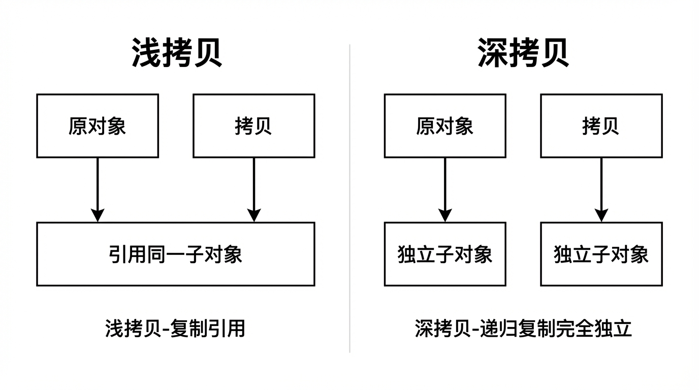
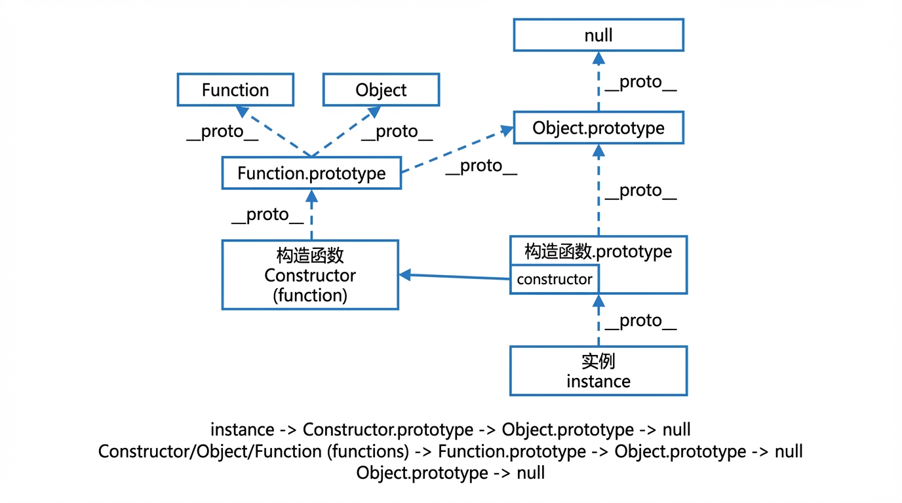

# JavaScript 对象

### 一、对象定义与存储类型

#### 对象定义

在 JavaScript 中，**对象**是一种引用类型，用于存储键值集合（属性和方法）。除了基本类型（number、string、boolean、null、undefined、symbol、bigint）外，函数、数组、正则、日期等本质上都是对象。对象可通过字面量 `{}`、构造函数 `new Object()`、`Object.create()` 等方式创建。

#### 存储类型

- 对象是**引用类型**：变量保存的是对象在**堆**中的地址（引用），赋值与传参时复制的是引用，因此多个变量可能指向同一对象，修改其一会影响其他引用。
- 基本类型存**值**，对象存**引用**；`===` 比较对象时比较的是引用是否指向同一块内存。

---

### 二、常见 API

#### 属性与枚举

| API | 说明 |
|-----|------|
| `Object.keys(obj)` | 自身可枚举**字符串**键组成的数组 |
| `Object.values(obj)` | 自身可枚举属性值组成的数组 |
| `Object.entries(obj)` | 自身可枚举 [key, value] 组成的数组 |
| `Object.getOwnPropertyNames(obj)` | 自身所有字符串键（含不可枚举） |
| `Object.getOwnPropertySymbols(obj)` | 自身所有 Symbol 键 |
| `for...in` | 遍历自身及原型链上可枚举键（通常需配合 hasOwnProperty） |

#### 属性描述与状态

| API | 说明 |
|-----|------|
| `Object.getOwnPropertyDescriptor(obj, key)` | 获取属性描述符（value、writable、enumerable、configurable） |
| `Object.defineProperty(obj, key, descriptor)` | 定义/修改属性描述符 |
| `Object.hasOwn(obj, prop)` / `obj.hasOwnProperty(prop)` | 是否为自身属性（不含原型） |
| `Object.freeze(obj)` | 冻结对象，不可增删改属性 |
| `Object.seal(obj)` | 密封，不可增删，可改已有属性 |
| `Object.isFrozen(obj)` / `Object.isSealed(obj)` | 是否已冻结/密封 |

#### 创建与合并

| API | 说明 |
|-----|------|
| `Object.create(proto[, propertiesObject])` | 以指定原型创建新对象 |
| `Object.assign(target, ...sources)` | 浅拷贝源对象的可枚举自身属性到 target |
| `Object.is(a, b)` | 同值相等（NaN===NaN、+0!==-0） |

---

### 三、对象创建过程理解

#### 字面量与 new Object()

- `const o = {}` 等价于 `const o = new Object()`，原型为 `Object.prototype`。
- 字面量写法简洁，无调用构造函数的过程。

#### 构造函数与 new 的步骤

使用 `new F()` 创建对象时，大致经历以下步骤（便于理解）：

1. 创建一个新对象（空对象）。
2. 将该新对象的 `[[Prototype]]`（即 `__proto__`）指向 `F.prototype`。
3. 以该新对象为 `this` 执行构造函数 `F`。
4. 若 `F` 返回了对象，则表达式结果为该对象；否则返回新对象。

```javascript
function Person(name) {
  this.name = name;
}
Person.prototype.say = function () { return this.name; };
const p = new Person('Tom');
// p.__proto__ === Person.prototype
// Person.prototype.__proto__ === Object.prototype
```

#### Object.create(proto)

- `Object.create(proto)` 创建一个新对象，并将其 `[[Prototype]]` 设为 `proto`，不执行构造函数。
- 常用于“仅继承原型、不调用构造函数”或实现纯净的原型继承。

---

### 四、浅拷贝与深拷贝

**浅拷贝**：只复制一层属性；若属性值为对象，则复制的是引用，修改嵌套对象会相互影响。  
**深拷贝**：递归复制所有层级，新对象与原对象完全独立（不共享嵌套引用）。



*图：浅拷贝时嵌套对象仍共享同一引用；深拷贝时每一层都是新对象，互不影响。*

#### 浅拷贝实现

```javascript
function shallowCopy(obj) {
  if (obj === null || typeof obj !== 'object') return obj;
  const copy = Array.isArray(obj) ? [] : {};
  for (const key in obj) {
    if (Object.prototype.hasOwnProperty.call(obj, key)) copy[key] = obj[key];
  }
  return copy;
}
// 或：Object.assign({}, obj)、展开运算 { ...obj }、数组 slice()/concat()
```

#### 深拷贝实现（简化版）

```javascript
function deepCopy(obj, cache = new WeakMap()) {
  if (obj === null || typeof obj !== 'object') return obj;
  if (cache.has(obj)) return cache.get(obj);  // 环引用
  const copy = Array.isArray(obj) ? [] : {};
  cache.set(obj, copy);
  for (const key in obj) {
    if (Object.prototype.hasOwnProperty.call(obj, key)) {
      copy[key] = deepCopy(obj[key], cache);
    }
  }
  return copy;
}
```

- 实际项目中可考虑 `structuredClone(obj)`（环境支持）、或 lodash 的 `cloneDeep`；需处理 Date、RegExp、函数等时需单独分支。

---

### 五、原型与原型链

#### 原型（prototype）与 __proto__

- 每个**函数**都有一个 `prototype` 属性（显式原型），指向一个对象；该对象在通过 `new` 创建实例时作为实例的**原型**。
- 每个**对象**都有一个 `[[Prototype]]` 内部槽，在环境中多暴露为 `__proto__`（隐式原型）；该对象即“原型”，由创建方式决定（如 `new F()` 则指向 `F.prototype`）。
- 关系：`实例.__proto__ === 构造函数.prototype`。

#### 原型链

- 访问对象属性时，若自身没有，则沿 `__proto__` 向上查找，直到 `Object.prototype`，再往上为 `null`。这条链路即**原型链**。
- 所有普通对象的原型链终点都是 `Object.prototype`；`Object.prototype.__proto__ === null`。
- **函数**也是对象：构造函数（如 `Person`）、`Object`、`Function` 的 `__proto__` 均指向 `Function.prototype`；`Function.prototype.__proto__ === Object.prototype`。因此完整链上会经过 **Function**、**Object**、**null**：实例 → 构造函数.prototype → Object.prototype → null；构造函数（函数）→ Function.prototype → Object.prototype → null。



*图：实例沿 __proto__ 经 构造函数.prototype、Object.prototype 到 null；函数沿 __proto__ 经 Function.prototype、Object.prototype 到 null。*

#### 相关 API

- `Object.getPrototypeOf(obj)`：获取 `obj` 的原型（等价于 `obj.__proto__`，推荐用 API）。
- `Object.setPrototypeOf(obj, proto)`：设置 `obj` 的原型（有性能影响，慎用）。
- `obj instanceof F`：判断 `F.prototype` 是否在 `obj` 的原型链上。

---

### 六、继承方式的特点与缺点

#### 1. 原型链继承

- **做法**：子类构造函数的 `prototype` 指向父类实例，`Sub.prototype = new Super()`。
- **特点**：子类实例可访问父类实例与原型上的属性。
- **缺点**：父类实例上的引用类型属性会被所有子类实例共享；无法在子类构造函数中向父类构造函数传参。

```javascript
function Super() {
  this.name = 'super';
  this.list = [];
}
Super.prototype.say = function () { return this.name; };

function Sub() {}
Sub.prototype = new Super();  // 子类原型 = 父类实例

const a = new Sub(), b = new Sub();
a.list.push(1);
console.log(b.list);  // [1]，引用类型被共享
```

#### 2. 原型式继承

- **做法**：不定义构造函数，直接用“父对象”作为原型创建新对象，如 `const child = Object.create(parent)` 或 `function create(o) { function F() {} F.prototype = o; return new F(); }`。
- **特点**：实现简单，适合“基于已有对象再复制一份”的场景。
- **缺点**：与原型链继承类似，引用类型属性会被共享；无法传参、无法在创建时初始化。

```javascript
const parent = { name: 'parent', list: [] };
// 方式一
const child = Object.create(parent);
// 方式二（兼容写法）
function create(o) {
  function F() {}
  F.prototype = o;
  return new F();
}
const child2 = create(parent);
child2.name = 'child2';
child2.list.push(1);
console.log(parent.list);  // [1]，共享
```

#### 3. 构造函数继承（借用构造函数）

- **做法**：在子类构造函数内 `Super.call(this, ...args)`，不改原型。
- **特点**：每个实例有独立的父类属性副本；可传参。
- **缺点**：父类原型上的方法子类实例访问不到；方法无法复用，需在构造函数内定义。

```javascript
function Super(name) {
  this.name = name;
  this.list = [];
}
Super.prototype.say = function () { return this.name; };

function Sub(name, age) {
  Super.call(this, name);  // 借用父类构造函数
  this.age = age;
}

const s = new Sub('Tom', 18);
console.log(s.name, s.age);  // Tom 18
console.log(s.say);           // undefined，拿不到父类原型方法
```

#### 4. 组合继承（原型链 + 构造函数）

- **做法**：子类内 `Super.call(this)`，再 `Sub.prototype = new Super()`（或 `Sub.prototype = Object.create(Super.prototype)` 并修正 constructor）。
- **特点**：实例有独立属性，又能访问父类原型方法。
- **缺点**：父类构造函数会执行两次；若用 `new Super()` 作为子类原型，子类原型上会多一份父类实例属性（通常再设 `Sub.prototype.constructor = Sub`）。

```javascript
function Super(name) {
  this.name = name;
  this.list = [];
}
Super.prototype.say = function () { return this.name; };

function Sub(name, age) {
  Super.call(this, name);   // 第一次调用 Super
  this.age = age;
}
Sub.prototype = new Super(); // 第二次调用 Super；子类原型上有 name、list
Sub.prototype.constructor = Sub;
Sub.prototype.run = function () { return this.age; };

const s = new Sub('Tom', 18);
console.log(s.name, s.say(), s.run());  // Tom, 'Tom', 18
```

#### 5. 寄生式继承

- **做法**：在“原型式继承”得到的对象上再增强属性或方法后返回，如 `function createChild(parent) { const o = Object.create(parent); o.extra = 1; return o; }`。
- **特点**：可在不定义子类构造函数的情况下给子对象增加自有属性。
- **缺点**：方法写在增强函数里，无法复用；引用类型仍在原型上共享。

```javascript
const parent = { name: 'parent', list: [] };

function createChild(parent) {
  const o = Object.create(parent);
  o.extra = 1;  // 增强：自有属性
  o.getExtra = function () { return this.extra; };  // 自有方法，无法复用
  return o;
}
const c = createChild(parent);
console.log(c.name, c.extra, c.getExtra());  // parent, 1, 1
```

#### 6. 寄生组合式继承（推荐）

- **做法**：子类内 `Super.call(this)`；`Sub.prototype = Object.create(Super.prototype)`，并设 `Sub.prototype.constructor = Sub`。不执行 `new Super()` 作为原型。
- **特点**：只调用一次父类构造函数；原型链干净，无多余属性；可传参、可复用方法。
- **缺点**：写法稍繁琐，需手动维护 constructor。

```javascript
function Super(name) {
  this.name = name;
  this.list = [];
}
Super.prototype.say = function () { return this.name; };

function Sub(name, age) {
  Super.call(this, name);   // 只调用一次
  this.age = age;
}
Sub.prototype = Object.create(Super.prototype);  // 不 new Super()，无多余实例属性
Sub.prototype.constructor = Sub;
Sub.prototype.run = function () { return this.age; };

const s = new Sub('Tom', 18);
console.log(s.name, s.say(), s.run());  // Tom, 'Tom', 18
console.log(s.list);  // []，独立于其他实例
```

#### 7. ES6 class extends

- **做法**：`class Sub extends Super { ... }`，内部由规范实现类似寄生组合继承的语义。
- **特点**：语法清晰，内置 `super` 调用与 constructor 处理；本质仍是基于原型的继承。
- **缺点**：需支持 ES6；部分旧环境需转译。

```javascript
class Super {
  constructor(name) {
    this.name = name;
    this.list = [];
  }
  say() { return this.name; }
}

class Sub extends Super {
  constructor(name, age) {
    super(name);  // 必须且只能在 this 之前调用
    this.age = age;
  }
  run() { return this.age; }
}

const s = new Sub('Tom', 18);
console.log(s.name, s.say(), s.run());  // Tom, 'Tom', 18
```

