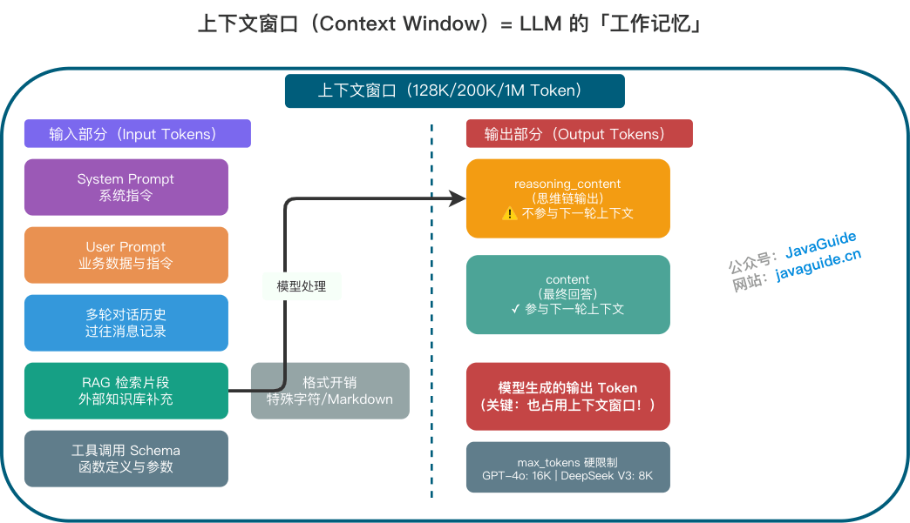

# LLM 应用工程架构：从 Token 原理到生产落地

## 一、LLM 基础原理

### 1.1 自回归生成

大模型本质上做的是「文字接龙」——根据前面所有文本，预测下一个 Token。每次只补一个 Token，然后把这个 Token 加进上下文，再预测下一个，如此循环。这个过程叫**自回归生成（Autoregressive Generation）**。

理解自回归生成后，所有概念都串联起来了：

- **Token**：模型每一步「补」的文本碎片
- **上下文窗口**：模型在「补」之前能看到多少文本
- **Temperature / Top-p**：模型选哪个候选碎片的策略
- **Max Tokens**：允许模型最多「补」多少步

### 1.2 Token 与分词

Token 是模型的「阅读单位」。模型既不按字、也不按词切分——它用 **Tokenizer**（子词切分算法，如 BPE、Unigram）把文本切成大小不等的碎片。高频词保留为整体，低频词拆成更小片段。

> 常用积木块比较大（「你好」可能是一个 Token），不常用的词会被拆成更小的基础块拼起来。

**估算规则**（仅用于粗略规划）：

| 语言 | 1 Token ≈ |
|------|-----------|
| 英文 | 3~4 个字符 |
| 中文 | 1~2 个汉字（与混排比例强相关） |

DeepSeek 官方数据：1 个英文字符 ≈ 0.3 Token，1 个中文字符 ≈ 0.6 Token。

成本趋势：Token 消耗与 Tokenizer 版本强相关。GPT-4o 的 o200k_base Tokenizer（词表约 20 万）对中文压缩率进一步提升；Qwen2.5 词表约 15 万。实测数据因文本类型而异：新闻类约 1.5 字/Token，技术文档约 1.2 字/Token。

**特殊 Token**（也计入 Token 总数）：

| 特殊 Token | 用途 | 示例 |
|-----------|------|------|
| BOS | 标记序列开始 | `<s>` |
| EOS | 标记序列结束 | `</s>` |
| PAD | 批处理时填充短序列 | `<pad>` |
| 工具调用标记 | Function Calling 边界 | `<tool_call/>` |

### 1.3 多模态输入的 Token 开销

图片不是零成本的——它会被转换成 Token，占用上下文窗口。

| 模型 | 计费方式 | 1024×1024 图片约等于 |
|------|---------|---------------------|
| GPT-4o | 按分辨率 + 细节模式 | 低细节 ~85 tokens，高细节 ~1105~765 tokens |
| Claude 3.5 | 缩略图/全图 | ~5/~85 tokens |
| Gemini | 按分辨率 | ~258 tokens |

工程启示：做多模态 RAG 时要把图片 Token 纳入预算；批量处理图片时 TTFT 会显著增加；如果只需 OCR，先用专门 OCR 服务提取文字再送入模型。

### 1.4 上下文窗口的容量边界

**上下文窗口**是 LLM 的「工作记忆」，决定模型在任何时刻可以处理或「记住」的文本量（以 Token 为单位）。

「模型支持 128K/200K/1M」指的是一次调用里能放进模型的**总 Token 上限**。注意：上下文窗口 ≠ 最大生成长度。GPT-4o 最大输出 16K，DeepSeek V3 最大输出 8K，o1 系列支持 `max_completion_tokens`。

上下文窗口被大量隐形成本占用：



- System Prompt（对用户隐藏）
- User Prompt（业务数据与指令）
- 多轮对话历史
- RAG 检索片段
- 工具调用 Schema
- 格式开销（特殊字符、Markdown 标记）
- **模型生成的输出 Token（也占用上下文窗口）**

真正能塞进 Prompt 的「有效业务内容」往往远小于标称上限。

### 1.5 长上下文背后的 O(N²) 约束

上下文窗口受限于 Transformer 的**自注意力机制**：计算需求与序列长度呈平方级关系。输入 Token 翻倍，计算量可能变为 4 倍。FlashAttention、GQA/MQA、Sliding Window Attention 等技术已显著降低开销，但 O(N²) 仍是理论瓶颈。

### 1.6 上下文溢出的真实表现

- **模型忽略早期约束**：System Prompt 要求「必须输出 JSON」，但因距离生成点太远被忽略
- **「中间丢失」现象**：即使在 1M 窗口模型中，对中间部分信息的召回率也显著下降
- **回答漂移**：前半段围绕问题，后半段开始扩写/跑题
- **RAG 失效**：检索文档过多，关键信息被稀释

### 1.7 输入与输出 Token 的计费差异

大多数供应商输出价格是输入的 **2~4 倍**：

| 模型 | 输入价格（/1M Tokens） | 输出价格（/1M Tokens） | 输出/输入比 |
|------|----------------------|----------------------|:--:|
| GPT-4o | \$2.50 | \$10.00 | 4x |
| Claude 3.5 Sonnet | \$3.00 | \$15.00 | 5x |
| DeepSeek V3 | ¥0.5 | ¥2.0 | 4x |
| DeepSeek-R1 | ¥4.0 | ¥16.0 | 4x |

思维链模型的 reasoning tokens 通常按输出价格计费。

### 1.8 Prompt Caching 的省钱逻辑

当请求中存在大量重复的固定前缀（System Prompt、长 RAG Context），供应商会缓存可复用的前缀部分，只收「缓存读取」费用（正常价格的 10%~50%）：

| 供应商 | 缓存时长 | 缓存命中折扣 |
|--------|---------|:--:|
| OpenAI | 5~10 分钟 | ~50% |
| Anthropic | 5 分钟 | ~10% |
| DeepSeek | 10~30 分钟 | ~25% |

实践建议：把不变的内容放前面（System Prompt、工具定义、RAG Context），变化的内容放后面（User Prompt）。

### 1.9 Token 预算公式

```
window ≥ input_tokens + max_output_tokens
```

对于思维链模型：

```
window ≥ input_tokens + reasoning_tokens + max_output_tokens
```

工程上建议反过来做预算：先定 `max_output_tokens`，再为输入预留安全边际（10%~20%）。超预算时，减少 RAG Top-K、对长字段做摘要/截断、拆分多段任务。

---

## 二、采样参数与输出控制

### 2.1 从 logits 到概率采样

模型每一步给词表中每个候选 Token 打一个分数（**logits**），经过 **softmax** 变换后变成概率，按概率分布采样决定输出。采样参数就是在这个过程中施加控制：

- **Temperature**：调整概率分布的「形状」
- **Top-p / Top-k**：直接砍掉不靠谱的候选项，缩小「抽签池」
- **Penalty 系列**：对已出现过的词降分

### 2.2 Temperature 的「冒险程度」

公式：**p(t) = softmax(z_t / T)**

| T 值 | 效果 | 行为 |
|------|------|------|
| < 1 | 分布更尖锐，更倾向高概率 Token | 更「稳」 |
| = 1 | 保持原始分布 | 默认 |
| > 1 | 分布更平坦，低概率 Token 也有机会 | 更「野」 |

工程建议：

| 场景 | 推荐温度 | 说明 |
|------|:--:|------|
| 结构化提取 / JSON 输出 | 0 ~ 0.3 | 配合严格 schema + 解析失败重试 |
| 评估 / 分析 / 代码评审 | 0.4 ~ 0.8 | 平衡确定性与表达多样性 |
| 创作类（文案、头脑风暴） | 0.8 ~ 1.2+ | 增加多样性 |

> 追求确定性？仅设 Temperature=0 不够（GPU 浮点误差仍可导致非确定性）。建议同时配置 `seed` 参数。

### 2.3 Top-p 与 Top-k

- **Top-k**：只保留概率最高的 k 个候选，固定数量
- **Top-p**：从高到低累加概率，保留累计刚好达到 p 的最小集合，自适应调整

实践中 **Top-p 更常用**。常见组合：

| 组合 | 效果 | 适用场景 |
|------|------|---------|
| T=0（贪婪解码） | 永远选最高分 | 结构化输出、可复现场景 |
| 低温 + Top-p=0.9 | 相对稳定，措辞可微调 | 分析报告、摘要 |
| 中高温 + Top-p=0.95 | 多样性高，排除极端离谱选项 | 创意写作、对话 |

### 2.4 Penalty 与复读问题

| 参数 | 作用 | 通俗理解 |
|------|------|---------|
| Repetition Penalty | 降低所有已出现 Token 的概率 | 「说过的词，再说就扣分」 |
| Presence Penalty | Token 出现过就扣分（不看次数） | 「鼓励聊新话题」 |
| Frequency Penalty | 出现次数越多扣分越重 | 「同一个词说了三遍？重罚」 |

工程陷阱：结构化输出别乱加 Penalty（JSON 字段名需要反复出现会被惩罚掉）；RAG 问答别加 Presence Penalty（会降低对检索内容的忠实度，增加幻觉）。

### 2.5 停止条件与截断风险

- **Max Tokens 是硬上限**：到上限强制截断，JSON 缺右括号、列表缺最后几项
- **Stop Sequences 是软切断**：指定字符串触发停止

结构化输出场景要把「截断风险」当成一类失败路径来设计缓解策略。

### 2.6 思维链模式的参数限制

思维链模型（DeepSeek-R1、OpenAI o1）的 `temperature`、`top_p`、penalty 参数通常被忽略——模型使用内部固定的采样策略。且 `max_tokens` 包含思考过程 + 最终回答两部分。

---

## 三、流式输出与协议选型

### 3.1 同步 vs 流式

| 对比项 | 同步返回 | 流式返回 |
|--------|---------|---------|
| 首字延迟（TTFT） | 高，需等完整结果 | 低，收到第一个片段即可展示 |
| 端到端总耗时 | 取决于完整生成时间 | 通常仍取决于完整生成时间 |
| 前端体验 | 提交表单后等待 | 聊天软件逐字出现 |
| 后端实现 | 简单 | 需处理增量、取消、断流 |
| 结构化解析 | 完整 JSON 一次解析 | 需缓存或增量解析器 |
| 适合场景 | 短文本、后台任务 | 聊天、写作、报告生成 |

核心认知：流式输出没有让模型少算 Token，只是把等待过程拆成可感知的进度。

### 3.2 SSE vs WebSocket vs HTTP Chunked

| 方式 | 核心特点 | 适合场景 | 边界 |
|------|---------|---------|------|
| SSE | 浏览器原生 `EventSource`，服务端→客户端单向推送 | 文本聊天、模型增量输出 | 单向通信；复杂双向控制需额外 HTTP 请求 |
| WebSocket | 双向长连接 | 实时语音、多人协作、需频繁取消或插话 | 连接管理更复杂 |
| HTTP chunked | HTTP/1.1 分块传输机制 | 后端到后端流式代理 | 传输机制，不是应用事件协议 |

### 3.3 SSE 协议要点

SSE 在传输层仍是 HTTP，但应用层是一份 UTF-8 纯文本协议。常用字段：

| 字段 | 作用 |
|------|------|
| `data` | 业务载荷 |
| `event` | 自定义事件名（默认 `message`） |
| `id` | 事件序号 |
| `retry` | 建议的重连间隔（ms） |

**`\n\n` 是事件分隔符**。如果模型输出包含裸换行（代码块、列表），会被客户端解析成多个事件，导致展示错乱。务实的做法是在出站前把 `\n`、`\r` 转成字面量 `\\n`、`\\r`。

### 3.4 网关流式配置（Nginx）

```nginx
location /api/ {
    proxy_pass http://backend;
    proxy_buffering off;
    proxy_cache off;
    proxy_read_timeout 300s;
    proxy_set_header Connection "";
    add_header Cache-Control no-cache;
}
```

### 3.5 流式异常四类场景

1. **用户取消**：后端要同时取消供应商请求、正在解析的响应流、后续落库任务
2. **超时**：分三层记录——连接超时、TTFT 超时、总时长超时
3. **断流**：记录 `finish_reason`，没有正常结束标记即标记 `INTERRUPTED`
4. **重连**：服务端为每个流式响应生成 `messageId` 和递增 `sequence`，已发送片段写短期缓存

---

## 四、生产级调用链路

### 4.1 一次调用的 8 个阶段

```
用户请求 → 业务校验 → Prompt 组装 → Token 预算预估 → 模型网关路由 → 供应商 API 调用 → 响应解析 → 状态回写与观测
```

1. 业务请求：校验用户身份、租户、权限、请求大小
2. 上下文组装：拼 System Prompt、历史消息、RAG 证据、工具 Schema
3. Token 预算预估：估算输入，预留输出，决定是否裁剪
4. 模型网关路由：选模型、供应商、超时、重试策略、限流桶
5. 供应商 API 调用：同步/流式，SSE/HTTP
6. 响应解析：delta、finish reason、tool call、结构化 JSON
7. 状态回写：保存完整回答、Token 用量、成本、失败原因
8. 观测与告警：traceId、TTFT、重试次数、429 次数、解析失败率

**核心结论：把模型调用收口到统一的 `LLMGateway`。** 如果没有网关，每个业务系统各自处理 API Key、超时、重试、限流，长期一定变成事故放大器。

### 4.2 Java 后端 LLMGateway 伪代码

```java
public interface LLMClient {
    LLMResponse chat(LLMRequest request);
    void stream(LLMRequest request, StreamHandler handler);
}

public final class LLMGateway {
    private final LLMClient client;
    private final RateLimiter rateLimiter;
    private final IdempotencyStore idempotencyStore;
    private final TokenEstimator tokenEstimator;
    private final Observation observation;

    public LLMResponse chatWithRetry(BusinessCommand command) {
        String idemKey = command.idempotencyKey();
        IdempotencyRecord existed = idempotencyStore.find(idemKey);
        if (existed != null && existed.isSuccess()) return existed.toResponse();

        LLMRequest request = buildRequest(command);
        TokenBudget budget = tokenEstimator.estimate(request);
        rateLimiter.acquire(command.tenantId(), request.model(), budget);

        RetryPolicy retryPolicy = RetryPolicy.defaultPolicy();
        for (int attempt = 0; attempt <= retryPolicy.maxRetries(); attempt++) {
            String attemptId = idemKey + ":attempt:" + attempt;
            try {
                idempotencyStore.markRunning(idemKey, attemptId);
                LLMResponse response = client.chat(request);
                ParsedAnswer parsed = parseAndValidate(response.content(), command.schema());
                idempotencyStore.markSuccess(idemKey, attemptId, response, parsed);
                observation.recordSuccess(request, response.usage(), startNanos, attempt);
                return response;
            } catch (LLMException ex) {
                if (!retryPolicy.canRetry(ex, attempt)) throw ex;
                sleep(retryPolicy.nextDelay(ex, attempt));
            }
        }
        throw new LLMException("LLM request failed after retries", lastError);
    }
}
```

关键点：
- 业务入口不直接调用供应商 SDK，统一走 `LLMGateway`
- 先估算 Token 并扣限流桶，再发请求
- 幂等记录包住整次业务消息，attempt 只是系统内部重试
- 同步和流式分开处理，流式记录 `sequence` 防重复
- 结构化解析在落库前做，失败就进入失败状态

---

## 五、稳定性治理

### 5.1 错误分类与重试策略

| 类型 | 示例 | 是否重试 | 处理方式 |
|------|------|:--:|------|
| 网络瞬断 | 连接重置、DNS 抖动 | 可以 | 指数退避 + 抖动 |
| 供应商 5xx | 500/502/503/504 | 可以 | 短暂重试，超阈值切换 |
| 供应商过载 | Anthropic 529 / overloaded | 可以 | 慢重试，必要时熔断 |
| 429 限流 | RPM/TPM 超出 | 谨慎 | 读 `Retry-After`，排队或降级 |
| 流式中断 | 未收到正常结束事件 | 视场景 | 用户可见不自动重试 |
| 400 参数错误 | Schema 不合法、上下文超限 | 不建议 | 修请求 |
| 401/403 | API Key 无效 | 不建议 | 告警并停用 |
| 解析失败 | JSON 不完整 | 有限 | 带失败原因修复，最多 1-2 次 |

指数退避公式：

```
sleep = min(maxDelay, baseDelay * 2^retryCount) + random(0, jitter)
```

两条硬约束：最大重试 2-3 次，总体截止时间（如 15 秒）。

### 5.2 幂等设计

幂等 Key 构成：

```
tenantId:userId:conversationId:messageId:attemptGroup
```

- `message_id`：业务消息 ID（对用户可见）
- `attempt_id`：模型调用尝试 ID（对系统可见）
- `provider_request_id`：供应商请求 ID（用于排查）
- 落库时只允许一个 attempt 成为 `final`

### 5.3 限流四层架构

| 层级 | 限制对象 | 核心目的 | 常见策略 |
|------|---------|---------|---------|
| 用户级 | 单用户/账号 | 防滥用、脚本刷接口 | 每分钟请求数、日 Token 上限 |
| 租户级 | 企业/团队/项目 | 控制套餐成本 | 月度配额、并发上限 |
| 模型级 | 某模型或模型族 | 避免热门模型被打满 | 令牌桶、降级到备用模型 |
| 供应商级 | OpenAI/Anthropic 等 | 保护外部依赖 | 全局 RPM/TPM、熔断 |

**为什么 Token 预算比请求数更重要？** 一个 500 Token 请求和一个 80K Token 请求都是 1 次请求，但资源消耗差两个量级。限流至少要同时看 RPM、TPM、并发数、上下文大小、最大输出。

策略组合建议：

- 用户级：滑动窗口 + 日 Token 上限
- 租户级：令牌桶 + 月度预算
- 模型级：令牌桶 + 并发信号量
- 供应商级：全局令牌桶 + 熔断器
- 流式请求：并发信号量 + 总时长限制

降级链路示例：

```
优先模型可用 → 正常调用
优先模型 429 → 切备用同级模型
备用也限流 → 切轻量模型并缩短输出
仍不可用 → 排队或返回「当前请求繁忙」
```

### 5.4 可观测性

至少记录以下指标：

| 指标 | 含义 | 用途 |
|------|------|------|
| TTFT | 首个 Token 返回时间 | 判断排队、上下文过长 |
| E2E Latency | 端到端完成时间 | 判断 SLA |
| Input / Output Tokens | Token 用量 | 成本分析 |
| Retry Count | 重试次数 | 识别供应商不稳定 |
| 429 Rate | 限流比例 | 判断配额合理性 |
| Parse Failure Rate | 解析失败率 | 判断 Schema/Prompt 适配 |
| Provider Error Rate | 供应商错误率 | 路由、降级依据 |

日志字段建议带上：trace_id、tenant_id、user_id、conversation_id、message_id、attempt_id、model、provider、prompt_version、input_tokens、output_tokens、ttft_ms、latency_ms、retry_count、finish_reason、error_type、provider_request_id。

---

## 六、结构化输出

### 6.1 为什么「请返回 JSON」不可靠？

常见 5 类翻车点：

1. **格式漂移**：模型在 JSON 前加一句「好的，以下是结果」
2. **字段缺失**：模型觉得某个字段没把握就省略了
3. **类型错误**：`confidence: "0.87"` 字符串当数字
4. **额外解释**：JSON 外补一句自然语言
5. **边界崩溃**：用户输入模糊/矛盾时，模型可能放弃格式

核心结论：Prompt 可以表达意图，但不能替代 Schema、校验器、重试机制。结构化输出的本质是把模型输出纳入工程契约。

### 6.2 JSON Mode / JSON Schema / Structured Outputs 对比

| 层次 | 管什么 | 不保证什么 |
|------|--------|-----------|
| **JSON Mode** | 输出合法 JSON 语法 | 不保证字段完整和业务语义 |
| **JSON Schema** | 描述字段、类型、枚举、必填 | 只描述不执行，需服务端校验 |
| **Structured Outputs** | 模型侧结构化生成约束 | 不同供应商支持的 Schema 子集不同 |

一句话：**JSON Mode 管语法，JSON Schema 管契约，Structured Outputs 把契约前移到模型生成阶段，但最终兜底仍在服务端。**

### 6.3 工程化落地要点

**Schema 设计原则：**

- 一个字段只表达一件事（坏：`"result": "支付问题，高优先级，需人工处理"`）
- 枚举优先于自由文本
- 字段描述要写「何时用」和「何时不用」
- 必填字段用 `null` 或状态字段表达「未知」，不要让字段缺失成为未知的表达
- Schema 也要有版本号（`schemaVersion`）

**校验失败重试：** 不要一失败就重跑原问题。把校验错误反馈给模型：

```
上一次输出没有通过 JSON Schema 校验，请只返回修正后的 JSON。
校验错误：
1. priority 必须是 LOW、MEDIUM、HIGH 之一
2. confidence 必须是 number
```

重试策略：最多 1-2 次，每次带上明确错误，重试仍失败则降级。

**降级策略：**

| 场景 | 降级策略 |
|------|---------|
| 工单分类失败 | 人工队列，标记 `AI_PARSE_FAILED` |
| 订单查询参数缺失 | 追问用户补充 |
| 风险评分失败 | 规则引擎兜底 |
| 工具调用超时 | 返回「系统繁忙」 |
| 非关键字段缺失 | 使用默认值，记录告警 |

核心原则：**可以降级，但不能让模型编造业务事实。**

---

## 七、工具调用（Function Calling）

### 7.1 Function Calling 的本质

**Function Calling 不是模型调用了你的函数。** 它做的是：根据用户问题和工具描述，生成一个结构化的工具调用意图（工具名 + 参数 JSON）。真正执行工具的是你的业务服务。

完整链路：

```
用户请求 → 模型判断需要工具 → 生成工具名 + 参数 → 服务端校验 → 执行业务逻辑 → 结果回填模型 → 生成最终回答
```

Function Calling 的价值是完成「自然语言意图 → 结构化参数」的映射。它只负责映射，不负责替你绕过权限、查数据库、发短信。

### 7.2 Function Calling / MCP / HTTP API / Agent Skill 分层

| 能力 | 本质定位 | 解决的问题 |
|------|---------|-----------|
| JSON Mode | 输出格式开关 | 让模型输出合法 JSON |
| JSON Schema / Structured Outputs | 数据契约与结构化生成 | 让输出符合结构 |
| Function Calling | 模型工具调用意图生成 | 自然语言转工具名和参数 |
| MCP (Model Context Protocol) | 工具和上下文接入协议 | 标准化工具发现、调用、资源访问 |
| HTTP API | 业务服务接口 | 确定性业务读写 |
| Agent Skill | 可复用任务说明和 SOP | 复杂任务流程编排 |

一句话总结：**Function Calling 是底层「神经信号」，MCP 是工具接入「接口标准」，HTTP API 是业务系统「确定性能力」，Skill 是上层「执行说明书」。**

### 7.3 选型指南

| 需求 | 推荐方案 |
|------|---------|
| 轻量数据抽取 | Structured Outputs |
| 读写业务系统 | Function Calling / Tool Calling |
| 工具多、客户端多、跨 IDE/Agent 复用 | MCP |
| 复杂任务有固定 SOP | Skill（组合工具 + 沉淀决策过程） |

### 7.4 工具调用安全

**参数校验三层模型：**

1. **结构校验**：类型、必填、枚举、长度、格式
2. **业务校验**：订单归属、状态流转、金额范围
3. **权限校验**：用户身份、角色、租户、数据范围

**按风险等级分层控制：**

| 风险等级 | 工具类型 | 控制策略 |
|---------|---------|---------|
| 低 | 查天气、读公开文档 | 基础限流 |
| 中 | 查订单、查用户资料 | 身份校验 + 数据范围 |
| 高 | 退款、发券、改地址 | 权限校验 + 二次确认 + 审计 |
| 极高 | 删数据、执行 SQL | 默认禁止，走人工审批 |

敏感操作拆成两步：`prepare_xxx`（生成预案）+ `confirm_xxx`（确认后执行）。

> 如果一个工具不能安全重试，它就不应该被 Agent 随意调用。

### 7.5 Java 落地示例（工具执行核心逻辑）

```java
public ToolResult dispatch(ToolCall toolCall, UserContext userContext) {
    Instant startedAt = Instant.now();
    try {
        ToolResult result = switch (toolCall.name()) {
            case "query_order" -> handleQueryOrder(toolCall.argumentsJson(), userContext);
            default -> ToolResult.failed("UNSUPPORTED_TOOL", "不支持的工具：" + toolCall.name());
        };
        auditLogService.record(AuditEvent.success(userContext.userId(), toolCall, result, startedAt));
        return result;
    } catch (Exception ex) {
        auditLogService.record(AuditEvent.failed(userContext.userId(), toolCall, ex, startedAt));
        return ToolResult.failed("TOOL_EXECUTION_FAILED", "工具执行失败。");
    }
}

private ToolResult handleQueryOrder(String argumentsJson, UserContext userContext) throws Exception {
    JsonNode arguments = OBJECT_MAPPER.readTree(argumentsJson);
    // 1. JSON Schema 结构校验
    Set<ValidationMessage> errors = queryOrderSchema.validate(arguments);
    if (!errors.isEmpty()) return ToolResult.failed("INVALID_ARGUMENTS", formatErrors(errors));

    QueryOrderArgs args = OBJECT_MAPPER.treeToValue(arguments, QueryOrderArgs.class);
    // 2. 业务权限校验
    if (!permissionService.canReadOrder(userContext.userId(), args.orderId()))
        return ToolResult.failed("FORBIDDEN", "无权查询该订单。");

    // 3. 执行查询
    OrderView order = orderService.queryOrder(args.orderId(), args.includeLogistics());
    if (order == null) return ToolResult.failed("ORDER_NOT_FOUND", "未查询到该订单。");
    return ToolResult.success(Map.of("orderId", order.orderId(), "status", order.status()));
}
```

重点：先按工具名分发 → 先做 Schema 校验 → 再做权限校验 → 工具返回结构化结果 → 全链路审计。

---

## 八、上线检查清单

### Schema 层
- 字段是否足够原子？枚举是否覆盖「信息不足」等状态？
- `required` 是否明确？`additionalProperties` 是否关闭？
- 字段描述是否说明了使用边界？是否有 `schemaVersion`？

### 模型调用层
- 是否使用供应商原生 Structured Outputs 或严格工具调用能力？
- 是否控制输出长度（避免 JSON 被截断）？
- 是否为校验失败设计了重试 Prompt？

### 服务端执行层
- 是否做 Schema 校验 + 业务校验 + 权限校验？
- 写操作是否幂等？高风险操作是否二次确认？
- 工具超时后是否短路？是否有审计日志和 traceId？

### 降级层
- 解析失败是否进入人工队列或规则兜底？
- 工具失败时是否禁止模型编造结果？
- 是否统计失败率、错误类型和高频非法枚举？

---

## 九、常见误区

1. **Temperature=0 就一定稳定** — 低 Temperature 减少随机性，但不能替代 Schema。上下文过长、指令冲突时仍会失败。
2. **用了 Structured Outputs 就不用校验** — 供应商能力降低的是概率，不是零风险。服务端必须自己兜底。
3. **Schema 越复杂越好** — 复杂 Schema 增加模型理解和供应商兼容成本，从稳定字段开始。
4. **工具越多 Agent 越强** — 工具越多，误调用概率越大。工具设计要小而清晰。
5. **Function Calling 可以绕过业务权限** — 权限控制必须在服务端，不能在 Prompt 里。Prompt 里的提醒只能算提示，不能算安全边界。

---

## 十、面试问题速答

### 1. 大模型 API 调用的完整链路是什么？

请求进入 → 用户/租户/权限校验 → 组装 System Prompt + 历史 + RAG + 工具定义 → 估算 Token 预算 → 模型网关路由/限流/重试 → 供应商 API → 解析响应/落库/校验 → 观测写入。核心：LLM 调用是一条需要治理的生产链路，不只一个 HTTP 请求。

### 2. Streaming 为什么能改善体验？

边生成边返回，降低 TTFT。不保证总时间变短，不天然省钱。需额外处理取消、超时、断流、重连、半成品 JSON。

### 3. SSE 和 WebSocket 怎么选？

服务端→浏览器推文本用 SSE（简单）；客户端也要频繁发数据（语音流、实时控制、插话打断）用 WebSocket。

### 4. 哪些错误可以重试？

网络瞬断、部分 5xx、供应商过载可以有限重试；429 结合 `Retry-After` 谨慎重试；400/401/403 不能重试。解析失败可重试 1-2 次。

### 5. 为什么必须做幂等？

重试、重复点击、网关超时都会让同一请求执行多次。用业务消息 ID 做幂等 Key，多 attempt 只保留一个 final。

### 6. 限流为什么不能只按 QPS？

大模型成本由 Token 决定，一个 500 Token 请求和一个 80K Token 请求资源消耗差两个量级。必须同时看 RPM、TPM、并发、上下文大小。

### 7. JSON Mode 和 Structured Outputs 有什么区别？

JSON Mode 保证合法 JSON 语法；Structured Outputs 把 Schema 接入生成链路，让输出贴合字段/类型/枚举约束。即便用了后者，服务端仍需校验。

### 8. Function Calling 的完整链路是什么？

服务端注册工具定义 → 模型生成工具名+参数 → 业务侧校验并执行 → 结果回填模型 → 生成回答。模型不直接执行函数，执行权在业务侧。

### 9. Function Calling 和 MCP 有什么区别？

Function Calling 是模型侧的工具调用意图生成机制。MCP 是应用层协议，标准化工具发现、描述、调用和返回。MCP 可承载工具生态，Function Calling 可作为模型选择 MCP 工具时的底层能力之一。

### 10. Agent Skill 和 Function Calling 是一回事吗？

不是。Skill 是可复用任务说明和 SOP（上下文注入+流程编排）。Function Calling 是底层工具调用机制。Skill 可以调用多个工具，也可以完全不调用工具。

### 11. 结构化输出失败后怎么处理？

服务端校验器拿到具体错误 → 反馈给模型做有限重试 → 重试仍失败降级（人工队列/规则兜底/追问用户）。禁止模型没事实依据时编答案。

### 12. 面试里怎么一句话概括结构化输出？

把大模型从「生成给人看的文本」收敛成「生成给程序消费的数据契约」；Function Calling 在此基础上把自然语言意图转换成可校验、可执行、可审计的工具调用。

---

## 总结

1. **Token 是成本与性能的标尺**：按 Token 算账，不按字数算账。
2. **上下文窗口是稀缺资源**：即便 1M 上下文，也要严格做 Token 预算分配。
3. **采样参数是业务调音台**：结构化输出压低 Temperature + 配合 Schema；创意场景适度放开。
4. **模型网关是稳定性入口**：路由、限流、重试、幂等、观测全收口在一个 `LLMGateway`。
5. **流式降低的是 TTFT，不是总成本**：取消、超时、断流、SSE 事件边界都要处理。
6. **结构化输出是数据契约**：JSON Schema + 服务端校验 + 失败重试 + 降级策略缺一不可。
7. **Function Calling 不执行函数**：模型生成意图，业务侧执行、校验、权限、审计。
8. **服务端校验永远不能省**：这是结构化输出进入生产环境的底线。
9. **没有观测就没有稳定性**：TTFT、usage、attempt、parse failure rate——少一个字段，线上排查多几倍时间。
