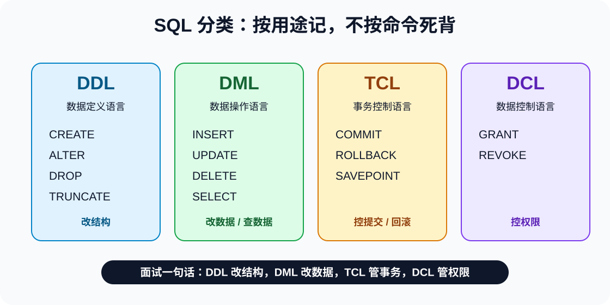
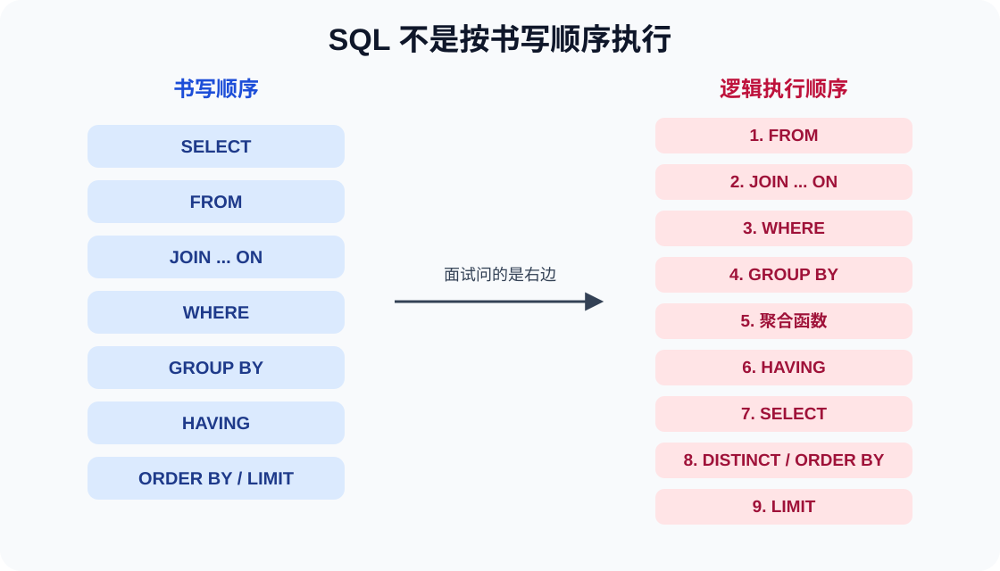
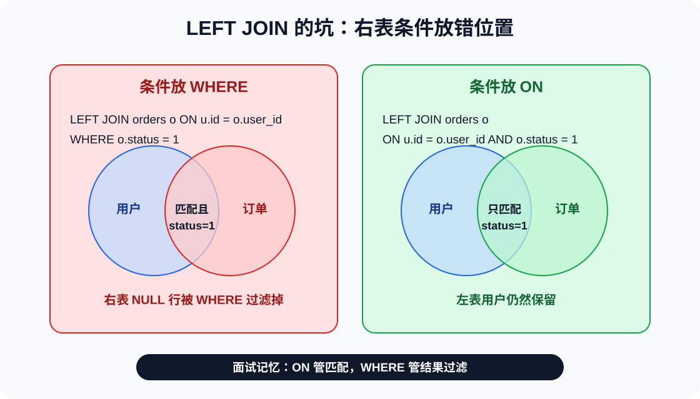

# MySQL 面试知识点全景

## 一、关系型数据库基础

### 1.1 什么是关系型数据库？

关系型数据库（RDB，Relational Database）是建立在关系模型基础上的数据库，数据之间存在一对一、一对多、多对多的联系。数据以表的形式存储，通过 SQL 进行操作和管理。大部分关系型数据库都支持事务的四大特性（ACID）。

常见的关系型数据库：MySQL、PostgreSQL、Oracle、SQL Server、SQLite。

### 1.2 什么是 SQL？

SQL 是一种结构化查询语言（Structured Query Language），几乎所有主流关系数据库都支持 SQL。SQL 可以帮助我们：新建数据库/表/字段、增删改查数据、新建视图/函数/存储过程、做简单的数据分析等。

### 1.3 MySQL 有什么优点？

- **开源免费**，社区庞大，生态完善
- **事务支持优秀**（InnoDB 引擎），默认 RR 隔离级别通过 MVCC 和 Next-Key Lock 很大程度上避免幻读
- **性能和可扩展性强**：经过海量互联网业务考验，支持主从复制、读写分离、分库分表
- **上手简单**，学习曲线平缓，维护成本低

### 1.4 数据库范式（Normalization）

面试常问：说说数据库三大范式？

**1NF（第一范式）**：字段不可再分，每个字段都是原子性的。

**2NF（第二范式）**：满足 1NF 前提下，不能出现部分依赖。即非主键字段必须完全依赖于主键（消除复合主键即可避免）。如果主键是联合主键 `(学号, 课程号)`，那么「学生姓名」只依赖于「学号」，就违反了 2NF。

**3NF（第三范式）**：满足 2NF 前提下，不能出现传递依赖。即非主键字段不能依赖于其他非主键字段。例如表中「学号→系编号→系名称」，系名称传递依赖于学号。

面试回答重点：范式是为了减少数据冗余、避免数据异常（插入异常、删除异常、更新异常）。但实际开发中不一定严格遵循 3NF，常会有意引入冗余来提高查询性能（反范式）。

### 1.5 关系型数据库 vs NoSQL

| 对比维度 | 关系型数据库 | NoSQL |
|---------|------------|-------|
| 数据模型 | 表结构，行列存储 | 键值、文档、列族、图等 |
| 事务支持 | 完整 ACID 事务 | 部分支持（通常最终一致性） |
| 扩展性 | 垂直扩展为主 | 水平扩展为主 |
| 典型产品 | MySQL、PostgreSQL、Oracle | Redis、MongoDB、Cassandra |

---

## 二、MySQL 基础架构

面试常问：一条 SQL 语句在 MySQL 中是如何执行的？

MySQL 主要分为 **Server 层**和**存储引擎层**：

```
连接器 → 查询缓存 → 分析器 → 优化器 → 执行器 → 存储引擎
```

| 组件 | 说明 |
|------|------|
| 连接器 | 身份认证和权限验证，建立和管理连接。连接建立后权限数据被缓存，后续即使管理员修改权限，当前连接也不受影响 |
| 查询缓存 | 8.0 版本已移除。之前版本以 Key-Value 缓存 SELECT 结果，但对表有任何更新都会清空该表所有缓存 |
| 分析器 | 词法分析（提取关键字）+ 语法分析（检查 SQL 语法是否正确） |
| 优化器 | 选择最优执行方案（如索引选择、JOIN 顺序） |
| 执行器 | 执行前校验权限，然后调用存储引擎接口返回结果 |
| 存储引擎 | 插件式架构，负责数据存储和读取，默认 InnoDB |

**更新语句（UPDATE/INSERT/DELETE）执行流程**：

```
分析器 → 权限校验 → 执行器 → 引擎 → redo log(prepare) → binlog → redo log(commit)
```

核心：两阶段提交保证 redo log 和 binlog 逻辑一致。redo log 是 InnoDB 特有（物理日志），binlog 是 Server 层共用的（逻辑日志）。

---

## 三、存储引擎

### 3.1 MyISAM vs InnoDB

| 特性 | MyISAM | InnoDB |
|------|--------|--------|
| 行级锁 | 仅表级锁 | 支持行级锁和表级锁 |
| 事务 | 不支持 | 支持（commit/rollback） |
| 外键 | 不支持 | 支持 |
| 崩溃恢复 | 不支持 | 支持（redo log） |
| MVCC | 不支持 | 支持 |
| 索引结构 | B+Tree，非聚簇索引 | B+Tree，聚簇索引（主键） |
| 默认引擎 | 5.5 之前 | 5.5 之后（当前默认） |

绝大多数场景推荐 InnoDB。MyISAM 只在极少数只读、并发低的历史归档场景才考虑。

### 3.2 存储引擎架构

MySQL 存储引擎采用**插件式架构**，可以为不同的表设置不同的存储引擎。存储引擎是基于表的，不是基于数据库的。

---

## 四、字段类型要点

### 4.1 整数类型

`TINYINT`（1 字节）、`SMALLINT`（2 字节）、`MEDIUMINT`（3 字节）、`INT`（4 字节）、`BIGINT`（8 字节）。

`UNSIGNED` 属性把正整数上限提高一倍。如 TINYINT 有符号范围 -128~127，无符号 0~255。

### 4.2 CHAR vs VARCHAR

| 类型 | 特点 | 适用场景 |
|------|------|---------|
| CHAR | 定长，存储时右边填充空格，检索时去掉 | 固定长度如身份证号、MD5 加密后的密码 |
| VARCHAR | 变长，需要 1~2 字节记录长度 | 变长字段如昵称、标题 |

CHAR(M) 和 VARCHAR(M) 的 M 都代表**字符数**，不是字节数。VARCHAR(100) 和 VARCHAR(10) 存储相同字符串时，占用磁盘空间一样，但 VARCHAR(100) 在内存操作（如排序）时会分配更多内存。

### 4.3 DECIMAL vs FLOAT/DOUBLE

**DECIMAL 是定点数**，存储精确值，适合金额。**FLOAT/DOUBLE 是浮点数**，近似值。金额必须用 DECIMAL，对应 Java 中的 `BigDecimal`。

### 4.4 DATETIME vs TIMESTAMP

| 类型 | 字节 | 范围 | 时区 |
|------|------|------|------|
| DATETIME | 8 | 1000~9999 年 | 无 |
| TIMESTAMP | 4 | 1970~2038 | 有 |

TIMESTAMP 有时区转换能力，但受 2038 问题限制。不涉及时区或需表示 2038 年之后时间，用 DATETIME。

### 4.5 NULL vs ''

- `NULL` 代表不确定/不存在的值；`''` 是已知的空字符串
- `COUNT(*)` 包含 NULL，`COUNT(column)` 不包含 NULL
- 判断 NULL 必须用 `IS NULL` / `IS NOT NULL`，不能用 `= NULL`
- MySQL 没有 Boolean 类型，用 `TINYINT(1)` 表示
- 建议尽量将列定义为 NOT NULL：索引 NULL 列需要额外空间，比较和计算时需特殊处理

### 4.6 存储手机号用 VARCHAR 还是 INT？

**强烈推荐 VARCHAR**：手机号可能包含前导零、国家代码前缀（'+'）、分隔符（'-'）；手机号本质是标识符不做运算；可用 `LIKE '138%'` 按号段查询；加密后的密文是字符串，INT 无法存储。

### 4.7 TEXT / BLOB 类型的坑

- TEXT 和 BLOB 是**大对象类型**（TINYTEXT < TEXT < MEDIUMTEXT < LONGTEXT，最大 4GB）
- 内存临时表不支持 TEXT/BLOB，查询中包含时可能将临时表从内存转为磁盘，性能急剧下降
- TEXT/BLOB 列只能使用**前缀索引**（`INDEX idx_name (text_col(50))`），不能建立全列索引
- 建议：将 TEXT/BLOB 列**分离到独立的扩展表**，只在需要时 JOIN 查询
- 查询时不要使用 `SELECT *`，只取需要的列，避免带上 TEXT 列

### 4.8 不建议使用 ENUM 类型

- 修改 ENUM 值需要用 `ALTER TABLE`，对大表是高成本操作
- ENUM 的 ORDER BY 按定义顺序而非字母序，行为容易误解
- 内部存储为数字，调试不直观
- 替代方案：用 `TINYINT` + 应用层常量/注释，或独立的字典表

### 4.9 时间类型存储建议

| 类型 | 存储空间 | 日期范围 | 时区 | 推荐场景 |
|------|---------|---------|:--:|------|
| DATETIME | 5~8 字节 | 1000 ~ 9999 年 | 否 | 不涉及时区，如生日、合同日期 |
| TIMESTAMP | 4~7 字节 | 1970 ~ 2038 年 | 是 | 记录创建/更新时间（自带头时区转换） |
| INT 时间戳 | 4 字节 | 1970 ~ 2038 年后 | 否 | 不推荐（无法使用日期函数，可读性差） |

**不要用字符串存日期**：无法利用日期函数、占用空间大、无法保证格式一致性。

---

## 五、索引

### 5.1 索引是什么？

索引是一种用于快速查询和检索数据的**排好序的数据结构**。作用相当于书的目录。MySQL 中 InnoDB 和 MyISAM 都使用 **B+Tree** 作为索引结构。

**优点**：查询速度快、保证数据唯一性、加速排序和分组

**缺点**：创建和维护耗时（DML 操作要同步维护索引）、占用磁盘空间、可能被误用或失效

**用了索引就一定能提高查询性能吗？** 不一定。数据量太小、查询结果集占比过大（超过 20%~30%，优化器认为全表扫描顺序 I/O 优于回表随机 I/O）、统计信息过时都可能导致索引不生效。

### 5.2 索引数据结构对比

面试常问「为什么 MySQL 用 B+Tree 而不用 Hash / B Tree / 跳表」，本质是在考察你对各数据结构**缺点**的理解，而不仅仅是 B+Tree 的优点。

#### 5.2.1 Hash 索引的致命缺点

Hash 基于哈希表，等值查询 O(1) 理论上最快。但 MySQL 没有将其作为默认索引，原因全部来自它的缺点：

- **不支持范围查询**：`>`、`<`、`BETWEEN`、`>=`、`<=` 完全无法使用 Hash 索引。OLTP 场景中范围查询极其常见（如「最近一周的订单」），这个缺点一票否决
- **不支持排序**：ORDER BY 不能被 Hash 索引加速，必须额外 filesort，大数据量下是性能灾难
- **不支持部分键匹配**：联合索引 `(a, b)` 中 `WHERE a=1`，B+Tree 走最左前缀即可，Hash 必须全部列精确匹配
- **哈希冲突**：数据量大时冲突增多，冲突部分退化为链表遍历，查找性能从 O(1) 退化到 O(N)，且不保证稳定
- **无法加速 GROUP BY / DISTINCT / 覆盖索引扫描**：这些操作都依赖数据的有序性，Hash 完全不保证顺序
- **仅 MEMORY / NDB 引擎原生支持**：InnoDB 下无法显式创建 Hash 索引，适用范围极窄

> InnoDB 存在「自适应哈希索引」（Adaptive Hash Index，AHI），是将高频访问的 B+Tree 页自动建立哈希映射加速等值查询，每个哈希桶内仍是一个小型 B+Tree。本质是缓存优化而非独立索引，不改变 B+Tree 的主体地位。

#### 5.2.2 B Tree 的缺点

B Tree 和 B+Tree 表面相似，但几个关键差异让 B Tree 在数据库场景中全面落败：

- **非叶子节点也存储完整数据行**：每个节点能容纳的索引键数量大幅减少 → 同样数据量下**树更高，磁盘 I/O 次数更多**
- **数据分散在所有层级**：范围查询需要在父子节点间反复跳转，产生大量**随机 I/O**，而 B+Tree 只需在叶子链表上顺序扫描
- **查询性能不稳定**：可能在根节点就命中（极快），也可能走到叶子（慢几个数量级），对延迟敏感的 OLTP 场景不友好

| 维度 | B Tree | B+Tree |
|------|--------|--------|
| 数据存储位置 | 所有节点都存数据 | 仅叶子节点存数据 |
| 单个节点容纳索引键数 | 少（被数据行挤占空间） | 多（仅存键 + 指针） |
| 树高 | 更高 | 更矮，I/O 更少 |
| 范围查询 | 中序遍历 + 回溯父节点，随机 I/O | 叶子双向链表顺序扫描 |
| 查询稳定性 | 不稳定（可能中途命中） | 稳定（每次必到叶子） |
| 全表扫描 | 需遍历所有层级 | 仅扫描叶子链表即可 |

#### 5.2.3 B+Tree 自身也有缺点

B+Tree 虽然是数据库索引的最优解，但并非完美：

- **非叶子节点冗余存储索引键**：空间开销略大于 B Tree（所有索引键在非叶子层多存一份）
- **每次查询必须走到叶子节点**：即使数据在根节点附近，也要走 log(N) 层，等值查询不如 Hash 的 O(1) 直接
- **写入代价**：插入/删除可能触发**页分裂**（page split）或**页合并**（page merge），随机主键（如 UUID）场景下页分裂尤其严重，导致大量碎片和空间浪费
- **并发瓶颈**：高并发写入同一数据页时存在 latch 竞争，虽然 B+Tree 的锁粒度到页级已经比表级好很多，但热点行场景仍是瓶颈

#### 5.2.4 全文索引（Full-Text）的缺点

全文索引基于**倒排索引**（Inverted Index），做关键词搜索很快，但缺点明显：

- **索引体积大**：需要维护词→文档 ID 的映射关系，索引体积通常是原数据的数倍
- **写入性能差**：每次 INSERT/UPDATE 都要分词、构建/更新倒排索引，写开销远超 B+Tree
- **中文分词是硬伤**：内置 ngram 分词器效果一般，生产环境往往需要引入 IK Analyzer 等第三方分词插件，维护成本高
- **不支持事务语义**：OLTP 场景基本不可用
- **OLTP 场景不适用**：实际生产环境中全文检索需求通通常用 Elasticsearch 等专用搜索引擎处理，MySQL 的 Full-Text 仅适用于小型、低频搜索场景

#### 5.2.5 空间索引（RTree）的缺点

RTree 专为地理位置、几何数据设计，通用性极差：

- **仅适用于 geometry 类型**：点、线、面等空间数据，普通业务数据完全用不上
- **插入/更新代价高**：多维空间的分裂算法比一维 B+Tree 复杂得多
- **维度灾难**：数据维度升高时（如三维 GPS + 时间），查询效率急剧退化，近似全表扫描
- **优化器支持不成熟**：MySQL 优化器对空间索引的统计信息估计不够精准，可能选错执行计划

#### 5.2.6 横向对比总表

| 数据结构 | 等值查询 | 范围查询 | 排序加速 | 空间占用 | 写入性能 | MySQL 支持范围 |
|---------|:--:|:--:|:--:|:--:|:--:|------|
| B+Tree | O(log N) | O(log N + K) | 支持 | 中等 | 中等（页分裂） | InnoDB / MyISAM 默认 |
| Hash | O(1) | **不支持** | **不支持** | 中等 | 快 | 仅 MEMORY / NDB |
| B Tree | 不稳定 | 慢（随机 I/O） | 中等 | 较小 | 中等（页分裂） | 已不再使用 |
| Full-Text | 快（关键词） | **不支持** | **不支持** | 大（数倍于数据） | 慢 | InnoDB / MyISAM |
| RTree | 快（低维空间） | 快（低维空间） | **不支持** | 大 | 慢（多维分裂） | InnoDB / MyISAM (geometry) |

**面试总结**：数据库索引选型的本质，是在 **磁盘 I/O、查询类型覆盖度、写入成本** 三者间做权衡。B+Tree 用可接受的写入代价和空间开销，覆盖了等值查询、范围查询、排序、分组等绝大多数 SQL 操作，因此在关系型数据库中获得统治地位。

**为什么推荐自增主键？** 自增主键顺序插入，页分裂少，B+Tree 维护成本低。UUID 等随机值会导致大量页分裂和碎片。

### 5.3 聚簇索引 vs 辅助索引

- **聚簇索引**（InnoDB）：主键索引的叶子节点直接存储完整数据记录，一张表只有一个
- **辅助索引**（二级索引）：叶子节点存储主键值，需要通过主键**回表**查询完整记录

### 5.4 覆盖索引

查询的所有字段都在索引中，无需回表，性能最好。`EXPLAIN` 中 `Extra` 显示 `Using index`。

### 5.5 联合索引与最左前缀原则

联合索引遵循**最左前缀匹配原则**，遇到范围查询（`>`、`<`、`BETWEEN`）会停止匹配后续字段（对于 `>=`、`<=`、`LIKE 'prefix%'` 不会停止）。

面试题：联合索引 `(a, b, c)`，以下查询能用到索引吗？
- `a=1 AND c=3` → 只有 `a` 走索引，`c` 跳过了 `b` 用不到
- `c=3` → 整个索引都不能用
- `b=1 AND c=3` → 整个索引都不能用
- `b=1 AND a=1 AND c=3` → 可以用！优化器会重排序为 `a=1 AND b=1 AND c=3`

区分度高的字段放在联合索引最左侧，能过滤更多数据。

### 5.6 索引下推（ICP）

MySQL 5.6+ 支持。存储引擎层在索引遍历时就过滤 WHERE 条件，减少回表次数。`EXPLAIN` 中 `Extra` 显示 `Using index condition`。

### 5.7 索引跳跃扫描（ISS）

MySQL 8.0 新特性。前导列区分度低时，即使不满足最左前缀也可能使用联合索引。但 MySQL 8.0.31 曾报告导致数据丢失的 bug，**严禁依赖 ISS 弥补糟糕的索引设计**。

### 5.8 索引类型分类

**按数据结构：**
| 类型 | 说明 | 缺点 |
|------|------|------|
| B+Tree 索引 | 默认和最常用，MyISAM 和 InnoDB 都使用 | 页分裂/合并有维护开销；等值查询不及 Hash 快；非叶子冗余存储键 |
| Hash 索引 | 仅 MEMORY 引擎支持，适合等值查询 | 不支持范围查询、排序、部分键匹配；哈希冲突导致性能退化 |
| Full-Text 索引 | 全文索引，`CHAR`/`VARCHAR`/`TEXT` 可用 | 索引体积大；写入性能差；中文分词需额外配置；OLTP 不适用 |
| RTree 索引 | 空间索引，仅 geometry 数据类型 | 仅适用空间数据；插入代价高；维度灾难；优化器支持不成熟 |

**按底层存储方式：**
| 类型 | 说明 |
|------|------|
| 聚簇索引 | 索引结构和数据一起存放，InnoDB 主键索引 |
| 非聚簇索引 | 索引结构和数据分开存放，MyISAM 所有索引、InnoDB 二级索引 |

**按应用维度：**
| 类型 | 说明 |
|------|------|
| 主键索引 | 加速查询 + 唯一非空 + 表中只有一个 |
| 唯一索引 | 加速查询 + 唯一（可以有 NULL） |
| 普通索引 | 仅加速查询 |
| 覆盖索引 | 索引包含所有需要查询的字段 |
| 联合索引 | 多列组成一个索引，遵循最左前缀 |
| 前缀索引 | 对文本前几个字符创建索引，省空间 |
| 全文索引 | 检索大文本关键字，通常用 ES 替代 |

**MySQL 8.x 新索引特性：**

| 特性 | 说明 |
|------|------|
| 隐藏索引 | 不会被优化器使用但仍需维护，用于灰度发布和软删除（主键不能隐藏） |
| 降序索引 | 真正支持 DESC 降序索引（之前版本语法支持但实际仍创建为升序） |
| 函数索引 | 可在索引中使用函数或表达式（`CREATE INDEX idx ON t ((UPPER(name)))`） |

**InnoDB 没有显式主键时怎么办？**
- 先检查表中是否有唯一索引且不允许 NULL 的字段，有则选为默认主键
- 否则自动创建 6 字节的 `DB_ROW_ID` 作为聚簇索引

### 5.9 索引失效的常见场景

1. **违背最左前缀原则**
2. **在索引列上进行计算、函数、类型转换**：`WHERE DATE(create_time) = '2022-01-01'`
3. **隐式类型转换**：字符串列与数字值比较时，转换发生在索引列上，破坏有序性
4. **LIKE 以通配符开头**：`LIKE '%abc%'`
5. **OR 条件**：任一列没有索引，全部放弃
6. **两表字符集不同**：关联查询时隐式转换

---

## 六、事务（ACID）

### 6.1 四大特性

| 特性 | 说明 | 实现机制 |
|------|------|---------|
| 原子性 (Atomicity) | 事务不可分割，要么全做要么全不做 | undo log |
| 一致性 (Consistency) | 事务前后数据保持一致 | A/I/D 共同保障 |
| 隔离性 (Isolation) | 并发事务互不干扰 | MVCC + 锁 |
| 持久性 (Durability) | 提交后数据永久保存 | redo log |

**A、I、D 是手段，C 是目的。**

### 6.2 并发问题

| 问题 | 描述 |
|------|------|
| 脏读 | 读到其他事务未提交的数据 |
| 丢失修改 | 两个事务同时修改，一个覆盖另一个 |
| 不可重复读 | 同一事务内两次读取结果不同（UPDATE 导致） |
| 幻读 | 同一事务内两次查询记录数不同（INSERT/DELETE 导致） |

不可重复读的重点是**内容修改**，幻读的重点是**记录新增**。解决幻读需要 Gap Lock，解决不可重复读只需 Record Lock。

### 6.3 并发问题演示

假设表 `account` 初始 `id=1, balance=1000`。

**脏读演示**（RU 隔离级别）：

| 时间 | 事务 A | 事务 B |
|------|--------|--------|
| T1 | BEGIN | |
| T2 | UPDATE SET balance=800 WHERE id=1 | |
| T3 | | BEGIN; SELECT balance → **800**（脏读！A 未提交） |
| T4 | ROLLBACK（balance 回到 1000） | |
| T5 | | 事务 B 基于 800 做了错误决策 |

**不可重复读演示**（RC 隔离级别）：

| 时间 | 事务 A | 事务 B |
|------|--------|--------|
| T1 | BEGIN; SELECT balance → **1000** | |
| T2 | | BEGIN; UPDATE SET balance=800; COMMIT |
| T3 | SELECT balance → **800**（不可重复读！同一事务两次读到不同值） | |

**幻读演示**（标准 RR 无法解决）：

| 时间 | 事务 A | 事务 B |
|------|--------|--------|
| T1 | BEGIN; SELECT * WHERE age>18 → **3 行** | |
| T2 | | BEGIN; INSERT age=20; COMMIT |
| T3 | SELECT * WHERE age>18 → 标准 SQL 下可能读到 **4 行**（幻读） | |

> InnoDB 通过 Next-Key Lock（当前读）或 MVCC 快照读解决了上述幻读问题。

### 6.4 隔离级别

| 级别 | 脏读 | 不可重复读 | 幻读 |
|------|:--:|:--:|:--:|
| READ-UNCOMMITTED | 是 | 是 | 是 |
| READ-COMMITTED | 否 | 是 | 是 |
| **REPEATABLE-READ** | 否 | 否 | InnoDB 用 Next-Key Lock 解决 |
| SERIALIZABLE | 否 | 否 | 否 |

**InnoDB 默认隔离级别是 REPEATABLE-READ**。通过 `SELECT @@transaction_isolation;` 查看。

标准 SQL 定义的 RR 级别无法防止幻读。但 InnoDB 在 RR 下：
- **快照读**（普通 SELECT）：通过 MVCC 读取事务开始时的快照，看不到其他事务插入的新行
- **当前读**（SELECT ... FOR UPDATE / INSERT / UPDATE / DELETE）：通过 Next-Key Lock 锁住记录和间隙，防止插入

---

## 七、MVCC（多版本并发控制）

### 7.1 什么是 MVCC？

MVCC 是一种并发控制机制，通过对每行数据维护多个版本来实现事务隔离。读操作使用快照读，不阻塞写操作。

### 7.2 实现依赖

MVCC 的实现依赖于：**隐藏字段、Read View、undo log**。

**隐藏字段**（每行数据）：
- `DB_TRX_ID`（6 字节）：最后一次修改该行的事务 ID
- `DB_ROLL_PTR`（7 字节）：回滚指针，指向 undo log 中的历史版本
- `DB_ROW_ID`（6 字节）：没有主键时的默认聚簇索引 ID

**Read View**：判断数据版本可见性的快照，记录当前活跃事务列表。

**undo log**：记录数据的历史版本，形成版本链。

### 7.3 快照读 vs 当前读

- **快照读**（一致性非锁定读）：普通 SELECT，读取快照版本，不会等待锁释放
- **当前读**（锁定读）：`SELECT ... FOR UPDATE`、`INSERT`、`UPDATE`、`DELETE`，读取最新数据并加锁

### 7.4 ReadView 可见性判断规则

ReadView 在创建时记录以下关键信息：

| 字段 | 含义 |
|------|------|
| `m_ids` | 创建 ReadView 时，当前系统中**活跃的（未提交的）**读写事务 ID 列表 |
| `min_limit_id` | `m_ids` 中最小的值 |
| `max_limit_id` | 创建 ReadView 时，系统尚未分配的下一个事务 ID（即全局最大已分配事务 ID + 1） |
| `creator_trx_id` | 创建该 ReadView 的事务 ID |

判断某行记录的版本 `trx_id` 是否可见：

1. **`trx_id == creator_trx_id`** → 可见（自己修改的）
2. **`trx_id < min_limit_id`** → 可见（修改该行的事务在 ReadView 创建前已提交）
3. **`trx_id >= max_limit_id`** → 不可见（修改该行的事务在 ReadView 创建后才开始）
4. **`min_limit_id <= trx_id < max_limit_id`** → 若 `trx_id` 在 `m_ids` 中，说明事务未提交，**不可见**；若不在，说明已提交，**可见**

如果当前版本不可见，则沿着 `DB_ROLL_PTR` 指向的 undo log 版本链向前查找，直到找到第一个可见的版本。

### 7.5 RC 和 RR 下 MVCC 的区别

**在 RC 下，每次 SELECT 都生成新的 Read View**，因此每次都能读到其他已提交事务的最新数据 → 导致不可重复读。

**在 RR 下，只在第一次 SELECT 时生成一个 Read View**，之后一直沿用这个 ReadView，后续其他事务的提交（trx_id 变大）对当前事务不可见 → 实现可重复读。

---

## 八、锁

### 8.1 表级锁 vs 行级锁

MyISAM 仅支持表级锁，InnoDB 支持表级锁和行级锁，默认行级锁。行级锁粒度更小，并发性能更高。

### 8.2 共享锁 (S) vs 排他锁 (X)

- **共享锁（S 锁）**：读锁，允许多个事务同时持有（兼容 S 锁，冲突 X 锁）
- **排他锁（X 锁）**：写锁，不允许其他任何锁

由于 MVCC 的存在，普通 SELECT 不加锁。显式加锁：
```sql
SELECT ... LOCK IN SHARE MODE;  -- S 锁
SELECT ... FOR UPDATE;          -- X 锁
```

### 8.3 InnoDB 的三种行锁

- **记录锁（Record Lock）**：锁住单行记录
- **间隙锁（Gap Lock）**：锁住一个范围，不包括记录本身
- **临键锁（Next-Key Lock）**：Record Lock + Gap Lock，锁住范围含记录本身，主要解决幻读

在 RR 默认隔离级别下，行锁默认使用 Next-Key Lock。但如果操作的索引是唯一索引或主键，会降级为 Record Lock。

### 8.4 意向锁

意向锁是**表级锁**，由引擎自动维护：
- **意向共享锁（IS）**：事务有意向对某些行加 S 锁
- **意向排他锁（IX）**：事务有意向对某些行加 X 锁

作用：快速判断表中是否有行锁，无需一行行遍历。意向锁之间互相兼容，但意向锁与表级 S/X 锁互斥。

### 8.5 锁兼容矩阵

|  | IS | IX | S | X |
|:--:|:--:|:--:|:--:|:--:|
| **IS** | ✅ | ✅ | ✅ | ❌ |
| **IX** | ✅ | ✅ | ❌ | ❌ |
| **S** | ✅ | ❌ | ✅ | ❌ |
| **X** | ❌ | ❌ | ❌ | ❌ |

> 横向是已持有锁，纵向是请求锁。IS/IX 之间完全兼容，体现了意向锁的高并发设计。

### 8.6 加锁规则（RR 隔离级别）

面试中常让分析一条 SQL 到底加了什么锁。核心原则：

1. **原则 1**：加锁的基本单位是 Next-Key Lock（前开后闭区间）
2. **原则 2**：查找过程中访问到的对象才会加锁
3. **优化 1**：唯一索引等值查询，找到目标时退化为 Record Lock
4. **优化 2**：唯一索引等值查询，找不到目标时退化为 Gap Lock
5. **Bug/特性**：唯一索引范围查询会访问到第一个不满足条件的值为止

**举例说明**（假设表 `t` 有主键 id：1, 5, 10, 15）：

```sql
-- 场景1：等值查询命中（唯一索引）
SELECT * FROM t WHERE id = 5 FOR UPDATE;
-- 只对 id=5 加 Record Lock（优化1）

-- 场景2：等值查询未命中（唯一索引）
SELECT * FROM t WHERE id = 7 FOR UPDATE;
-- 对 (5, 10) 加 Gap Lock（优化2），防止在 5-10 之间插入

-- 场景3：范围查询
SELECT * FROM t WHERE id >= 5 AND id < 10 FOR UPDATE;
-- Next-Key Lock: (1,5] + (5,10]，但 id=10 也会被访问到
-- 实际锁: (1,5], (5,10], (10,15) 加 Gap Lock
```

**RC 隔离级别下**：只使用 Record Lock，不使用 Gap Lock。因此无法解决幻读。

### 8.7 自增锁（AUTO-INC Lock）

表级锁，用于 INSERT 语句获取自增值。`innodb_autoinc_lock_mode` 控制：

| 值 | 说明 |
|:--:|------|
| 0 | 传统模式：表级 AUTO-INC 锁，INSERT 完成后释放 |
| 1 | 连续模式（默认）：简单 INSERT 使用轻量级互斥量；`INSERT...SELECT` 使用表级锁 |
| 2 | 交叉模式：全部使用轻量级互斥量，自增值可能不连续（主从复制需用 row 格式 binlog） |

### 8.8 死锁预防

- 保证加锁顺序一致（访问表和行的顺序）
- 缩短事务（避免在事务中做网络调用等耗时操作）
- 尽早提交事务
- MySQL 自动死锁检测（默认开启，`innodb_deadlock_detect=ON`），检测到后会回滚较小的事务

---

## 九、MySQL 三大日志

### 9.1 redo log（重做日志）

**InnoDB 独有**，物理日志，记录"在某个数据页上做了什么修改"。保证事务的**持久性**。

采用 WAL（Write-Ahead Logging）：先写日志，后刷数据页。redo log 是顺序写，性能远优于随机写数据页。

**刷盘策略** `innodb_flush_log_at_trx_commit`：
- **0**：每次提交不刷盘，性能最高，MySQL 宕机可能丢 1 秒数据
- **1**（默认）：每次提交都刷盘，最安全，性能最低
- **2**：每次提交写 page cache，MySQL 宕机不丢数据，但机器宕机可能丢数据

**日志文件组**：redo log 以环形数组形式存储。`write pos` 是当前写入位置，`checkpoint` 是当前擦除位置。`write pos` 追上 `checkpoint` 时，MySQL 需停下来推进 `checkpoint`。

### 9.2 binlog（归档日志）

**Server 层**的逻辑日志，记录语句的原始逻辑。所有存储引擎共用。

作用：**数据备份、主从复制**。MySQL 主备、主主、主从集群依赖 binlog 同步数据。

**三种格式**：
- **statement**：记录 SQL 原文，可能因函数（如 `now()`）导致主从不一致
- **row**（推荐）：记录每行数据的具体变化，保证一致性，但日志量大
- **mixed**：折中方案，大多数用 statement，不确定时用 row

### 9.3 undo log（回滚日志）

undo log 记录 SQL 的反向操作（INSERT 记录 DELETE，DELETE 记录 INSERT，UPDATE 记录逆向 UPDATE），保证事务的**原子性**（回滚时依赖它恢复数据）。同时是 **MVCC 的核心依赖**——通过 undo log 的版本链（`DB_ROLL_PTR` 串联）读取历史数据。

undo log 也是逻辑日志，每条 undo log 对应一个修改操作。undo log 不是独立的日志文件，而是存储在 **undo 表空间**（默认 `innodb_undo_tablespaces >= 2`，MySQL 8.0+）中。

**回滚段（Rollback Segment）**：
- 每个回滚段包含 1024 个 undo log slot
- InnoDB 支持最多 128 个回滚段（`innodb_rollback_segments`）
- 其中 32 个用于临时表（不对应 redo log），96 个用于普通表

**undo log 的两大类**：
| 类型 | 用途 | 特点 |
|------|------|------|
| INSERT undo log | 回滚 INSERT 操作 | 仅回滚需要，事务提交后立即删除 |
| UPDATE undo log | 回滚 UPDATE/DELETE + MVCC | 只有没有 ReadView 需要时才由 purge 线程清理 |

**purge 线程**：后台清理不再需要的 undo log 和历史版本。过长的事务会导致 undo log 堆积，占用大量磁盘空间。`information_schema.innodb_trx` 可查看当前活跃事务。

### 9.4 两阶段提交

redo log 和 binlog 的写入时机不同：redo log 在事务执行中不断写入，binlog 在事务提交时才写入。如果不用两阶段提交，可能出现 redo log 写完但 binlog 没写（崩溃恢复后数据不一致）。

**两阶段提交过程**：
1. redo log 进入 **prepare** 状态
2. 写入 binlog
3. redo log 提交为 **commit** 状态

崩溃恢复时：如果 redo log 是 prepare 状态且有对应 binlog，则提交；否则回滚。

---

## 十、查询缓存

查询缓存是 MySQL 8.0 之前的功能，以 Key-Value 缓存 SELECT 结果。**MySQL 8.0 已完全移除**，原因：

- **单一全局互斥锁**（`LOCK_query_cache`）：所有读写缓存操作争抢同一把锁，高并发下成为性能瓶颈（可通过 `SHOW PROCESSLIST` 看到大量 `Waiting for query cache lock`）
- **写操作触发全表失效**：对表的任何更新（数据/结构/索引）都会清空该表所有缓存。写密集场景失效率极高，刚存进去的缓存可能立刻被清掉
- **缓存规则苛刻**：SQL 必须完全一致（大小写、空格、注释等），稍有不同即为两条不同的查询
- **分库分表环境几乎无效**：中间件路由到不同实例各自维护独立缓存，且 SQL 被改写后 Hash 值不同

**监控指标**（MySQL 5.7 及之前版本）：

```sql
SHOW STATUS LIKE 'Qcache%';
```

| 状态变量 | 含义 |
|------|------|
| `Qcache_hits` | 缓存命中次数 |
| `Qcache_inserts` | 写入缓存的查询次数 |
| `Qcache_not_cached` | 未被缓存的查询次数（不可缓存或未命中） |
| `Qcache_lowmem_prunes` | 因内存不足被淘汰的缓存条目数，持续升高说明空间不足或碎片严重 |
| `Qcache_free_memory` | 缓存剩余空闲内存（字节） |

**命中率公式**：`Qcache_hits / (Qcache_hits + Qcache_inserts + Qcache_not_cached)`。若命中率长期低于 50%，说明不适合开启。若 `Qcache_lowmem_prunes` 持续增长，缓存是纯负收益。

**适用场景**：表数据修改不频繁（如博客系统）、查询重复度高、结果集小于 1 MB。**高并发写密集场景下开启反而降低性能。**

**替代方案**：使用本地缓存（Caffeine）或分布式缓存（Redis），性能更好，控制更灵活。

---

## 十一、SQL 基础

### 11.1 SQL 分类

| 分类 | 全称 | 常见命令 |
|------|------|---------|
| DDL | 数据定义语言 | `CREATE`、`ALTER`、`DROP`、`TRUNCATE` |
| DML | 数据操作语言 | `INSERT`、`UPDATE`、`DELETE`、`SELECT` |
| TCL | 事务控制语言 | `COMMIT`、`ROLLBACK`、`SAVEPOINT` |
| DCL | 数据控制语言 | `GRANT`、`REVOKE` |



### 11.2 DROP、TRUNCATE、DELETE 区别

| 操作 | 类型 | 作用 | 可回滚 | 可加 WHERE | 自增值 |
|------|------|------|:--:|:--:|:--:|
| DELETE | DML | 逐行删除数据 | 是 | 是 | 不变 |
| TRUNCATE | DDL | 释放数据页清空表 | 否 | 否 | 重置 |
| DROP | DDL | 删除表结构和数据 | 否 | 否 | — |

面试关键：**只有 DELETE 可以回滚**。TRUNCATE 和 DROP 是 DDL，执行后隐式提交，不可回滚。

### 11.3 SQL 执行顺序

书写顺序：`SELECT ... FROM ... JOIN ... ON ... WHERE ... GROUP BY ... HAVING ... ORDER BY ... LIMIT ...`

逻辑执行顺序：
1. `FROM` → 2. `JOIN ... ON` → 3. `WHERE` → 4. `GROUP BY` → 5. 聚合函数 → 6. `HAVING` → 7. `SELECT` → 8. `DISTINCT` → 9. `ORDER BY` → 10. `LIMIT`



**要点**：WHERE 在分组前过滤，不能使用聚合函数；HAVING 在分组后过滤，可以使用聚合函数。SELECT 中定义的别名不能直接在 WHERE 中使用（因为 WHERE 逻辑上先执行）。

### 11.4 WHERE 与 HAVING 区别

```sql
SELECT status, COUNT(*) AS cnt
FROM users
WHERE created_at >= '2026-01-01'
GROUP BY status
HAVING COUNT(*) > 10;
```

WHERE 过滤原始行（分组前），HAVING 过滤聚合结果（分组后）。

### 11.5 JOIN

- **INNER JOIN**：只返回两表都匹配的数据
- **LEFT JOIN**：保留左表全部数据，右表没匹配为 NULL
- **RIGHT JOIN**：保留右表全部数据，左表没匹配为 NULL

**ON 和 WHERE 的区别（LEFT JOIN 中的坑）**：
- `ON` 决定表如何关联
- `WHERE` 对关联后的结果再过滤
- **右表过滤条件写在 WHERE 会过滤掉 NULL 行，让 LEFT JOIN 退化为 INNER JOIN**
- 口诀：**右表条件放 ON，左表条件放 WHERE**



### 11.6 子查询

- **IN 子查询**：关注子查询返回的具体值集合，适用于子查询结果集小的场景
- **EXISTS**：关注子查询是否能查到记录，适用于外表小的场景

### 11.7 ORDER BY 与 LIMIT

`LIMIT offset, size` 跳过 offset 行取 size 行。深分页越来越慢（需要扫描并丢弃大量数据）。

**深分页优化**：游标分页
```sql
-- 慢：SELECT * FROM users ORDER BY id LIMIT 100000, 20;
-- 快：SELECT * FROM users WHERE id < last_id ORDER BY id DESC LIMIT 20;
```


### 11.8 UNION

UNION 默认去重（DISTINCT），UNION ALL 不去重。在明显不会有重复值时用 UNION ALL 性能更好。

### 11.9 字符集与校验集

MySQL、数据库、表、字段均可设置编码。三个关键变量：

| 变量 | 含义 |
|------|------|
| character_set_client | 客户端发送数据使用的编码 |
| character_set_results | 服务器返回结果使用的编码 |
| character_set_connection | 连接层编码 |

`SET NAMES GBK` 等同于同时设置以上三个变量。

**校验集（Collation）** 用于排序规则。查看支持：`SHOW CHARACTER SET; SHOW COLLATION;`

建议统一使用 **utf8mb4**（MySQL 的 utf8 是阉割版，最多 3 字节，不支持 emoji）。

### 11.10 CREATE TABLE 常用选项

```sql
CREATE [TEMPORARY] TABLE [IF NOT EXISTS] 表名 (
    字段名 数据类型 [NOT NULL | NULL] [DEFAULT 默认值] [AUTO_INCREMENT]
    [UNIQUE [KEY] | [PRIMARY] KEY] [COMMENT '注释']
) ENGINE=InnoDB DEFAULT CHARSET=utf8mb4 COMMENT='表注释';
```

表选项：`ENGINE`（存储引擎）、`CHARSET`（字符集）、`AUTO_INCREMENT`（自增起始值）、`COMMENT`（注释）。

复制表结构：`CREATE TABLE new_table LIKE old_table;`
复制表结构和数据：`CREATE TABLE new_table AS SELECT * FROM old_table;`

### 11.11 视图（View）

**什么是视图**：虚拟表，内容由查询定义，不存储数据，只有结构文件。作用：
- 简化复杂查询
- 隐藏真实表结构（安全）

```sql
CREATE [OR REPLACE] VIEW view_name AS select_statement;
DROP VIEW [IF EXISTS] view_name;
```

**注意**：不是所有视图更新都能映射到基表，一般不修改视图数据。

### 11.12 存储过程（Procedure）

一段预编译的 SQL 代码集合，用于完成业务逻辑。与函数的区别：**没有返回值**，通过 CALL 调用，不可在其他语句中混杂使用。

```sql
CREATE PROCEDURE sp_name (参数列表)
BEGIN
    -- 过程体
END;

CALL sp_name(参数);
```

参数类型：`IN`（输入）、`OUT`（输出）、`INOUT`（输入输出）。

### 11.13 触发器（Trigger）

监听表的 INSERT、UPDATE、DELETE 事件，自动触发执行。

```sql
CREATE TRIGGER trigger_name
BEFORE/AFTER INSERT/UPDATE/DELETE ON table_name
FOR EACH ROW trigger_body;
```

通过 `OLD` 和 `NEW` 引用修改前后的数据：UPDATE 前后都有，INSERT 只有 NEW，DELETE 只有 OLD。

### 11.14 表维护操作

| 操作 | 作用 |
|------|------|
| `ANALYZE TABLE` | 分析并存储表的关键字分布（影响优化器选择索引） |
| `CHECK TABLE` | 检查表是否有错误 |
| `OPTIMIZE TABLE` | 整理数据文件碎片 |
| `REPAIR TABLE` | 修复表 |

---

## 十二、EXPLAIN 执行计划

### 12.1 核心列说明

| 列名 | 含义 |
|------|------|
| id | SELECT 标识符，id 值越大越先执行，相同 id 从上往下执行 |
| select_type | 查询类型（见下表） |
| **type** | 访问方法：system > const > eq_ref > ref > range > index > **ALL（需优化）** |
| possible_keys | 可能用到的索引 |
| **key** | 实际使用的索引，NULL 表示未用到 |
| key_len | 索引中使用的字节数，判断联合索引用了几列 |
| **ref** | 与 key 列比较的列或常量（`const` / 具体字段名 / `func`） |
| **rows** | 估算需要扫描的行数，越小越好 |
| filtered | 经 WHERE 过滤后留存记录的百分比（100% 表示全部保留），值越小说明索引过滤效果越好 |
| **Extra** | 附加信息 |

### 12.2 select_type 详解

| select_type | 含义 |
|------|------|
| SIMPLE | 简单查询，不含子查询或 UNION |
| PRIMARY | 最外层查询（含子查询时标注最外层） |
| SUBQUERY | SELECT / WHERE 中的非 FROM 子查询 |
| DERIVED | FROM 中的子查询，生成临时派生表 |
| UNION | UNION 中第二个及之后的 SELECT |
| UNION RESULT | UNION 合并的结果集 |
| DEPENDENT SUBQUERY | 依赖外层查询的子查询（每行外层数据触发一次，性能差） |
| DEPENDENT UNION | 依赖外层查询的 UNION |
| MATERIALIZED | 子查询结果物化为临时表（MySQL 5.6+） |
| UNCACHEABLE SUBQUERY | 无法缓存的子查询（含 `rand()` 等不确定函数） |

> **核心关注**：出现 `DEPENDENT SUBQUERY` 是严重性能信号——外层每行数据都要执行一次子查询，应立即改写为 JOIN。

### 12.3 key_len 计算要点

key_len 用于判断**联合索引中到底用了几个列**。计算规则（简化）：

- `INT`：4 字节，允许 NULL 时 +1 = 5
- `BIGINT`：8 字节，允许 NULL 时 +1 = 9
- `VARCHAR(n)`（utf8mb4）：`n * 4 + 2`（变长字段长度存储），允许 NULL 时 +1
- `CHAR(n)`（utf8mb4）：`n * 4`，允许 NULL 时 +1

示例：联合索引 `(name VARCHAR(50), age INT)` 均 NOT NULL，utf8mb4。
- key_len = 202 → 只用到 name 列（50 * 4 + 2 = 202）
- key_len = 207 → 两列都用到了（202 + 4 + 1(age 可为空) ≈ 207）

### 12.4 Extra 关键值

| Extra 值 | 含义 |
|------|------|
| Using index | 覆盖索引，无需回表，性能最佳 |
| Using index condition | 索引下推（ICP） |
| Using where | Server 层额外过滤 |
| Using filesort | 无法用索引完成排序，需额外排序操作 |
| Using temporary | 创建临时表，常见于 GROUP BY / ORDER BY |
| Using join buffer | 被驱动表未使用索引 |

出现 `Using filesort` 或 `Using temporary` 时，性能可能有问题，需优化。

### 12.5 type 字段详解

| type | 说明 |
|------|------|
| system | 表只有一行，const 的特例 |
| const | 主键或唯一索引等值查询，最多一行匹配 |
| eq_ref | JOIN 时每一行匹配被驱动表的唯一一行 |
| ref | 普通索引等值查询，一个值可能匹配多行 |
| range | 索引范围扫描 |
| index | 全索引扫描（比全表好，但数据量大时仍然需要关注） |
| ALL | 全表扫描，需要优化 |

---

## 十三、索引失效

### 13.1 SQL 写法导致索引失效

**类型一：破坏 B+Tree 有序性**

1. **违背最左前缀**：跳过联合索引前导列
2. **索引列上做计算/函数**：`WHERE height + 1 = 170`
3. **隐式类型转换**：字符串列与数字比较（转换发生在索引列上）
4. **LIKE 前置通配符**：`LIKE '%abc'`
5. **ORDER BY 排序陷阱**：排序字段不在索引中、顺序不一致

**类型二：优化器成本决策**

6. **查询结果集占比过大**（>20%~30%）：优化器认为全表扫描优于回表
7. **OR 条件**：任一侧无索引即全表扫描
8. **IN 列表过长**（>200）：可能触发粗略估算导致选错索引
9. **NOT IN 常量列表**：通常全表扫描

### 13.2 隐式类型转换规则

| 场景 | 转换方向 | 索引 |
|------|---------|:--:|
| `varchar_col = 123` | 字符串转数字（发生在索引列） | ❌ 失效 |
| `int_col = '123'` | 字符串转数字（发生在常量侧） | ✅ 有效 |

---

## 十四、性能优化规范

### 14.1 数据库设计规范

- 所有表必须使用 **InnoDB** 存储引擎
- 字符集统一使用 **utf8mb4**
- 所有表和字段必须添加 **COMMENT 注释**
- 单表数据量控制在 **500 万以内**
- 每个 InnoDB 表必须有**主键**，建议使用自增 ID
- 禁止使用外键，在应用层保证数据一致性
- 同财务相关的金额数据必须用 **DECIMAL** 类型
- 尽量把列定义为 **NOT NULL**

### 14.2 索引设计规范

- 单表索引不超过 **5 个**
- 区分度最高的列放在联合索引最左侧
- 优先使用覆盖索引避免回表
- 避免建立冗余索引（如 `index(a,b)` 和 `index(a)`）
- 禁止使用全文索引（OLTP 场景不适用）

### 14.3 SQL 编写规范

- 禁止 `SELECT *`，使用具体字段列表
- INSERT 必须指定字段名
- 避免子查询，尽量改写为 JOIN
- JOIN 关联表不超过 **5 个**
- 用 `IN` 代替多个 `OR`
- 用 `UNION ALL` 代替 `UNION`（不去重时）
- WHERE 中禁止对列进行函数转换和计算
- 超 **100 万行**的批操作分批多次执行

### 14.4 性能优化思路

1. **定位慢 SQL**：慢查询日志 → 找到瓶颈
2. **分析执行计划**：EXPLAIN 看 type/key/rows/Extra
3. **优化索引**：覆盖索引、联合索引、修正最左前缀顺序
4. **优化表结构**：合理字段类型、避免冗余
5. **架构优化**：读写分离、分库分表、缓存（Redis）

---

## 十五、自增主键

### 15.1 InnoDB 为什么建议用自增主键？

自增主键顺序插入，页分裂少，B+Tree 维护成本低。UUID 等随机值会导致大量页分裂和碎片。二级索引叶子节点存主键值，主键越长二级索引越大。

### 15.2 自增主键一定连续吗？

**不保证连续**。四种不连续场景：

1. **自增步长不为 1**（`auto_increment_increment` > 1）
2. **唯一键冲突**：插入失败但自增值已递增
3. **事务回滚**：回滚不会回退自增值（为了避免并发申请 ID 时产生主键冲突）
4. **批量插入**（insert...select 等）：MySQL 不知道需要多少 ID，采用批量申请策略（1,2,4,8...），用不完的 ID 被浪费

---

## 十六、常见面试题速答

### 16.1 DELETE、TRUNCATE、DROP 区别？

DELETE 是 DML，逐行删除，可加 WHERE，可回滚。TRUNCATE 是 DDL，清空表并重置自增值，不可回滚。DROP 删表结构，不可回滚。**只有 DELETE 可回滚，TRUNCATE 和 DROP 会隐式提交。**

### 16.2 COUNT(\*)和 COUNT(1)和 COUNT(column)区别？

`COUNT(*)` 和 `COUNT(1)` 都统计行数，现代 MySQL 性能无差异。`COUNT(column)` 只统计该列不为 NULL 的行，如果列可为 NULL，结果可能小于前两者。

### 16.3 为什么不建议 SELECT \*？

- 读取不必要字段，增加网络传输和内存消耗
- 无法利用覆盖索引，可能导致回表
- 表结构变更易影响代码

### 16.4 深分页为什么慢？如何优化？

`LIMIT offset, size` 需扫描并跳过 offset 行。优化：游标分页（`WHERE id < last_id ORDER BY id DESC LIMIT 20`）。

### 16.5 ON 和 WHERE 在 LEFT JOIN 中有什么区别？

`ON` 决定表如何关联，`WHERE` 对关联后结果再过滤。右表过滤条件写在 WHERE 会过滤掉 NULL，让 LEFT JOIN 退化为 INNER JOIN。**右表条件放 ON，左表条件放 WHERE。**

### 16.6 不可重复读和幻读有什么区别？

不可重复读是**数据内容修改**（UPDATE），幻读是**记录数量变化**（INSERT/DELETE）。解决方案不同——前者用 Record Lock，后者需要 Gap Lock。

### 16.7 MySQL 默认隔离级别为什么是 RR 而不是 RC？

RR 通过 MVCC 和 Next-Key Lock 很大程度上解决了幻读，在数据一致性和并发性能之间取得了更好的平衡。大多数互联网业务场景对一致性要求较高。

### 16.8 什么是索引下推（ICP）？

MySQL 5.6+ 的优化功能。存储引擎在索引遍历时直接判断 WHERE 条件，过滤掉不满足条件的记录，减少回表次数和 Server 层与存储引擎之间的数据传输。

### 16.9 什么是覆盖索引？

查询的所有字段都在索引中，直接从索引获取数据，无需回表。`EXPLAIN` 中 Extra 显示 `Using index`。是索引优化中的重要手段。

### 16.10 redo log 和 binlog 的区别？

| 维度 | redo log | binlog |
|------|---------|--------|
| 所属 | InnoDB 引擎 | Server 层 |
| 类型 | 物理日志 | 逻辑日志 |
| 作用 | 崩溃恢复（持久性） | 主从复制、数据备份 |
| 写入方式 | 循环写 | 追加写 |
