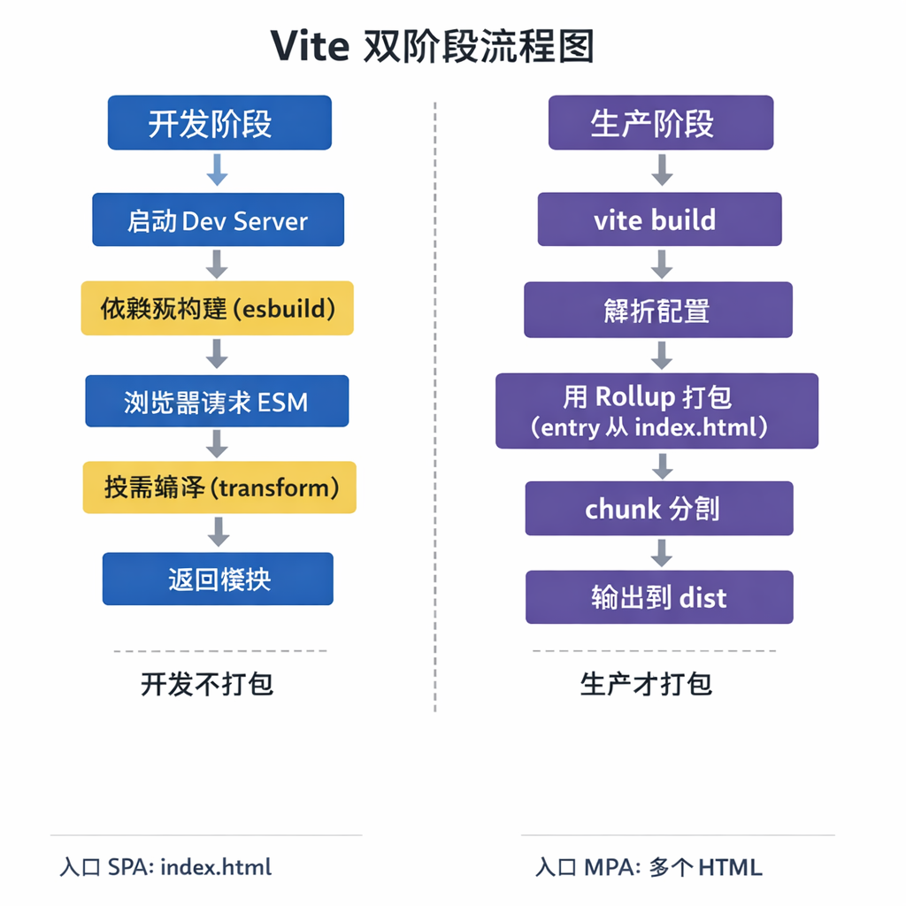

# 前端工程化

前端工程化指用**工程化手段**提升前端开发效率、协作质量和可维护性，涵盖构建、规范、模块化、部署等一整套流程。

---

## 一、构建工具

### 1. 主流构建工具对比

| 工具 | 特点 | 适用场景 |
|------|------|----------|
| **Vite** | 基于 ESM 的 dev 秒启、Rollup 生产打包；配置简单 | 新项目、Vue/React 现代框架 |
| **Webpack** | 生态成熟、插件丰富、可深度定制 | 遗留项目、复杂定制需求 |
| **Rollup** | 擅长库打包、Tree-shaking 好 | 库/组件库发布 |
| **esbuild** | Go 编写、极快，常用于 Vite 等内部 | 作为底层或脚本构建 |
| **Turbopack** | Webpack 团队新作，Rust、增量编译 | 探索/Next.js 等 |

### 2. Vite 核心概念

**一句话理解**：Vite 采用**双引擎**——开发阶段用 esbuild 预构建依赖 + 浏览器原生 ESM 按需编译，不打包；生产阶段用 Rollup 打包。入口是 **HTML 文件**（单页一个、多页多个）。



下面按「入口与单页/多页声明 → 开发流程 → 生产构建流程 → 插件生命周期钩子」顺序说明，便于和 Webpack 对照记忆。

#### 2.1 单页面（SPA）与多页面（MPA）如何声明

- **单页面（SPA）**  
  - 默认以**项目根目录下的 `index.html`** 为入口，HTML 里通过 `<script type="module" src="/src/main.js">` 引入应用入口。  
  - 不需要在 `vite.config` 里单独配 entry，Vite 会从该 HTML 出发解析依赖。  
  - 开发时访问根路径即可；构建时 `vite build` 默认也是以 `index.html` 为入口，生成一套产物。

- **多页面（MPA）**  
  - 需要**多个 HTML 入口**，在 `build.rollupOptions.input` 里用对象形式指定多个入口 HTML 路径（注意：Vite 官方以 HTML 为入口，不是只写 js）。  
  - 开发时通过不同路径访问不同页面（如 `/`、`/nested/`）；构建时会对每个 HTML 入口分别打包，输出到同一 `dist` 目录下，保持与开发阶段一致的路径结构。

**多页面配置示例**（来自 [Vite 官方文档 - 多页面应用](https://cn.vitejs.dev/guide/build#multi-page-app)）：

```js
// vite.config.js
import { resolve } from 'node:path'
import { defineConfig } from 'vite'

export default defineConfig({
  build: {
    rollupOptions: {
      input: {
        main: resolve(__dirname, 'index.html'),
        nested: resolve(__dirname, 'nested/index.html'),
      },
    },
  },
})
```

目录示例：根目录有 `index.html`、`main.js`，以及 `nested/index.html`、`nested/nested.js`。构建后 `dist` 下会有 `index.html`、`nested/index.html` 及对应 chunk。

#### 2.2 开发阶段流程（简要）

1. 执行 `vite` 启动开发服务器，读取 `vite.config` 并合并默认配置。  
2. **依赖预构建**：对 `node_modules` 里用到的依赖用 **esbuild** 打包成少量 ESM，解决 CommonJS/UMD 兼容和大量小文件问题。  
3. 浏览器请求某模块时，Vite 按需用 **esbuild**（如 TS、JSX）或 **插件** 做 transform，返回 ESM 源码，**不打包整应用**，因此冷启动快。  
4. **热更新（HMR）**：文件变更后只重新编译受影响模块，通过 WebSocket 推给浏览器做局部替换（详见下文）。

#### 2.2.1 Vite 热更新（HMR）

**一句话理解**：Vite 开发时内置 HMR，文件改动后只对**受影响模块**做 transform，通过 **WebSocket** 把更新推给浏览器，浏览器用 **`import.meta.hot`** 做局部替换，不整页刷新，保留状态。

**流程简述**

1. **监听文件**：dev server 监听项目源码，某文件保存后触发。
2. **增量处理**：只对变更文件及其依赖链做 transform（走 esbuild/插件），不重新打包整应用。
3. **推送更新**：通过 **WebSocket** 向浏览器发送本次更新的模块 id 或路径（及可选的 payload）。
4. **客户端接管**：浏览器里注入的 **HMR runtime** 收到消息后，请求新的模块内容（或直接带在消息里），执行 **`import.meta.hot.accept`** 注册的回调，用新模块替换旧模块；若没有 accept 或替换失败，则 **fallback 为整页刷新**。

**在代码里“接住”热更新**

- 某模块希望**自己**被热替换时，在该模块内写：

```js
// 当前模块可被热替换，替换后重新执行本模块
if (import.meta.hot) {
  import.meta.hot.accept((newModule) => {
    // newModule 为更新后的模块，可按需用新逻辑替换当前状态
  })
}
```

- **接受子模块更新**（例如父组件在子组件更新时重新渲染）：

```js
import { render } from './App'
import.meta.hot.accept('./App', (newModule) => {
  if (newModule) newModule.render()
})
```

- Vue/React 等框架的官方 Vite 插件（如 `@vitejs/plugin-vue`）已为 SFC、组件做了 HMR 边界处理，多数情况下无需手写上述代码。

**插件里扩展 HMR：`handleHotUpdate`**

在插件中实现 `handleHotUpdate`，可过滤或扩展热更新（例如只对某些文件发更新、或给 payload 里加自定义数据）：

```js
export function myHmrPlugin() {
  return {
    name: 'my-hmr',
    handleHotUpdate({ file, server }) {
      if (file.endsWith('.custom')) {
        server.ws.send({ type: 'custom', data: { file } })
      }
    },
  }
}
```

**和 Webpack HMR 的对比**

| 对比项 | Vite HMR | Webpack HMR |
|--------|----------|-------------|
| 通信 | WebSocket（dev server 内置） | WebSocket（dev server / 中间件） |
| 更新粒度 | 以 ESM 模块为单位，按需 transform | 以 chunk/模块为单位，增量编译 |
| API | `import.meta.hot.accept` / `dispose` | `module.hot.accept` |
| 冷启动 | 不打包，快 | 需先打包/编译，相对慢 |

两者目标一致：**尽量只更新改动的模块，减少整页刷新，保留应用状态**。

#### 2.3 生产构建流程（vite build）

1. **解析配置**：读取 `vite.config.ts` 与命令行参数，得到最终配置（含 `build.rollupOptions`）。  
2. **确定入口**：单页时默认为根目录 `index.html`；多页时为 `rollupOptions.input` 里列出的多个 HTML。  
3. **调用 Rollup**：用 Rollup（或当前 Vite 版本使用的打包器）根据 HTML 入口解析依赖图，进行模块解析、转换、合并。  
4. **Chunk 分割与 Tree-shaking**：按动态 import、入口等生成 chunk，并做 Tree-shaking。  
5. **输出**：将 JS、CSS 等写入 `dist`，HTML 中引用正确的产物路径。

构建产物可通过 `build.outDir` 修改，默认 `dist`。

#### 2.4 关键生命周期钩子（插件 API）

与 Webpack 类似，理解“在哪个阶段做什么”即可。钩子分为 **Vite 专有** 和 **Rollup 通用**（生产构建时使用）。

**Vite 专有钩子（执行顺序概念上靠前）**

| 钩子 | 说明 | 典型用途 |
|------|------|----------|
| `config` | 解析 Vite 配置前调用，可修改用户配置 | 按环境注入不同配置 |
| `configResolved` | 配置解析完成后调用，可读取最终配置 | 缓存最终配置供后续钩子使用 |
| `configureServer` | 仅开发时调用，用于配置 dev server | 加自定义中间件、proxy |
| `transformIndexHtml` | 转换入口 HTML 内容 | 注入脚本、修改 meta |
| `handleHotUpdate` | 自定义 HMR 更新逻辑 | 过滤或扩展热更新行为 |

**Rollup 通用钩子（构建阶段）**

- **构建阶段**：`options` → `buildStart` → `resolveId` → `load` → `transform` → `buildEnd`。  
- **输出阶段**：`renderStart` → `renderChunk` / `generateBundle` → `writeBundle` → `closeBundle`。

插件可通过 `enforce: 'pre' | 'post'` 调整执行顺序。  
实现「如何介入」时：在插件函数里返回对象，键为钩子名，值为对应函数；需要异步时返回 Promise。

**简单插件示例（在 config 阶段修改配置）**

```js
// 示例：给 config 钩子返回一个修改 root 的插件
export function myPlugin() {
  return {
    name: 'my-plugin',
    config(config) {
      // 可修改、合并 config
      return { resolve: { alias: { '@': '/src' } } }
    },
    configResolved(resolvedConfig) {
      console.log('resolved config', resolvedConfig.root)
    },
  }
}
```

在 `vite.config.js` 中 `plugins: [myPlugin()]` 即可。

#### 2.5 常用配置小结

- **入口与多页**：SPA 默认 `index.html`；MPA 用 `build.rollupOptions.input` 配置多个 HTML。  
- **路径与代理**：`resolve.alias`、`server.proxy`。  
- **构建**：`build.rollupOptions`（input、output、external 等）、`build.outDir`、`build.target`。  
- **插件**：`plugins` 数组，框架官方插件（如 Vue、React）负责处理 SFC、JSX 等。

#### 2.6 编写 Vite 插件的思路（与 Webpack Plugin 对照）

- Vite 没有 Loader 概念，**只有 Plugin**；模块转换通过插件的 **transform**、**load** 等 Rollup 钩子或 Vite 的 **transformIndexHtml** 等完成。
- **编写思路**：插件返回一个对象，键为**钩子名**，值为**钩子函数**；在需要的阶段读取/修改配置、转换代码、注入资源或处理 HMR。
- **与 Webpack 对比**：Webpack 用 Tapable 广播事件，Plugin 通过 `compiler.hooks.xxx.tap` 注册；Vite 使用 Rollup 的钩子 + Vite 专有钩子（config、configResolved、configureServer、transformIndexHtml、handleHotUpdate），通过 **enforce: 'pre' | 'post'** 控制顺序。
- 实现“如何介入”：在对应钩子里改入参或返回值；异步钩子返回 Promise；需要改 HTML 用 **transformIndexHtml**，需要改模块内容用 **transform** 或 **load**。

#### 2.7 Vite 性能与构建速度优化（与 Webpack 对照）

- **生产构建**：合理设置 **build.target**（如 `esnext` 减少转译）、生产环境关闭 **sourcemap**（`build.sourcemap: false`）可明显加快构建；依赖 Rollup/esbuild 的 Tree-shaking，无需额外配置。
- **依赖与缓存**：**预构建**结果会缓存，可用 **server.fs.cache** 等；构建时可利用 **build.rollupOptions** 的 cache 选项（视版本而定）。
- **开发性能**：减少 **resolve.extensions** 数量、用 **alias** 减少解析；避免插件在 **resolveId/load/transform** 里做重逻辑；可用 `vite --profile` 或 **vite-plugin-inspect** 分析瓶颈。
- **代码分割**：动态 **import()** 按路由/组件拆 chunk；通过 **build.rollupOptions.output.manualChunks** 把第三方库拆成 vendor，利于缓存。
- **外部化**：**build.rollupOptions.external** 将不打包的依赖（如 CDN 上的 Vue）排除，减小体积与构建时间。

```js
// vite.config.js 示例：构建优化
export default defineConfig({
  build: {
    target: 'esnext',
    sourcemap: false,
    rollupOptions: {
      output: {
        manualChunks: {
          vendor: ['vue', 'vue-router'],
        },
      },
    },
  },
  resolve: {
    alias: { '@': '/src' },
    extensions: ['.mjs', '.js', '.ts', '.jsx', '.tsx', '.json'],
  },
})
```

---

### 3. Webpack 核心概念

- **Entry / Output**：入口与输出目录、文件名。
- **Loader**：对非 JS 资源做转换（如 babel-loader、css-loader、ts-loader）。
- **Plugin**：在构建生命周期做扩展（如 HtmlWebpackPlugin、DefinePlugin、MiniCssExtractPlugin）。
- **Code Splitting**：`splitChunks`、动态 `import()` 实现按需加载。

#### Webpack 构建生命周期（按执行顺序理解）

**一句话理解**：Webpack 会从 `entry` 出发，构建模块依赖图（module graph），把模块打包成 chunk，再生成最终的 assets 并输出到文件系统；**Loader 负责“转换模块”**，**Plugin 负责“在各阶段 hooks 里介入”**。


下面按生命周期顺序把关键概念“放到它出现的位置”，记忆最省力。

**1）初始化参数（配置合并）**

- 读取 `webpack.config.js`（或 `webpack.config.ts`）与命令行参数，合并得到最终配置。
- 这里决定了：入口/输出、模块规则（loaders）、插件（plugins）、优化策略（mode、splitChunks、minimizer）等。

**2）创建 Compiler（全局构建器）**

- **Compiler** 是一次构建的“总指挥”，贯穿整个打包流程。
- 插件系统基于 **Tapable hooks**：插件在这里注册监听（如 `compiler.hooks.emit.tap(...)`），在后续阶段介入并改变构建结果。

**3）run / compile 开始编译**

- 调用 `compiler.run()` 进入编译流程（开发模式会进入 watch 模式，触发增量构建）。

**4）确定入口（entry）**

- 解析 `entry`，找到所有入口模块（单入口/多入口）。
- 入口是构建依赖图的起点，也影响 chunk 的拆分方式。

**5）创建 Compilation（本次构建上下文）**

- **Compilation** 表示“这一次构建”的上下文，保存模块、chunk、asset 等中间产物。
- 你可以把它理解为：一次 build 的“工作台”，所有产物都挂在上面。

**6）从入口开始构建模块（module graph）**

- **Resolver**：先把 `import/require` 的路径解析成真实文件（含 alias、extensions、node_modules 查找规则）。
- **Loader**：把模块转换成 Webpack 能处理的形式（JS/JSON/Asset），如 TS/JS 转译、CSS 处理、图片/字体资源处理等。
  - **执行顺序**：`use: ['style-loader','css-loader']` 是 **从右到左**执行（先 `css-loader` 再 `style-loader`）。
- **AST 分析依赖**：解析模块源码，找出它依赖的模块，再递归处理，最终形成完整的依赖图。

**7）生成 Chunk（打包单元）**

- Webpack 会把一组相关模块组装成 **chunk**（例如入口 chunk、动态 `import()` 产生的异步 chunk）。
- 生产环境常配合 `splitChunks` 抽取公共依赖，减少重复下载与缓存失效。

**8）生成 Assets（最终输出内容）**

- 把 chunk 转换为最终输出文件（js/css/图片等 assets），并在必要时注入 runtime。
- 这是很多插件发挥作用的阶段之一（如生成 HTML、提取 CSS、压缩、分析体积）。

**9）emit 输出到文件系统**

- 将生成的 assets 写入 `output.path` 对应目录（如 `dist/`），构建完成。

总结：**Loader = 模块转换**（发生在“构建 module graph”阶段），**Plugin = 生命周期介入**（在 hooks 上做增强/改写输出）。

#### 开发体验：Watch 与热更新（HMR）

**一句话理解**：**Watch** 负责“文件变了就重新编译”，**HMR（Hot Module Replacement）** 负责“把变更过的模块在浏览器里局部替换掉，尽量不整页刷新，从而保留页面状态”。

**1）Watch（监听构建）**

- 开发模式下 Webpack 会开启文件监听（watch），当源码发生变化时触发一次新的增量编译。
- 只开启 watch 通常只能做到：**重新编译 + 刷新页面**（或由 dev server 触发刷新）。

**2）HMR（热模块替换）**

HMR 是 Webpack 在开发阶段提升体验的核心能力，典型流程如下：

1. `webpack-dev-server` 启动，构建产物通常写入**内存**（更快）；
2. 浏览器加载 bundle，同时注入 **HMR runtime**；
3. 文件变化触发 watch，Webpack 重新编译受影响的模块；
4. dev server 通过 **WebSocket** 通知浏览器本次更新的 hash/信息；
5. 浏览器请求 **update manifest** 与 `hot-update` 增量 chunk；
6. HMR runtime 调用 `module.hot.accept` 等回调，尝试在运行时替换模块；
7. 如果某模块（或其父模块链）没有 accept handler，通常会 **fallback 到整页刷新**（full reload）。


**3）HMR 能解决什么问题？**

- **减少整页刷新**：CSS/组件代码修改后只替换局部模块，减少“丢失输入框内容/滚动位置/组件状态”的痛点。
- **更快反馈**：相比每次都刷新，热替换通常更快（尤其是大型项目）。

**4）常见面试追问点**

- **为什么有时改了代码还是会整页刷新？**：对应模块没有被 accept；或改动影响了边界（比如入口/runtime 相关）导致无法安全热替换。
- **HMR 和 React Fast Refresh 的关系？**：Fast Refresh 是 React 侧对组件边界的增强，底层仍依赖打包器的 HMR 通道来把模块推到浏览器端。

**5）Webpack HMR 实现原理（详细 8 步）**

HMR（Hot Module Replacement）热替换：在不刷新浏览器的前提下，用新模块替换旧模块。需要 **服务端** 与 **客户端** 配合。

1. **watch 发现变更**：在 Webpack 的 watch 模式下，某文件被修改，Webpack 监听到变化，根据配置对模块重新编译打包，将打包结果以 JS 对象形式**保存在内存**（不写磁盘）。
2. **dev-server 与 Webpack 的桥梁**：**webpack-dev-middleware** 调用 Webpack 暴露的 API 监听代码变化，并通知 Webpack 将产物输出到内存。
3. **静态资源监控（可选）**：配置 `devServer.watchContentBase: true` 时，dev server 会监听静态目录变化并触发 **live reload**（整页刷新），与 HMR 是两套机制。
4. **建立 WebSocket 长连接**：通过 **sockjs** 在浏览器与 dev server 之间建立 WebSocket，把编译各阶段状态、以及**新模块的 hash** 推给浏览器，浏览器根据消息决定后续是 HMR 还是刷新。
5. **客户端交给 hot runtime**：**webpack-dev-server/client** 只负责收消息，不直接请求更新代码；**webpack/hot/dev-server** 根据配置和收到的 hash 决定是**热更新**还是**整页刷新**。
6. **HMR runtime 拉取更新**：**HotModuleReplacement.runtime** 根据新模块 hash，通过 **jsonp** 向服务端请求 manifest（包含待更新模块的 hash 列表），再按需请求最新模块代码。
7. **对比与替换**：**HotModulePlugin** 对新旧模块做对比，决定是否更新；更新时一并更新模块间的**依赖引用**，保证运行时引用正确。
8. **失败回退**：若 HMR 失败（如无 accept、或更新异常），则回退到 **live reload**，整页刷新以加载最新打包结果。

### 常⻅的**Loader** 

- file-loader：把⽂件输出到⼀个⽂件夹中，在代码中通过相对 URL 去引⽤输出的⽂件 
- url-loader：和 file-loader 类似，但是能在⽂件很⼩的情况下以 base64 的⽅式把⽂件内容注⼊到代码中去 
- source-map-loader：加载额外的 Source Map ⽂件，以⽅便断点调试 
- image-loader：加载并且压缩图⽚⽂件 
- babel-loader：把 ES6 转换成 ES5 
- css-loader：加载 CSS，⽀持模块化、压缩、⽂件导⼊等特性 
- style-loader：把 CSS 代码注⼊到 JavaScript 中，通过 DOM 操作去加载 CSS。 
- eslint-loader：通过 ESLint 检查 JavaScript 代码 


**注意：**在Webpack中，loader的执行顺序是**从右向左**执行的。因为webpack选择了**compose这样的函数式编程方式**，这种方式的表达式执行是从右向左的。

```js
module.exports = {
  module: {
    rules: [
      // 处理 JavaScript/TypeScript 文件
      {
        test: /\.(js|jsx|ts|tsx)$/,
        exclude: /node_modules/,
        use: {
          loader: 'babel-loader',
          options: {
            presets: ['@babel/preset-env', '@babel/preset-react']
          }
        }
      },
      
      // 处理 CSS 文件
      {
        test: /\.css$/,
        use: ['style-loader', 'css-loader'] // 从右到左执行
      },
      
      // 处理 SCSS 文件
      {
        test: /\.scss$/,
        use: ['style-loader', 'css-loader', 'sass-loader']
      },
      
      // 处理图片文件
      {
        test: /\.(png|jpe?g|gif|svg)$/,
        type: 'asset/resource',
        generator: {
          filename: 'images/[hash][ext][query]'
        }
      },
      
      // 处理字体文件
      {
        test: /\.(woff|woff2|eot|ttf|otf)$/,
        type: 'asset/resource',
        generator: {
          filename: 'fonts/[hash][ext][query]'
        }
      }
    ]
  }
};
```

### 常⻅的**Plugin**

- define-plugin：定义环境变量 
- html-webpack-plugin：简化html⽂件创建 
- uglifyjs-webpack-plugin：通过 UglifyES 压缩 ES6 代码 
- webpack-parallel-uglify-plugin: 多核压缩，提⾼压缩速度 
- webpack-bundle-analyzer: 可视化webpack输出⽂件的体积 
- mini-css-extract-plugin: CSS提取到单独的⽂件中，⽀持按需加载 

```js
const path = require('path');
const HtmlWebpackPlugin = require('html-webpack-plugin');
const { CleanWebpackPlugin } = require('clean-webpack-plugin');
const MiniCssExtractPlugin = require('mini-css-extract-plugin');
const BundleAnalyzerPlugin = require('webpack-bundle-analyzer').BundleAnalyzerPlugin;

module.exports = {
  plugins: [
    // 自动清理输出目录
    new CleanWebpackPlugin(),
    
    // 自动生成 HTML 文件并注入打包后的资源
    new HtmlWebpackPlugin({
      title: 'My App',
      template: './src/index.html'
    }),
    
    // 提取 CSS 到单独文件
    new MiniCssExtractPlugin({
      filename: 'css/[name].[contenthash:8].css'
    }),
    
    // 打包分析工具
    new BundleAnalyzerPlugin({
      analyzerMode: 'disabled', // 不自动打开
      generateStatsFile: true // 生成 stats.json 文件
    }),
    
    // 定义环境变量
    new webpack.DefinePlugin({
      'process.env.NODE_ENV': JSON.stringify(process.env.NODE_ENV)
    })
  ]
};
```

#### 编写 Loader 与 Plugin 的思路

**Loader：像“翻译官”，链式转义源文件**

- Loader 的职责是**单一转义**：读入源文件内容（`source`），输出处理后的内容；多个 Loader 链式组合（从右到左），一步步把源文件变成 Webpack 能消费的形态。
- **编写原则**：一个 Loader 只做一种转义，便于复用和测试。
- **输出方式**：
  - 直接 **return** 字符串（同步）；
  - 使用 **this.callback(err, content, sourceMap?)** 返回内容或错误；
  - 使用 **this.async()** 拿到异步 callback，在异步逻辑里调用 callback 把结果交给 Webpack。
- 工具库 **loader-utils**（如 `getOptions(this)`）可用来解析 loader 的 `options`。

**Loader 示例（同步 + callback + async）**

```js
// 同步：直接返回
module.exports = function (source) {
  return source.replace(/foo/g, 'bar')
}

// 使用 this.callback（可带 sourceMap）
module.exports = function (source) {
  this.callback(null, source.replace(/foo/g, 'bar'), null)
}

// 异步：this.async()
module.exports = function (source) {
  const callback = this.async()
  someAsyncTransform(source, (err, result) => {
    if (err) return callback(err)
    callback(null, result)
  })
}
```

**Plugin：监听生命周期事件，在合适时机改输出**

- Webpack 在运行过程中会**广播大量事件**（Tapable hooks），Plugin 通过监听这些事件，在对应阶段用 Webpack 提供的 API 改变构建结果（如增删资源、改 HTML、改 chunk）。
- 编写思路：**拿到 Compiler/Compilation** → **在需要的 hook 上注册**（如 `compiler.hooks.emit.tapAsync`）→ 在回调里通过 `compilation.assets`、`compilation.chunks` 等读写产物。

**Plugin 示例（在 emit 阶段追加一个文件）**

```js
class MyPlugin {
  apply(compiler) {
    compiler.hooks.emit.tapAsync('MyPlugin', (compilation, callback) => {
      compilation.assets['my-file.txt'] = {
        source: () => 'hello from plugin',
        size: () => 21,
      }
      callback()
    })
  }
}
module.exports = MyPlugin
```

---

### Tree shaking 基本原理

1. **静态分析**：
   - 在编译阶段（而非运行时）分析代码的导入导出关系
   - 通过 ES6 模块的静态结构特性（`import/export` 必须在顶层作用域）实现
2. **标记-清除**过程：
   - **标记阶段**：从入口文件开始，标记所有被使用的导出
   - **清除阶段**：删除所有未被标记的导出代码

```js
module.exports = {
  mode: 'production', // 生产模式自动开启 Tree Shaking
  
  optimization: {
    usedExports: true, // 标记未使用的导出
    minimize: true,    // 启用代码压缩
    minimizer: [
      new TerserPlugin(), // 使用 Terser 进行压缩
      new CssMinimizerPlugin() // 压缩 CSS
    ],
    
    // 代码分割配置
    splitChunks: {
      chunks: 'all',
      cacheGroups: {
        vendors: {
          test: /[\\/]node_modules[\\/]/,
          name: 'vendors',
          chunks: 'all'
        }
      }
    }
  }
};
```

#### 用 Webpack 优化前端性能（输出结果在浏览器中更高效）

- **压缩代码**：删除多余代码、注释，简化写法。可用 **TerserPlugin**（或 UglifyJsPlugin）压缩 JS，**CssMinimizerPlugin** 或 css-loader 的 minimize（如配合 cssnano）压缩 CSS。
- **CDN 加速**：构建时把静态资源路径改为 CDN 地址。通过 **output.publicPath** 或各 loader 的 **publicPath** 配置。
- **Tree Shaking**：删除永远不会执行到的代码。`mode: 'production'` 或 `--optimize-minimize` 会启用；需 ES Module 静态结构。
- **Code Splitting**：按路由或组件拆 chunk，**按需加载**（动态 `import()`），并利于浏览器缓存。
- **提取公共第三方库**：用 **SplitChunksPlugin**（或旧版 CommonsChunkPlugin）把公共依赖抽成单独 chunk，长期缓存不常变的 vendor。

```js
// 示例：压缩 + 公共 chunk + 动态加载
module.exports = {
  optimization: {
    minimize: true,
    splitChunks: {
      chunks: 'all',
      cacheGroups: {
        vendor: {
          test: /[\\/]node_modules[\\/]/,
          name: 'vendors',
        },
      },
    },
  },
}
```

#### 提高 Webpack 打包与构建速度

- **多线程编译**：**thread-loader** 将后续 loader 放在 worker 池中执行（原 happypack 已不维护，可用 thread-loader 替代）。
- **externals**：把不常更新的第三方库排除出 bundle，用 script 或 CDN 引入，减少打包体积与时间。
- **DllPlugin + DllReferencePlugin**：把基本不变的依赖预先打成 dll，主构建只引用 dll，避免每次全量编译。
- **缓存**：**cache**（Webpack 5 内置）、**babel-loader 的 cacheDirectory** 等，提高 rebuild 效率。
- **缩小搜索范围**：loader 的 **include** 限定在 `src`，**exclude: /node_modules/`，避免误编译无关目录。

```js
// 示例：thread-loader + 缓存 + include
module.exports = {
  module: {
    rules: [
      {
        test: /\.js$/,
        include: path.resolve(__dirname, 'src'),
        use: [
          { loader: 'thread-loader', options: { workers: 2 } },
          { loader: 'babel-loader', options: { cacheDirectory: true } },
        ],
      },
    ],
  },
  externals: { vue: 'Vue' }, // 不打包 vue，用 script 引入
}
```

#### Webpack 单页（SPA）与多页（MPA）配置

- **单页应用（SPA）**：在 **entry** 中指定一个入口（如 `main: './src/main.js'`），配合单页路由与代码分割即可；Webpack 默认就是“单入口打包”模式。
- **多页应用（MPA）**：
  - **多入口**：`entry: { page1: './src/page1.js', page2: './src/page2.js' }`，配合 **HtmlWebpackPlugin** 为每个入口生成一个 HTML（或使用多实例）。
  - **抽离公共代码**：用 **SplitChunksPlugin** 把各页公共部分打成单独 chunk，避免重复加载。
  - **入口配置灵活**：可结合 glob 或脚本根据目录自动生成 `entry` 与 `htmlWebpackPlugin` 配置，避免每加一页就改配置。

```js
// MPA 示例：多入口 + 每页一个 HTML
const HtmlWebpackPlugin = require('html-webpack-plugin')
module.exports = {
  entry: {
    index: './src/index.js',
    about: './src/about.js',
  },
  plugins: [
    new HtmlWebpackPlugin({ template: './src/index.html', chunks: ['index'] }),
    new HtmlWebpackPlugin({ template: './src/about.html', filename: 'about.html', chunks: ['about'] }),
  ],
}
```

---


## 二、包管理器

### 1. npm / yarn / pnpm 对比

| 对比项 | npm | Yarn | pnpm |
|--------|-----|------|------|
| 安装速度 | 较慢 | 较快 | 快，硬链接节省磁盘 |
| 依赖存储 | node_modules 平铺/嵌套 | 平铺 | 内容寻址 store + 软链 |
| 锁文件 | package-lock.json | yarn.lock | pnpm-lock.yaml |
| monorepo | 需工具支持 | Workspaces | 原生 Workspaces 友好 |

下面从**技术原理与核心区别**、**各自存在的问题**两方面展开，便于理解和面试作答。

#### 一、技术原理与核心区别

**1. 依赖管理机制**

- **npm**
  - **嵌套结构（v2）**：依赖树深层嵌套，相同依赖重复安装，路径过长易超 Windows 路径限制。
  - **扁平化（v3+）**：依赖提升至顶层，减少重复。但同一包多版本时仅提升一个，其余版本仍嵌套安装，产生 **依赖分身**（同一包多版本在磁盘上重复存储）。
- **yarn**
  - **扁平化 + 缓存**：依赖提升至顶层，用 `yarn.lock` 锁定版本；并行下载 + 缓存机制，安装更快。
  - **问题未根治**：仍有 **幽灵依赖**（未在 package.json 声明的依赖因被提升而可被代码直接引用）和 **依赖分身**。
- **pnpm**
  - **硬链接 + 符号链接**：
    - **全局存储**（`~/.pnpm-store`）：每个依赖版本在磁盘上只存一份。
    - **硬链接**：项目中的依赖通过硬链接指向该存储，避免重复占用磁盘。
    - **符号链接**：`node_modules` 里只放**直接依赖**的符号链接，子依赖通过 `.pnpm` 目录下的软链接组织，**严格按声明隔离**，无法访问未声明的包。

**2. 性能与磁盘效率**

| 工具 | 安装速度 | 磁盘占用 | 原理优化 |
|------|----------|----------|----------|
| npm | 较慢（串行） | 高（重复存储） | 扁平化减少嵌套 |
| yarn | 快（并行） | 中（缓存共享） | 并行下载 + 缓存复用 |
| pnpm | 极快（链接） | 低（全局单份存储） | 硬链接 + 符号链接 |

**3. 安全性 & 一致性**

- **锁定文件**：npm 使用 `package-lock.json` 锁定版本（早期版本有过安全问题）；yarn / pnpm 使用 `yarn.lock` / `pnpm-lock.yaml`，可严格锁定版本及完整性哈希，防篡改。
- **依赖隔离**：pnpm 只允许访问在 package.json 中显式声明的依赖，从机制上杜绝幽灵依赖；npm / yarn 因扁平化无法做到这一点。

下图概括了三者的依赖管理机制差异（嵌套 / 扁平 / 全局 store + 链接），便于对比记忆。


#### 二、依然存在的问题

- **npm**  
  - **依赖不确定性**：扁平化后，安装顺序不同可能导致依赖结构不一致，需依赖 `package-lock.json` 保证可复现。  
  - **磁盘冗余**：同一依赖在不同项目中各自存一份，占用空间大。

- **yarn**  
  - **幽灵依赖**：未声明的依赖仍可被引用，删除某个父依赖后可能突然报错。  
  - **依赖分身**：多版本包中未被提升的版本仍会重复安装。

- **pnpm**  
  - **软链接兼容性**：依赖符号链接，在不支持或限制软链接的环境（如部分 Electron 应用、Windows 受限模式）可能无法使用。  
  - **调试与补丁**：真实文件在全局 store，直接改 `node_modules` 不直观，需通过 `pnpm patch` 等流程。  
  - **生态兼容**：极少数包硬编码了 `node_modules` 路径，可能在 pnpm 下运行异常（如部分 Webpack 插件）。

### 2. 常用命令

- **npm**：`npm install`、`npm run <script>`、`npm publish`、`npx <pkg>`。
- **pnpm**：`pnpm add`、`pnpm install`、`pnpm run`、`pnpm -F <filter> run`（monorepo 过滤）。
- **锁定依赖**：提交 lock 文件，CI 使用 `npm ci` / `pnpm install --frozen-lockfile` 保证可复现。

---

## 三、代码规范与质量

### 1. ESLint

- **作用**：静态分析 JS/TS 代码，发现语法错误、风格问题、潜在 bug。
- **配置**：`.eslintrc.*` 或 `eslint.config.js`（Flat Config），指定 `parser`（如 `@typescript-eslint/parser`）、`plugins`、`rules`、`extends`。
- **常见规则**：`no-unused-vars`、`react-hooks/rules-of-hooks`、`@typescript-eslint/no-explicit-any` 等。

### 2. Prettier

- **作用**：统一代码格式（缩进、引号、分号、换行等），与 ESLint 配合时可用 `eslint-config-prettier` 关闭冲突规则。
- **配置**：`.prettierrc` 或 `prettier.config.js`。

### 3. Husky + lint-staged

- **Husky**：在 Git 钩子（如 `pre-commit`）中执行脚本。
- **lint-staged**：只对暂存区文件执行 ESLint/Prettier，加快提交前检查。
- **典型流程**：`git commit` → `pre-commit` → `lint-staged` 对暂存文件跑 lint/format → 通过后才完成提交。

### 4. 类型检查

- **TypeScript**：`tsc --noEmit` 仅做类型检查，可放入 CI 或 `pre-commit`。
- **与构建分离**：构建用 esbuild/swc 提速，类型检查单独流水线，保证质量不丢。

---

## 四、模块化与规范

### 1. 模块系统

- **CommonJS**：`require` / `module.exports`，Node 默认，同步加载。
- **ES Module (ESM)**：`import` / `export`，静态分析、Tree-shaking 友好，浏览器与现代构建工具支持。


- **UMD**：兼容脚本、CommonJS、AMD 的格式，常见于老库。

### 2. 模块化实践

- 新项目优先 **ESM**，Node 可用 `"type": "module"` 或 `.mjs`。
- 库发布可同时提供 ESM 与 CJS（`package.json` 的 `exports`、`module`、`main`）。
- 使用 **路径别名**（如 `@/`）简化 import，需在构建工具与 TS 的 `paths` 中一致配置。

---

## 五、Monorepo

### 1. 概念与工具

- **Monorepo**：多个包/应用放在同一仓库，共享依赖和配置，便于复用与统一发布。
- **常见方案**：
  - **pnpm Workspaces**：`pnpm-workspace.yaml` 定义包列表，依赖提升与安装速度快。
  - **Turborepo**：在 pnpm/npm workspaces 之上做任务编排与缓存。
  - **Nx**：功能全面，适合大型 Monorepo。

### 2. 目录与脚本约定

- 根目录 `package.json` 中定义 `workspaces` 或由工具配置指定包路径。
- 公共配置（ESLint、TypeScript、Prettier）可提到根目录，各子包通过 `extends` 复用。
- 脚本：`pnpm -F @scope/app build` 或 `turbo run build` 按依赖图执行。

---

## 六、工程化实践小结

- **本地开发**：统一 Node 版本（.nvmrc / engines）、一键 install + dev。
- **提交规范**：Commitlint + Conventional Commits，便于生成 CHANGELOG 和语义化版本。
- **CI/CD**：在流水线中跑 lint、type-check、test、build，通过后再部署；构建产物可上传 CDN 或对象存储。
- **性能与体验**：生产构建开启压缩、拆包、懒加载；配合 SPA 路由做按需加载与预加载策略。

---

## 七、面试常见考点

1. **Vite 为什么快？** 开发时基于 ESM 按需编译，无整体打包；生产用 Rollup。
2. **Webpack 与 Vite 的区别？** 开发阶段架构不同（打包 vs 非打包），生态与可定制程度不同。
3. **pnpm 如何节省磁盘？** 全局 store + 硬链接，相同依赖只存一份；node_modules 为软链。
4. **ESLint 与 Prettier 如何配合？** ESLint 管逻辑与最佳实践，Prettier 管格式；用 eslint-config-prettier 关掉格式类规则避免冲突。
5. **Monorepo 的优缺点？** 优点：代码复用、统一版本与规范、原子化提交；缺点：仓库体积大、权限与构建编排需设计。

如需展开某一块（如 Vite 配置示例、pnpm workspace 搭建、CI 配置），可以在此基础上按章节补充。
